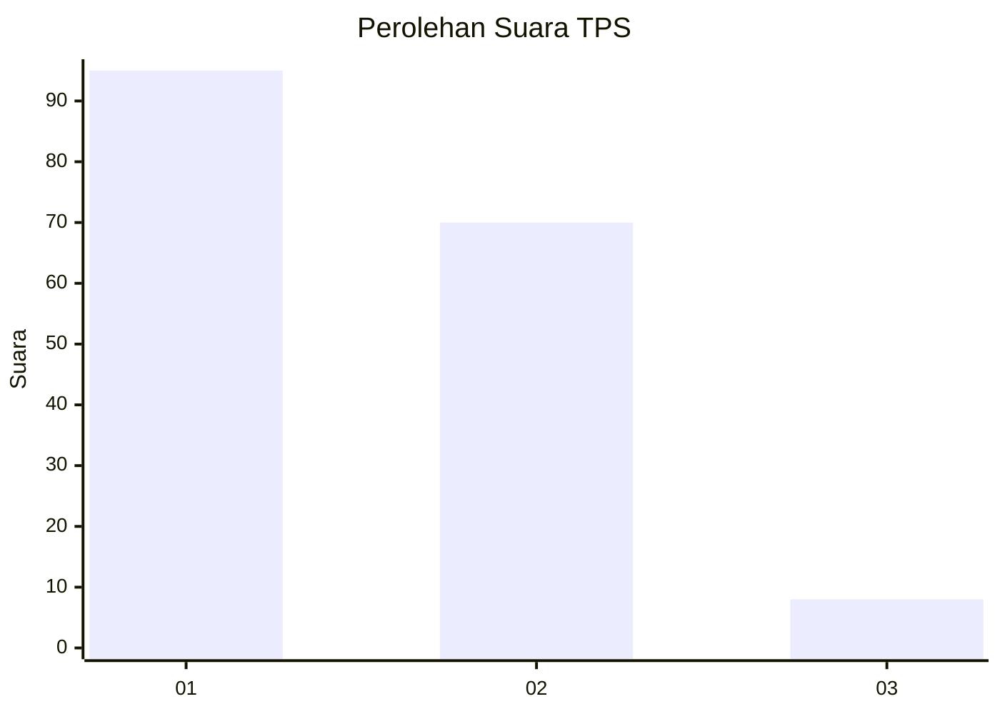
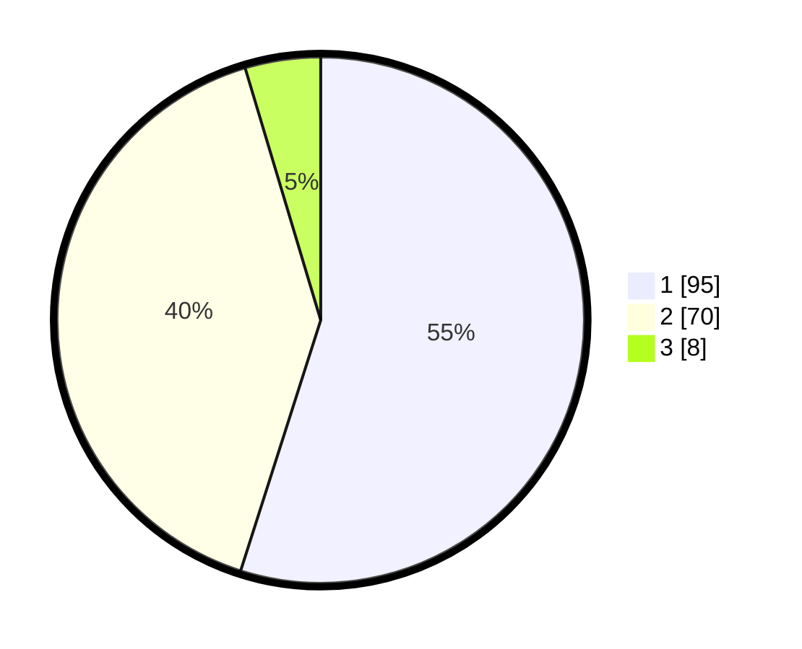

# Hasil

## Grafik

## Tabel

| No. | Nama Paslon    | Suara | Suara (raw) | Persentase |
|:--- |:-------------- | -----:| -----------:| ----------:|
| 1   | ANIES MUHAIMIN | 95    | [95][p-1]   | 54,91      |
| 2   | PRABOWO GIBRAN | 70    | [70][p-2]   | 40,46      |
| 3   | GANJAR MAHFUD  | 8     | [8][p-3]    | 4,62       |

[p-1]: https://github.com/gigit-pemilu/pemilu-2024/blob/main/pilpres/hitung-suara/sub/12-sumatera-utara/sub/71-kota-medan/sub/18-medan-perjuangan/sub/1003-sei-kera-hilir-i/sub/015-tps/sub/paslon-1.txt
[p-2]: https://github.com/gigit-pemilu/pemilu-2024/blob/main/pilpres/hitung-suara/sub/12-sumatera-utara/sub/71-kota-medan/sub/18-medan-perjuangan/sub/1003-sei-kera-hilir-i/sub/015-tps/sub/paslon-2.txt
[p-3]: https://github.com/gigit-pemilu/pemilu-2024/blob/main/pilpres/hitung-suara/sub/12-sumatera-utara/sub/71-kota-medan/sub/18-medan-perjuangan/sub/1003-sei-kera-hilir-i/sub/015-tps/sub/paslon-3.txt

## Foto C Plano

https://sirekap-obj-formc.kpu.go.id/0d2f/pemilu/ppwp/12/71/18/10/03/1271181003015-20240214-213915--f9e4345a-a342-431c-a906-65cbf2790c4c.jpg

https://sirekap-obj-formc.kpu.go.id/0d2f/pemilu/ppwp/12/71/18/10/03/1271181003015-20240218-102837--a98f3490-1d2e-4852-8298-0c631acc9cd6.jpg

https://sirekap-obj-formc.kpu.go.id/0d2f/pemilu/ppwp/12/71/18/10/03/1271181003015-20240214-214318--ec419994-9c00-44fb-bceb-69c86a9c1e37.jpg

## Metadata

| Key        | Value               |
| ---------- | ------------------- |
| Time Stamp | 2024-02-25 22:00:00 |

