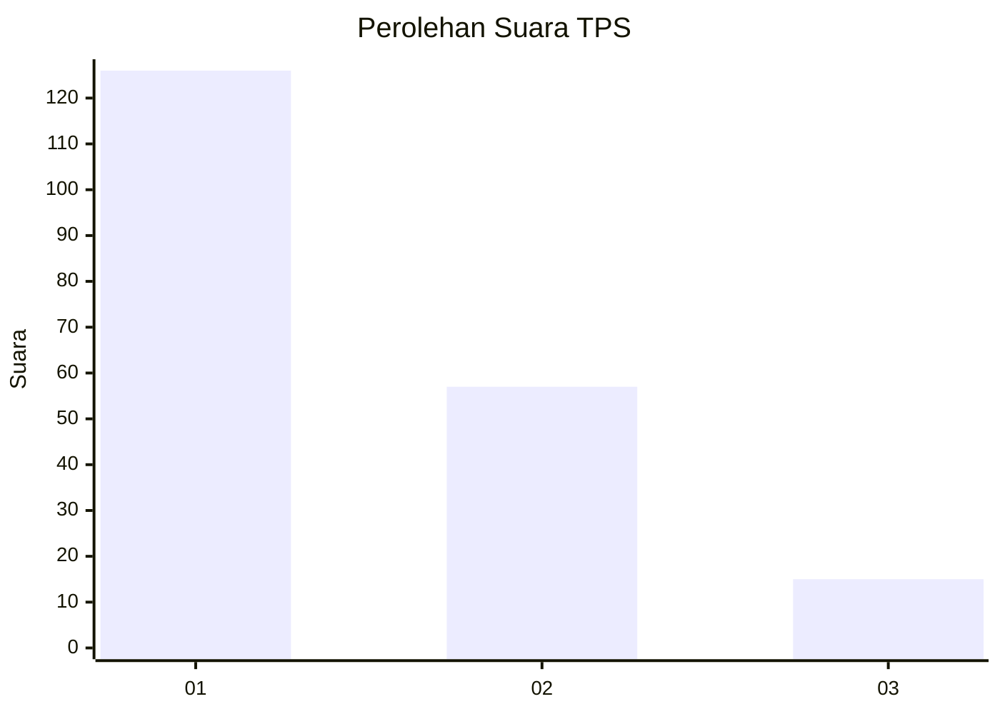
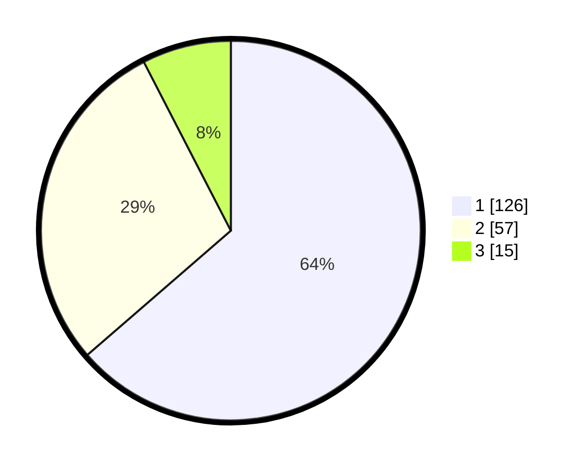

# Hasil

## Grafik

## Tabel

| No. | Nama Paslon    | Suara | Suara (raw) | Persentase |
|:--- |:-------------- | -----:| -----------:| ----------:|
| 1   | ANIES MUHAIMIN | 126   | [126][p-1]  | 63,64      |
| 2   | PRABOWO GIBRAN | 57    | [57][p-2]   | 28,79      |
| 3   | GANJAR MAHFUD  | 15    | [15][p-3]   | 7,58       |

[p-1]: https://github.com/gigit-pemilu/pemilu-2024/blob/main/pilpres/hitung-suara/sub/12-sumatera-utara/sub/71-kota-medan/sub/18-medan-perjuangan/sub/1004-sei-kera-hilir-ii/sub/007-tps/sub/paslon-1.txt
[p-2]: https://github.com/gigit-pemilu/pemilu-2024/blob/main/pilpres/hitung-suara/sub/12-sumatera-utara/sub/71-kota-medan/sub/18-medan-perjuangan/sub/1004-sei-kera-hilir-ii/sub/007-tps/sub/paslon-2.txt
[p-3]: https://github.com/gigit-pemilu/pemilu-2024/blob/main/pilpres/hitung-suara/sub/12-sumatera-utara/sub/71-kota-medan/sub/18-medan-perjuangan/sub/1004-sei-kera-hilir-ii/sub/007-tps/sub/paslon-3.txt

## Foto C Plano

https://sirekap-obj-formc.kpu.go.id/c125/pemilu/ppwp/12/71/18/10/04/1271181004007-20240215-031251--e804133a-1fed-4eeb-848e-50fbc48c7b37.jpg

https://sirekap-obj-formc.kpu.go.id/c125/pemilu/ppwp/12/71/18/10/04/1271181004007-20240215-030924--44fda7ba-6201-4d78-ad6b-1c0d8feb9150.jpg

https://sirekap-obj-formc.kpu.go.id/c125/pemilu/ppwp/12/71/18/10/04/1271181004007-20240215-031059--9012c6f6-4469-44ca-84ed-4b3accef1956.jpg

## Metadata

| Key        | Value               |
| ---------- | ------------------- |
| Time Stamp | 2024-02-24 22:31:28 |

