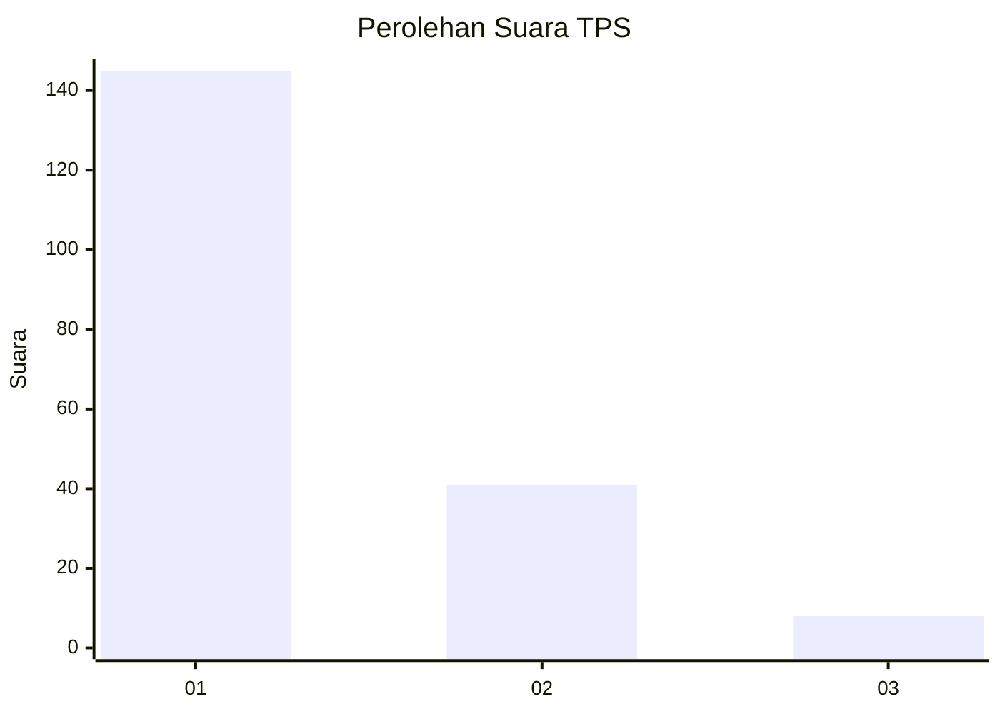
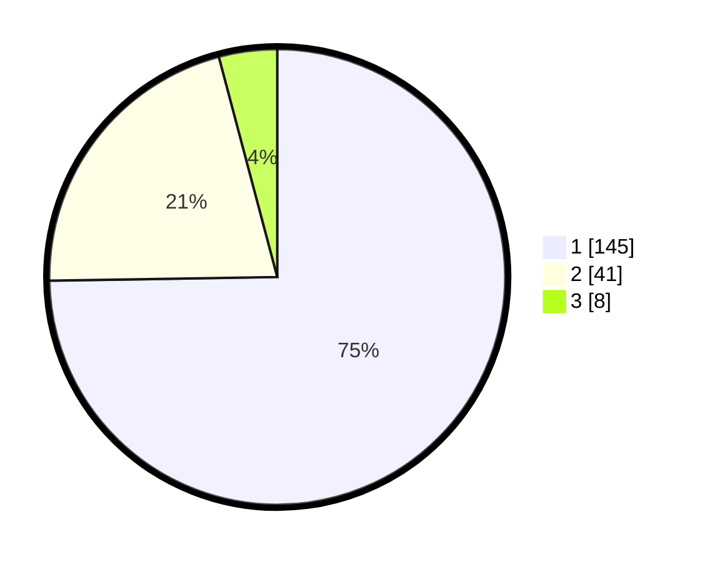

# Hasil

## Grafik

## Tabel

| No. | Nama Paslon    | Suara | Suara (raw) | Persentase |
|:--- |:-------------- | -----:| -----------:| ----------:|
| 1   | ANIES MUHAIMIN | 145   | [145][p-1]  | 74,74      |
| 2   | PRABOWO GIBRAN | 41    | [41][p-2]   | 21,13      |
| 3   | GANJAR MAHFUD  | 8     | [8][p-3]    | 4,12       |

[p-1]: https://github.com/gigit-pemilu/pemilu-2024/blob/main/pilpres/hitung-suara/sub/12-sumatera-utara/sub/71-kota-medan/sub/18-medan-perjuangan/sub/1004-sei-kera-hilir-ii/sub/023-tps/sub/paslon-1.txt
[p-2]: https://github.com/gigit-pemilu/pemilu-2024/blob/main/pilpres/hitung-suara/sub/12-sumatera-utara/sub/71-kota-medan/sub/18-medan-perjuangan/sub/1004-sei-kera-hilir-ii/sub/023-tps/sub/paslon-2.txt
[p-3]: https://github.com/gigit-pemilu/pemilu-2024/blob/main/pilpres/hitung-suara/sub/12-sumatera-utara/sub/71-kota-medan/sub/18-medan-perjuangan/sub/1004-sei-kera-hilir-ii/sub/023-tps/sub/paslon-3.txt

## Foto C Plano

https://sirekap-obj-formc.kpu.go.id/5ce2/pemilu/ppwp/12/71/18/10/04/1271181004023-20240215-000617--18e49465-82be-4f1c-9872-b2896a00eb08.jpg

https://sirekap-obj-formc.kpu.go.id/5ce2/pemilu/ppwp/12/71/18/10/04/1271181004023-20240215-001048--8a69d102-2b78-4f0d-bcac-8820c9f61e63.jpg

https://sirekap-obj-formc.kpu.go.id/5ce2/pemilu/ppwp/12/71/18/10/04/1271181004023-20240215-001257--9f933ff6-1fcf-406d-9a4d-18ee8597a986.jpg

## Metadata

| Key        | Value               |
| ---------- | ------------------- |
| Time Stamp | 2024-02-25 17:00:00 |

