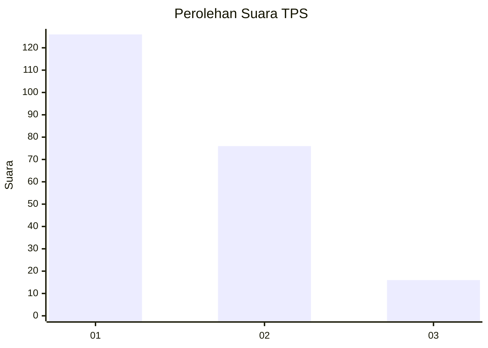
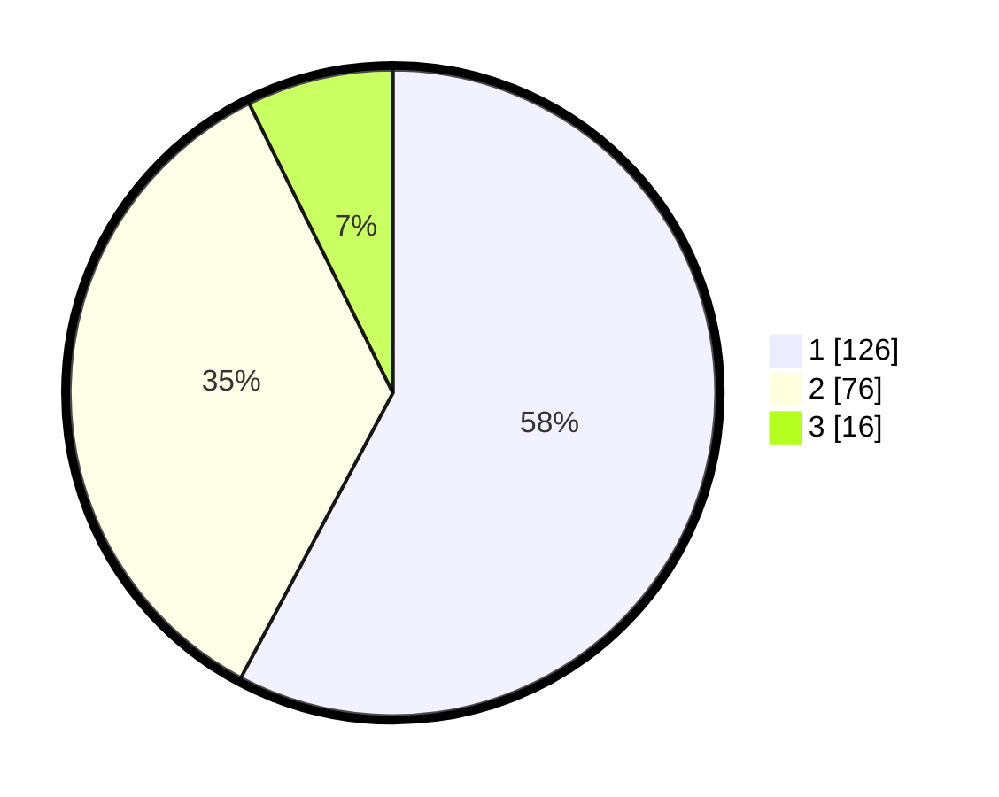

# Hasil

## Grafik

## Tabel

| No. | Nama Paslon    | Suara | Suara (raw) | Persentase |
|:--- |:-------------- | -----:| -----------:| ----------:|
| 1   | ANIES MUHAIMIN | 126   | [126][p-1]  | 57,80      |
| 2   | PRABOWO GIBRAN | 76    | [76][p-2]   | 34,86      |
| 3   | GANJAR MAHFUD  | 16    | [16][p-3]   | 7,34       |

[p-1]: https://github.com/gigit-pemilu/pemilu-2024/blob/main/pilpres/hitung-suara/sub/12-sumatera-utara/sub/71-kota-medan/sub/18-medan-perjuangan/sub/1007-sidorame-barat-i/sub/003-tps/sub/paslon-1.txt
[p-2]: https://github.com/gigit-pemilu/pemilu-2024/blob/main/pilpres/hitung-suara/sub/12-sumatera-utara/sub/71-kota-medan/sub/18-medan-perjuangan/sub/1007-sidorame-barat-i/sub/003-tps/sub/paslon-2.txt
[p-3]: https://github.com/gigit-pemilu/pemilu-2024/blob/main/pilpres/hitung-suara/sub/12-sumatera-utara/sub/71-kota-medan/sub/18-medan-perjuangan/sub/1007-sidorame-barat-i/sub/003-tps/sub/paslon-3.txt

## Foto C Plano

https://sirekap-obj-formc.kpu.go.id/fc9d/pemilu/ppwp/12/71/18/10/07/1271181007003-20240214-232009--7da5d7c6-4191-4af1-a43a-cf8f8567a323.jpg

https://sirekap-obj-formc.kpu.go.id/fc9d/pemilu/ppwp/12/71/18/10/07/1271181007003-20240214-205452--89042462-2327-4a65-92e1-e6888f700d3e.jpg

https://sirekap-obj-formc.kpu.go.id/fc9d/pemilu/ppwp/12/71/18/10/07/1271181007003-20240214-231623--3bb1ce0d-95be-413b-a100-8f5017ea23f5.jpg

## Metadata

| Key        | Value               |
| ---------- | ------------------- |
| Time Stamp | 2024-02-15 05:00:24 |

