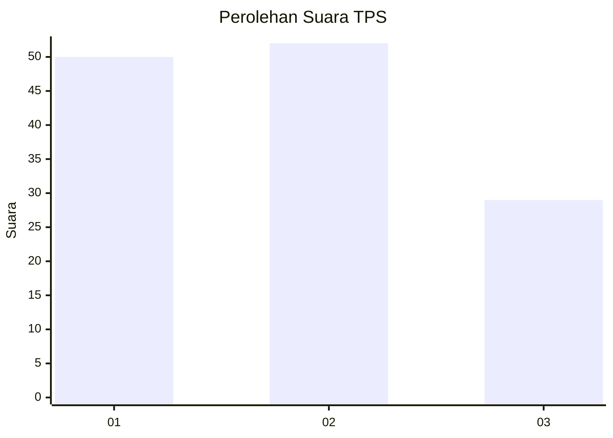
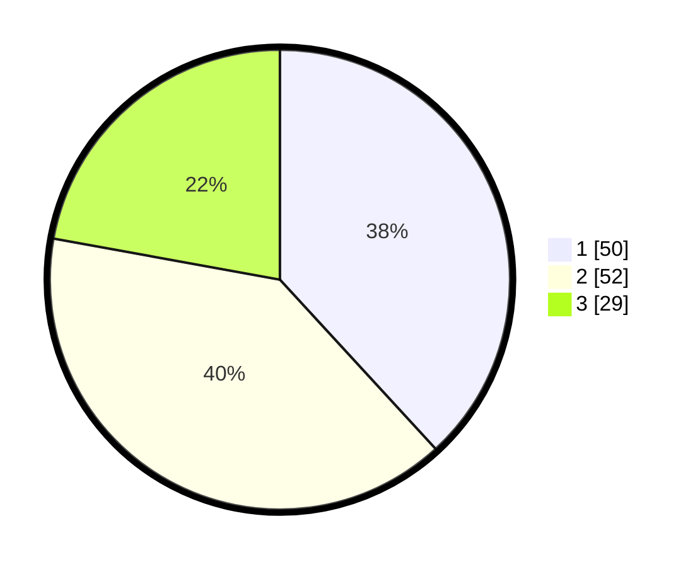

# Hasil

## Grafik

## Tabel

| No. | Nama Paslon    | Suara | Suara (raw) | Persentase |
|:--- |:-------------- | -----:| -----------:| ----------:|
| 1   | ANIES MUHAIMIN | 50    | [50][p-1]   | 38,17      |
| 2   | PRABOWO GIBRAN | 52    | [52][p-2]   | 39,69      |
| 3   | GANJAR MAHFUD  | 29    | [29][p-3]   | 22,14      |

[p-1]: https://github.com/gigit-pemilu/pemilu-2024/blob/main/pilpres/hitung-suara/sub/12-sumatera-utara/sub/71-kota-medan/sub/18-medan-perjuangan/sub/1007-sidorame-barat-i/sub/008-tps/sub/paslon-1.txt
[p-2]: https://github.com/gigit-pemilu/pemilu-2024/blob/main/pilpres/hitung-suara/sub/12-sumatera-utara/sub/71-kota-medan/sub/18-medan-perjuangan/sub/1007-sidorame-barat-i/sub/008-tps/sub/paslon-2.txt
[p-3]: https://github.com/gigit-pemilu/pemilu-2024/blob/main/pilpres/hitung-suara/sub/12-sumatera-utara/sub/71-kota-medan/sub/18-medan-perjuangan/sub/1007-sidorame-barat-i/sub/008-tps/sub/paslon-3.txt

## Foto C Plano

https://sirekap-obj-formc.kpu.go.id/6f6d/pemilu/ppwp/12/71/18/10/07/1271181007008-20240214-160118--45b10a94-6ca6-4881-8380-3be9c8d57f98.jpg

https://sirekap-obj-formc.kpu.go.id/6f6d/pemilu/ppwp/12/71/18/10/07/1271181007008-20240215-012347--fb6d00ab-c3ba-4113-b32a-dec9cdbd4236.jpg

https://sirekap-obj-formc.kpu.go.id/6f6d/pemilu/ppwp/12/71/18/10/07/1271181007008-20240215-012454--e449be46-7603-4c78-9a48-94baf7800242.jpg

## Metadata

| Key        | Value               |
| ---------- | ------------------- |
| Time Stamp | 2024-02-25 14:00:00 |

