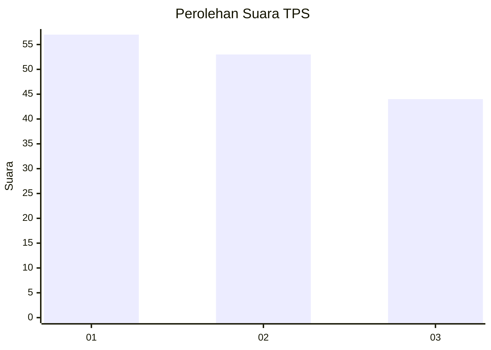
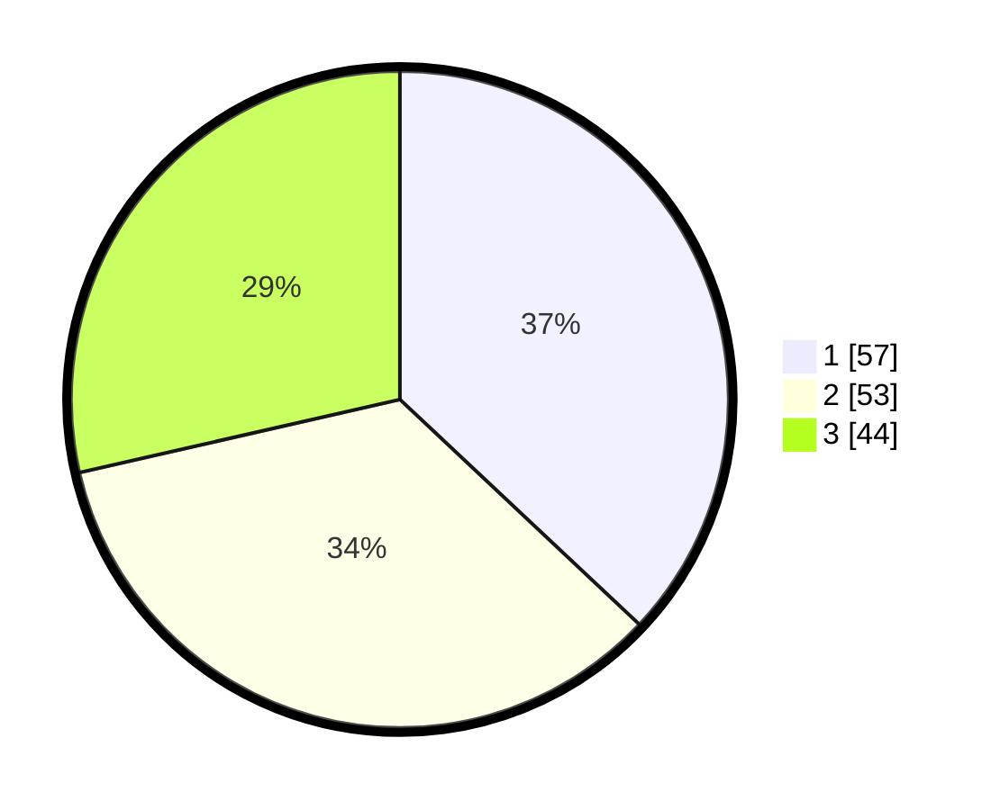

# Hasil

## Grafik

## Tabel

| No. | Nama Paslon    | Suara | Suara (raw) | Persentase |
|:--- |:-------------- | -----:| -----------:| ----------:|
| 1   | ANIES MUHAIMIN | 57    | [57][p-1]   | 37,01      |
| 2   | PRABOWO GIBRAN | 53    | [53][p-2]   | 34,42      |
| 3   | GANJAR MAHFUD  | 44    | [44][p-3]   | 28,57      |

[p-1]: https://github.com/gigit-pemilu/pemilu-2024/blob/main/pilpres/hitung-suara/sub/12-sumatera-utara/sub/71-kota-medan/sub/19-medan-petisah/sub/1002-sekip/sub/027-tps/sub/paslon-1.txt
[p-2]: https://github.com/gigit-pemilu/pemilu-2024/blob/main/pilpres/hitung-suara/sub/12-sumatera-utara/sub/71-kota-medan/sub/19-medan-petisah/sub/1002-sekip/sub/027-tps/sub/paslon-2.txt
[p-3]: https://github.com/gigit-pemilu/pemilu-2024/blob/main/pilpres/hitung-suara/sub/12-sumatera-utara/sub/71-kota-medan/sub/19-medan-petisah/sub/1002-sekip/sub/027-tps/sub/paslon-3.txt

## Foto C Plano

https://sirekap-obj-formc.kpu.go.id/ea35/pemilu/ppwp/12/71/19/10/02/1271191002027-20240214-155226--51b1dd56-8fbb-40c6-beca-885509874035.jpg

https://sirekap-obj-formc.kpu.go.id/ea35/pemilu/ppwp/12/71/19/10/02/1271191002027-20240214-155516--98cc2d12-94f8-4f87-88d5-537b8a04ac96.jpg

https://sirekap-obj-formc.kpu.go.id/ea35/pemilu/ppwp/12/71/19/10/02/1271191002027-20240214-155830--364770ec-ff36-4378-bcde-1cfa02f09cb8.jpg

## Metadata

| Key        | Value               |
| ---------- | ------------------- |
| Time Stamp | 2024-02-25 17:00:00 |

