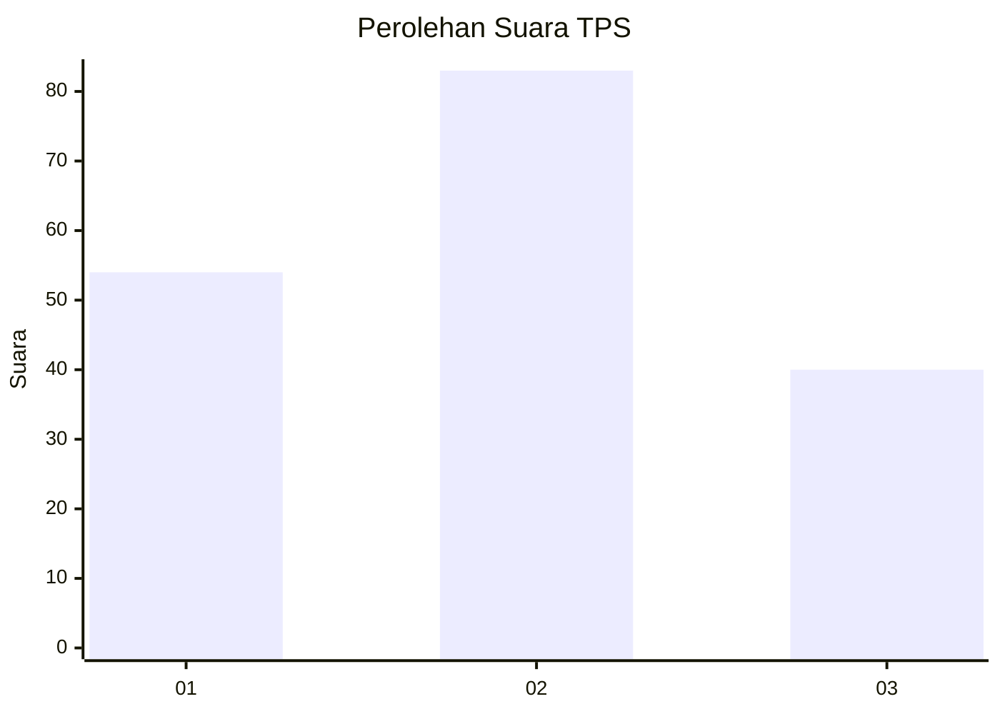
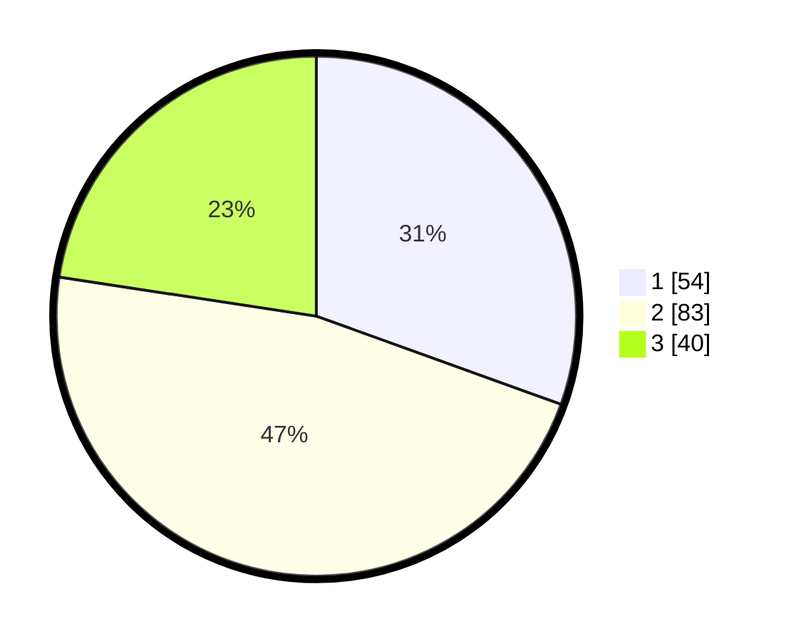

# Hasil

## Grafik

## Tabel

| No. | Nama Paslon    | Suara | Suara (raw) | Persentase |
|:--- |:-------------- | -----:| -----------:| ----------:|
| 1   | ANIES MUHAIMIN | 54    | [54][p-1]   | 30,51      |
| 2   | PRABOWO GIBRAN | 83    | [83][p-2]   | 46,89      |
| 3   | GANJAR MAHFUD  | 40    | [40][p-3]   | 22,60      |

[p-1]: https://github.com/gigit-pemilu/pemilu-2024/blob/main/pilpres/hitung-suara/sub/12-sumatera-utara/sub/71-kota-medan/sub/19-medan-petisah/sub/1003-sei-sikambing-d/sub/004-tps/sub/paslon-1.txt
[p-2]: https://github.com/gigit-pemilu/pemilu-2024/blob/main/pilpres/hitung-suara/sub/12-sumatera-utara/sub/71-kota-medan/sub/19-medan-petisah/sub/1003-sei-sikambing-d/sub/004-tps/sub/paslon-2.txt
[p-3]: https://github.com/gigit-pemilu/pemilu-2024/blob/main/pilpres/hitung-suara/sub/12-sumatera-utara/sub/71-kota-medan/sub/19-medan-petisah/sub/1003-sei-sikambing-d/sub/004-tps/sub/paslon-3.txt

## Foto C Plano

https://sirekap-obj-formc.kpu.go.id/33a3/pemilu/ppwp/12/71/19/10/03/1271191003004-20240214-233328--b04dced1-9907-49c4-b55f-59569aa53f7f.jpg

https://sirekap-obj-formc.kpu.go.id/33a3/pemilu/ppwp/12/71/19/10/03/1271191003004-20240214-233547--61621a80-83fd-4d5e-82c1-eb2eea2a2d01.jpg

https://sirekap-obj-formc.kpu.go.id/33a3/pemilu/ppwp/12/71/19/10/03/1271191003004-20240214-233811--fb2cbdca-c32a-4a1c-86dc-d4d58f56e55e.jpg

## Metadata

| Key        | Value               |
| ---------- | ------------------- |
| Time Stamp | 2024-02-24 22:31:28 |

