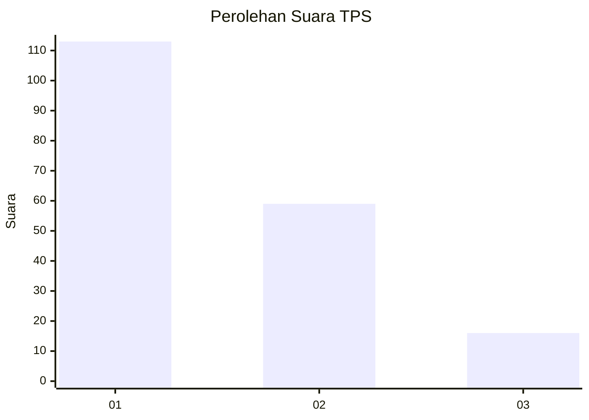
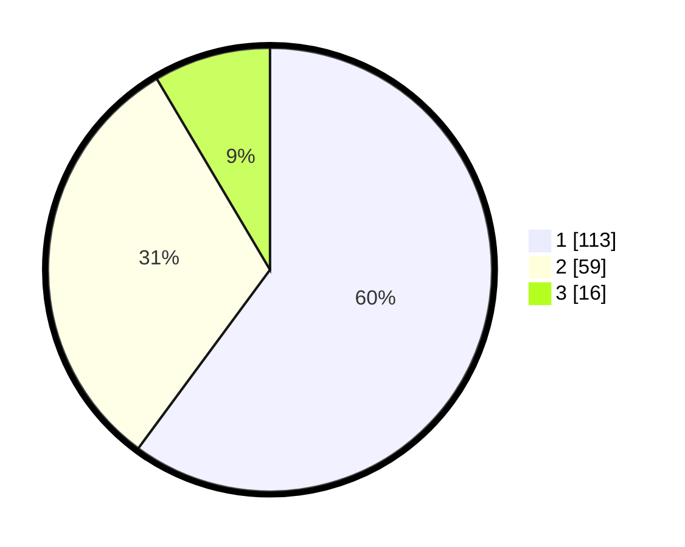

# Hasil

## Grafik

## Tabel

| No. | Nama Paslon    | Suara | Suara (raw) | Persentase |
|:--- |:-------------- | -----:| -----------:| ----------:|
| 1   | ANIES MUHAIMIN | 113   | [113][p-1]  | 60,11      |
| 2   | PRABOWO GIBRAN | 59    | [59][p-2]   | 31,38      |
| 3   | GANJAR MAHFUD  | 16    | [16][p-3]   | 8,51       |

[p-1]: https://github.com/gigit-pemilu/pemilu-2024-12-sumatera-utara/blob/main/pilpres/hitung-suara/sub/12-sumatera-utara/sub/71-kota-medan/sub/19-medan-petisah/sub/1003-sei-sikambing-d/sub/012-tps/sub/paslon-1.txt
[p-2]: https://github.com/gigit-pemilu/pemilu-2024-12-sumatera-utara/blob/main/pilpres/hitung-suara/sub/12-sumatera-utara/sub/71-kota-medan/sub/19-medan-petisah/sub/1003-sei-sikambing-d/sub/012-tps/sub/paslon-2.txt
[p-3]: https://github.com/gigit-pemilu/pemilu-2024-12-sumatera-utara/blob/main/pilpres/hitung-suara/sub/12-sumatera-utara/sub/71-kota-medan/sub/19-medan-petisah/sub/1003-sei-sikambing-d/sub/012-tps/sub/paslon-3.txt

## Foto C Plano

https://sirekap-obj-formc.kpu.go.id/d65b/pemilu/ppwp/12/71/19/10/03/1271191003012-20240214-211202--d35ba520-0b3d-4d16-876b-d28711bc5d7d.jpg

https://sirekap-obj-formc.kpu.go.id/d65b/pemilu/ppwp/12/71/19/10/03/1271191003012-20240214-211320--0714416d-8e06-4be9-809f-87d557dec81c.jpg

https://sirekap-obj-formc.kpu.go.id/d65b/pemilu/ppwp/12/71/19/10/03/1271191003012-20240214-211413--fd5fb7f5-cb03-42ad-80c2-b11904e6acfc.jpg

## Metadata

| Key        | Value               |
| ---------- | ------------------- |
| Time Stamp | 2024-02-25 20:00:00 |

