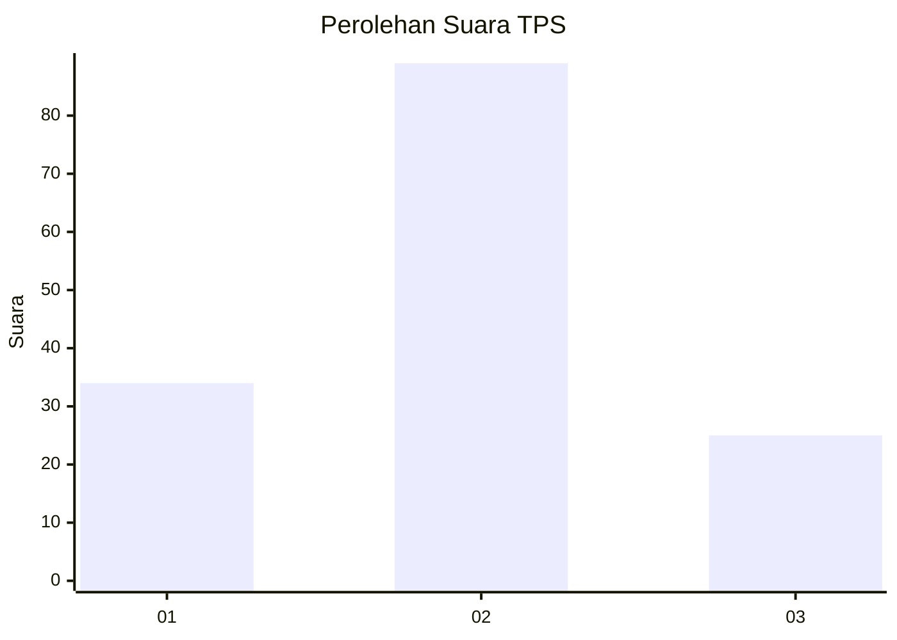
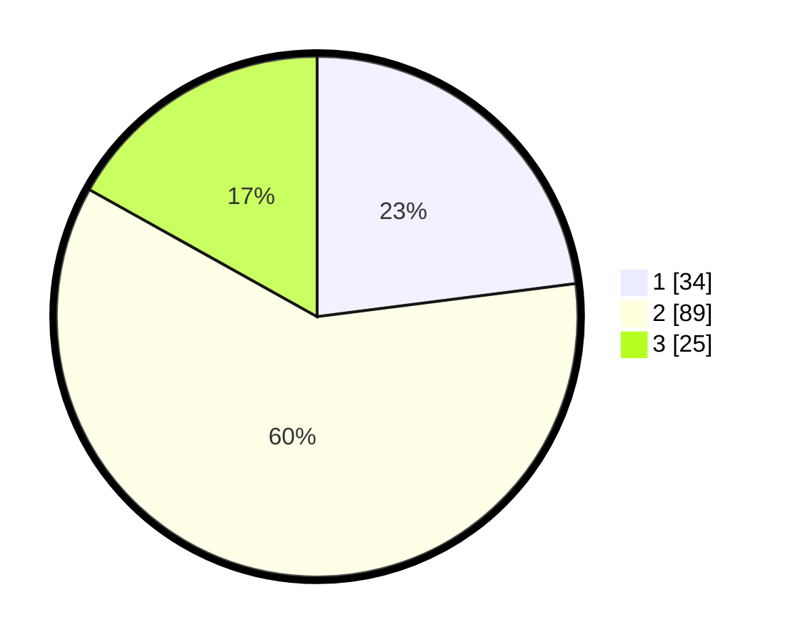

# Hasil

## Grafik

## Tabel

| No. | Nama Paslon    | Suara | Suara (raw) | Persentase |
|:--- |:-------------- | -----:| -----------:| ----------:|
| 1   | ANIES MUHAIMIN | 34    | [34][p-1]   | 22,97      |
| 2   | PRABOWO GIBRAN | 89    | [89][p-2]   | 60,14      |
| 3   | GANJAR MAHFUD  | 25    | [25][p-3]   | 16,89      |

[p-1]: https://github.com/gigit-pemilu/pemilu-2024/blob/main/pilpres/hitung-suara/sub/12-sumatera-utara/sub/71-kota-medan/sub/19-medan-petisah/sub/1003-sei-sikambing-d/sub/029-tps/sub/paslon-1.txt
[p-2]: https://github.com/gigit-pemilu/pemilu-2024/blob/main/pilpres/hitung-suara/sub/12-sumatera-utara/sub/71-kota-medan/sub/19-medan-petisah/sub/1003-sei-sikambing-d/sub/029-tps/sub/paslon-2.txt
[p-3]: https://github.com/gigit-pemilu/pemilu-2024/blob/main/pilpres/hitung-suara/sub/12-sumatera-utara/sub/71-kota-medan/sub/19-medan-petisah/sub/1003-sei-sikambing-d/sub/029-tps/sub/paslon-3.txt

## Foto C Plano

https://sirekap-obj-formc.kpu.go.id/9d39/pemilu/ppwp/12/71/19/10/03/1271191003029-20240214-235320--af0532e9-7d36-4dad-9aad-83cb6c3dba95.jpg

https://sirekap-obj-formc.kpu.go.id/9d39/pemilu/ppwp/12/71/19/10/03/1271191003029-20240214-235429--6e955e43-96d2-416e-bd23-e3f1a7033907.jpg

https://sirekap-obj-formc.kpu.go.id/9d39/pemilu/ppwp/12/71/19/10/03/1271191003029-20240215-000312--c0c93fea-4ada-4697-9719-9bc4d42c6e4c.jpg

## Metadata

| Key        | Value               |
| ---------- | ------------------- |
| Time Stamp | 2024-02-24 22:31:28 |

