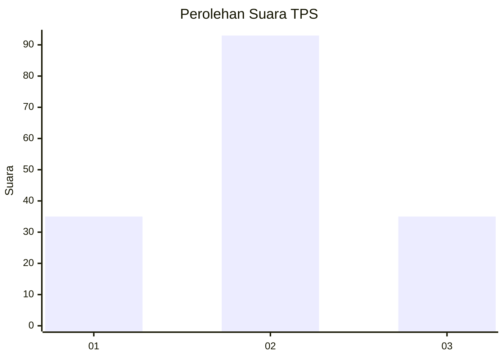
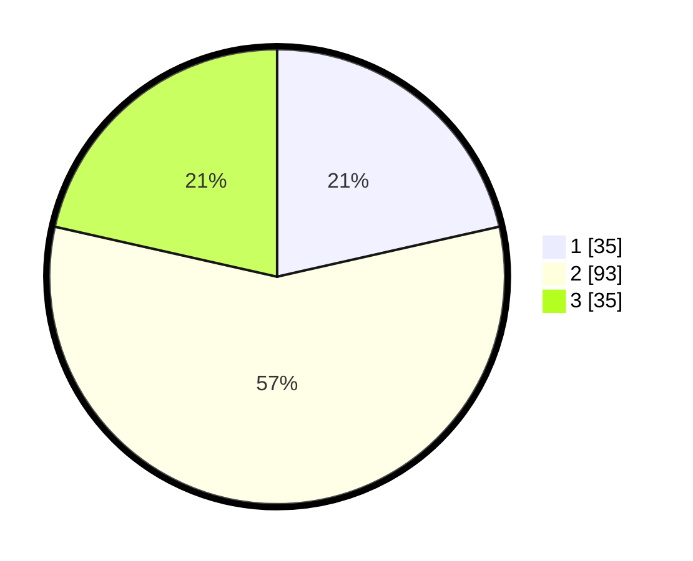

# Hasil

## Grafik

## Tabel

| No. | Nama Paslon    | Suara | Suara (raw) | Persentase |
|:--- |:-------------- | -----:| -----------:| ----------:|
| 1   | ANIES MUHAIMIN | 35    | [35][p-1]   | 21,47      |
| 2   | PRABOWO GIBRAN | 93    | [93][p-2]   | 57,06      |
| 3   | GANJAR MAHFUD  | 35    | [35][p-3]   | 21,47      |

[p-1]: https://github.com/gigit-pemilu/pemilu-2024/blob/main/pilpres/hitung-suara/sub/12-sumatera-utara/sub/71-kota-medan/sub/19-medan-petisah/sub/1007-sei-putih-timur-ii/sub/019-tps/sub/paslon-1.txt
[p-2]: https://github.com/gigit-pemilu/pemilu-2024/blob/main/pilpres/hitung-suara/sub/12-sumatera-utara/sub/71-kota-medan/sub/19-medan-petisah/sub/1007-sei-putih-timur-ii/sub/019-tps/sub/paslon-2.txt
[p-3]: https://github.com/gigit-pemilu/pemilu-2024/blob/main/pilpres/hitung-suara/sub/12-sumatera-utara/sub/71-kota-medan/sub/19-medan-petisah/sub/1007-sei-putih-timur-ii/sub/019-tps/sub/paslon-3.txt

## Foto C Plano

https://sirekap-obj-formc.kpu.go.id/0f0f/pemilu/ppwp/12/71/19/10/07/1271191007019-20240215-014936--8a4a1e7b-8612-4acc-8936-3645d88e0e33.jpg

https://sirekap-obj-formc.kpu.go.id/0f0f/pemilu/ppwp/12/71/19/10/07/1271191007019-20240215-015027--a71cf322-266e-4e72-b5ca-0744788a537c.jpg

https://sirekap-obj-formc.kpu.go.id/0f0f/pemilu/ppwp/12/71/19/10/07/1271191007019-20240215-015106--0ea82375-435c-4901-9ffa-94c930728a31.jpg

## Metadata

| Key        | Value               |
| ---------- | ------------------- |
| Time Stamp | 2024-02-25 13:00:00 |

