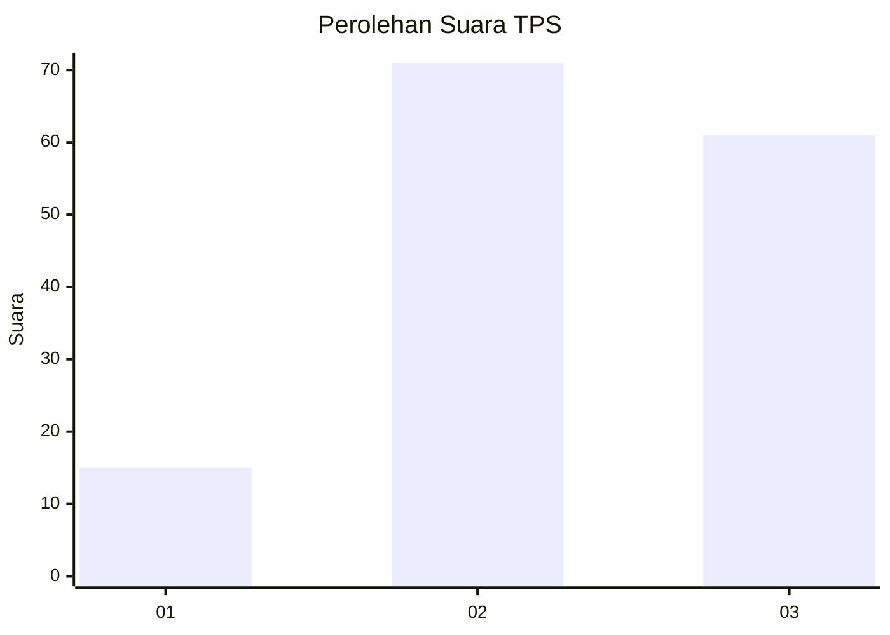
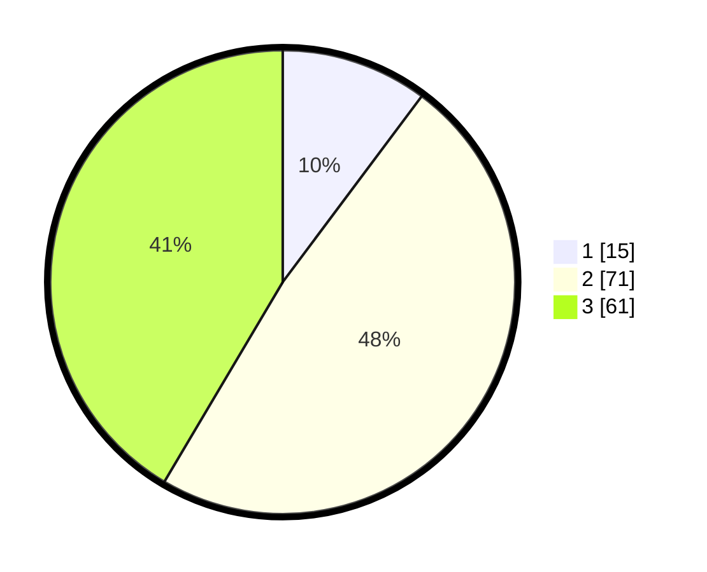

# Hasil

## Grafik

## Tabel

| No. | Nama Paslon    | Suara | Suara (raw) | Persentase |
|:--- |:-------------- | -----:| -----------:| ----------:|
| 1   | ANIES MUHAIMIN | 15    | [15][p-1]   | 10,20      |
| 2   | PRABOWO GIBRAN | 71    | [71][p-2]   | 48,30      |
| 3   | GANJAR MAHFUD  | 61    | [61][p-3]   | 41,50      |

[p-1]: https://github.com/gigit-pemilu/pemilu-2024/blob/main/pilpres/hitung-suara/sub/12-sumatera-utara/sub/71-kota-medan/sub/19-medan-petisah/sub/1007-sei-putih-timur-ii/sub/020-tps/sub/paslon-1.txt
[p-2]: https://github.com/gigit-pemilu/pemilu-2024/blob/main/pilpres/hitung-suara/sub/12-sumatera-utara/sub/71-kota-medan/sub/19-medan-petisah/sub/1007-sei-putih-timur-ii/sub/020-tps/sub/paslon-2.txt
[p-3]: https://github.com/gigit-pemilu/pemilu-2024/blob/main/pilpres/hitung-suara/sub/12-sumatera-utara/sub/71-kota-medan/sub/19-medan-petisah/sub/1007-sei-putih-timur-ii/sub/020-tps/sub/paslon-3.txt

## Foto C Plano

https://sirekap-obj-formc.kpu.go.id/1235/pemilu/ppwp/12/71/19/10/07/1271191007020-20240215-011028--c4c8cad8-2723-4a94-9301-34fb8f8ddaf6.jpg

https://sirekap-obj-formc.kpu.go.id/1235/pemilu/ppwp/12/71/19/10/07/1271191007020-20240215-011135--fa82ecf2-376b-4499-8a24-382419be2c24.jpg

https://sirekap-obj-formc.kpu.go.id/1235/pemilu/ppwp/12/71/19/10/07/1271191007020-20240215-011251--e5a73cba-5431-4cb9-af29-2e7ca005a2e2.jpg

## Metadata

| Key        | Value               |
| ---------- | ------------------- |
| Time Stamp | 2024-02-25 16:00:00 |

