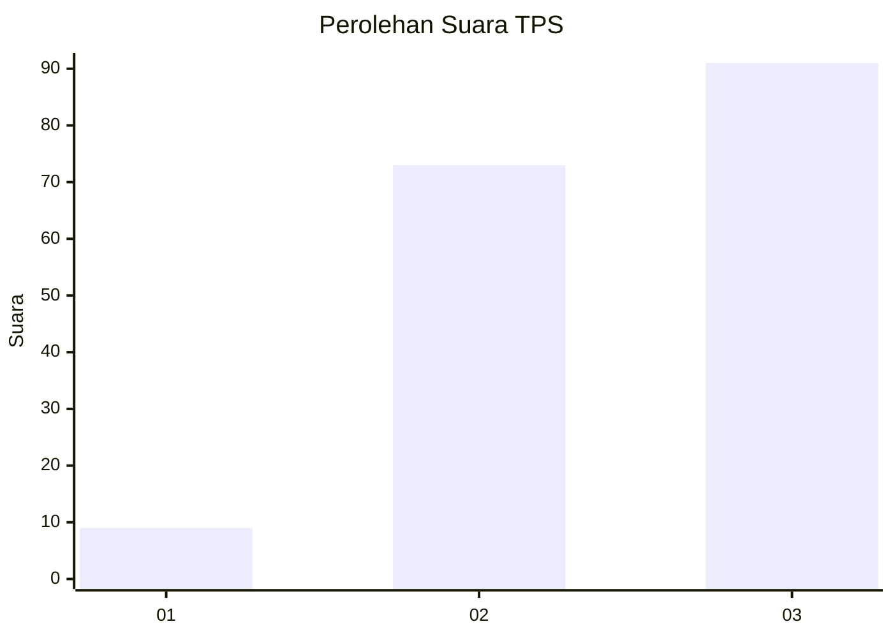
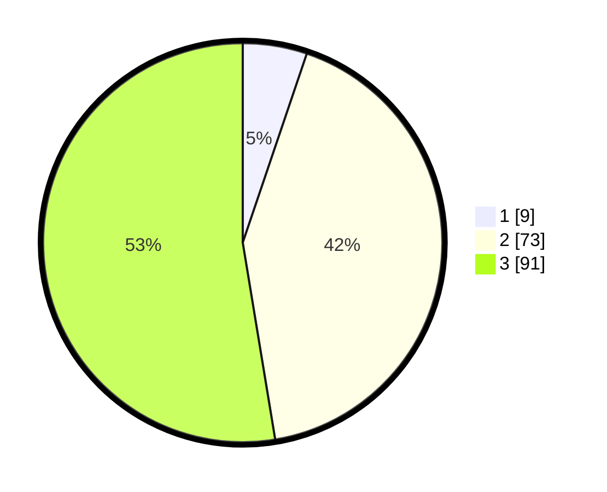

# Hasil

## Grafik

## Tabel

| No. | Nama Paslon    | Suara | Suara (raw) | Persentase |
|:--- |:-------------- | -----:| -----------:| ----------:|
| 1   | ANIES MUHAIMIN | 9     | [9][p-1]    | 5,20       |
| 2   | PRABOWO GIBRAN | 73    | [73][p-2]   | 42,20      |
| 3   | GANJAR MAHFUD  | 91    | [91][p-3]   | 52,60      |

[p-1]: https://github.com/gigit-pemilu/pemilu-2024/blob/main/pilpres/hitung-suara/sub/12-sumatera-utara/sub/71-kota-medan/sub/20-medan-timur/sub/1001-gang-buntu/sub/006-tps/sub/paslon-1.txt
[p-2]: https://github.com/gigit-pemilu/pemilu-2024/blob/main/pilpres/hitung-suara/sub/12-sumatera-utara/sub/71-kota-medan/sub/20-medan-timur/sub/1001-gang-buntu/sub/006-tps/sub/paslon-2.txt
[p-3]: https://github.com/gigit-pemilu/pemilu-2024/blob/main/pilpres/hitung-suara/sub/12-sumatera-utara/sub/71-kota-medan/sub/20-medan-timur/sub/1001-gang-buntu/sub/006-tps/sub/paslon-3.txt

## Foto C Plano

https://sirekap-obj-formc.kpu.go.id/2b5b/pemilu/ppwp/12/71/20/10/01/1271201001006-20240214-213641--adabb175-ea47-482a-b66d-119cf887c6b8.jpg

https://sirekap-obj-formc.kpu.go.id/2b5b/pemilu/ppwp/12/71/20/10/01/1271201001006-20240214-192525--797bff52-2d8a-4dc8-b6a0-1467c78dd10e.jpg

https://sirekap-obj-formc.kpu.go.id/2b5b/pemilu/ppwp/12/71/20/10/01/1271201001006-20240214-195146--ff88e92a-92bf-44c7-81c8-d5a5e2fa550f.jpg

## Metadata

| Key        | Value               |
| ---------- | ------------------- |
| Time Stamp | 2024-02-15 23:29:50 |

