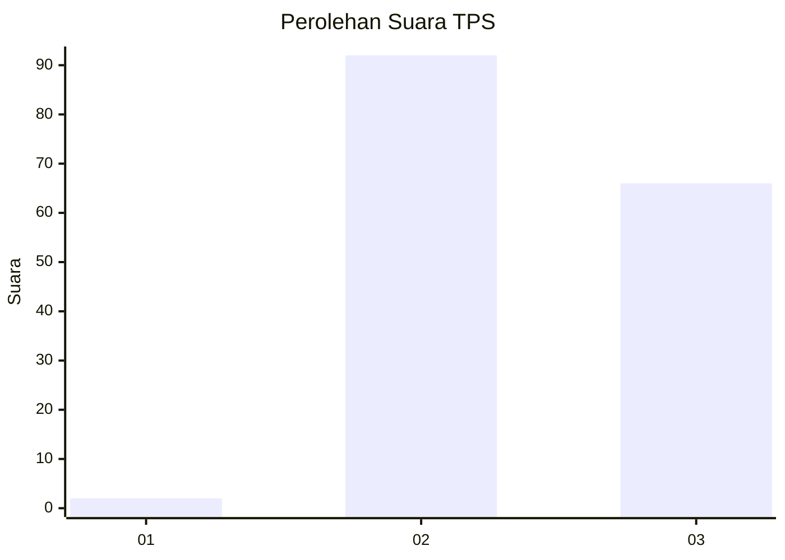
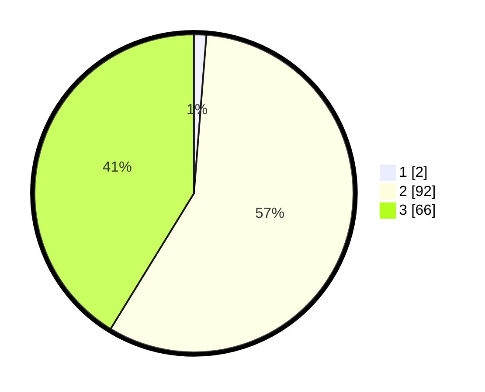

# Hasil

## Grafik

## Tabel

| No. | Nama Paslon    | Suara | Suara (raw) | Persentase |
|:--- |:-------------- | -----:| -----------:| ----------:|
| 1   | ANIES MUHAIMIN | 2     | [2][p-1]    | 1,25       |
| 2   | PRABOWO GIBRAN | 92    | [92][p-2]   | 57,50      |
| 3   | GANJAR MAHFUD  | 66    | [66][p-3]   | 41,25      |

[p-1]: https://github.com/gigit-pemilu/pemilu-2024-12-sumatera-utara/blob/main/pilpres/hitung-suara/sub/12-sumatera-utara/sub/71-kota-medan/sub/20-medan-timur/sub/1002-sidodadi/sub/002-tps/sub/paslon-1.txt
[p-2]: https://github.com/gigit-pemilu/pemilu-2024-12-sumatera-utara/blob/main/pilpres/hitung-suara/sub/12-sumatera-utara/sub/71-kota-medan/sub/20-medan-timur/sub/1002-sidodadi/sub/002-tps/sub/paslon-2.txt
[p-3]: https://github.com/gigit-pemilu/pemilu-2024-12-sumatera-utara/blob/main/pilpres/hitung-suara/sub/12-sumatera-utara/sub/71-kota-medan/sub/20-medan-timur/sub/1002-sidodadi/sub/002-tps/sub/paslon-3.txt

## Foto C Plano

https://sirekap-obj-formc.kpu.go.id/d7dd/pemilu/ppwp/12/71/20/10/02/1271201002002-20240214-155631--662fb10d-c1d9-4fa2-87f2-13599c454842.jpg

https://sirekap-obj-formc.kpu.go.id/d7dd/pemilu/ppwp/12/71/20/10/02/1271201002002-20240214-155535--e7e0a0df-7bb9-43ef-ac97-c01177a3e7d1.jpg

https://sirekap-obj-formc.kpu.go.id/d7dd/pemilu/ppwp/12/71/20/10/02/1271201002002-20240214-155708--26a38492-88d1-4172-9c1a-4ccfc91860c1.jpg

## Metadata

| Key        | Value               |
| ---------- | ------------------- |
| Time Stamp | 2024-02-16 14:00:34 |

