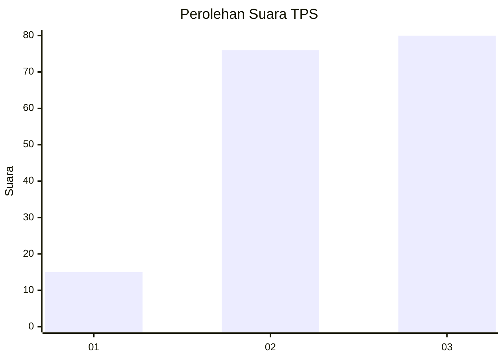
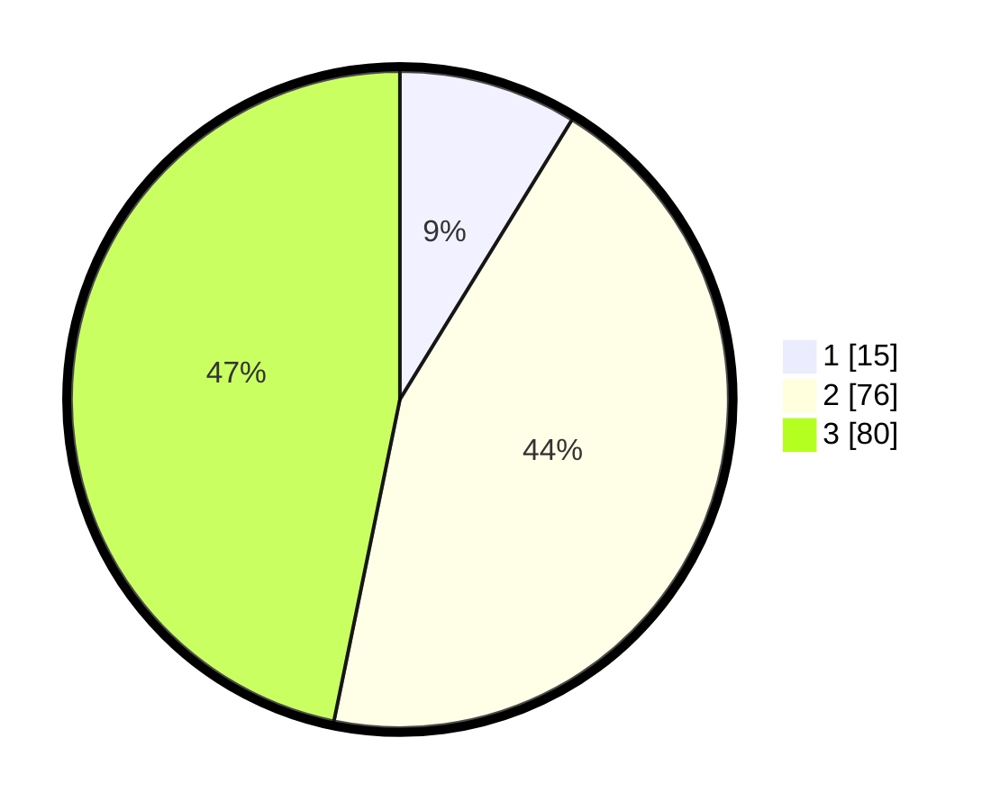

# Hasil

## Grafik

## Tabel

| No. | Nama Paslon    | Suara | Suara (raw) | Persentase |
|:--- |:-------------- | -----:| -----------:| ----------:|
| 1   | ANIES MUHAIMIN | 15    | [15][p-1]   | 8,77       |
| 2   | PRABOWO GIBRAN | 76    | [76][p-2]   | 44,44      |
| 3   | GANJAR MAHFUD  | 80    | [80][p-3]   | 46,78      |

[p-1]: https://github.com/gigit-pemilu/pemilu-2024/blob/main/pilpres/hitung-suara/sub/12-sumatera-utara/sub/71-kota-medan/sub/20-medan-timur/sub/1002-sidodadi/sub/016-tps/sub/paslon-1.txt
[p-2]: https://github.com/gigit-pemilu/pemilu-2024/blob/main/pilpres/hitung-suara/sub/12-sumatera-utara/sub/71-kota-medan/sub/20-medan-timur/sub/1002-sidodadi/sub/016-tps/sub/paslon-2.txt
[p-3]: https://github.com/gigit-pemilu/pemilu-2024/blob/main/pilpres/hitung-suara/sub/12-sumatera-utara/sub/71-kota-medan/sub/20-medan-timur/sub/1002-sidodadi/sub/016-tps/sub/paslon-3.txt

## Foto C Plano

https://sirekap-obj-formc.kpu.go.id/56eb/pemilu/ppwp/12/71/20/10/02/1271201002016-20240214-220050--f8207f34-367b-4261-8359-545211cedbe0.jpg

https://sirekap-obj-formc.kpu.go.id/56eb/pemilu/ppwp/12/71/20/10/02/1271201002016-20240214-220322--6d7049ce-4551-4a07-bd48-6cd9c53899dc.jpg

https://sirekap-obj-formc.kpu.go.id/56eb/pemilu/ppwp/12/71/20/10/02/1271201002016-20240214-220757--6803cf67-9c28-460c-ae84-bf73133d3ddb.jpg

## Metadata

| Key        | Value               |
| ---------- | ------------------- |
| Time Stamp | 2024-02-16 14:30:33 |

