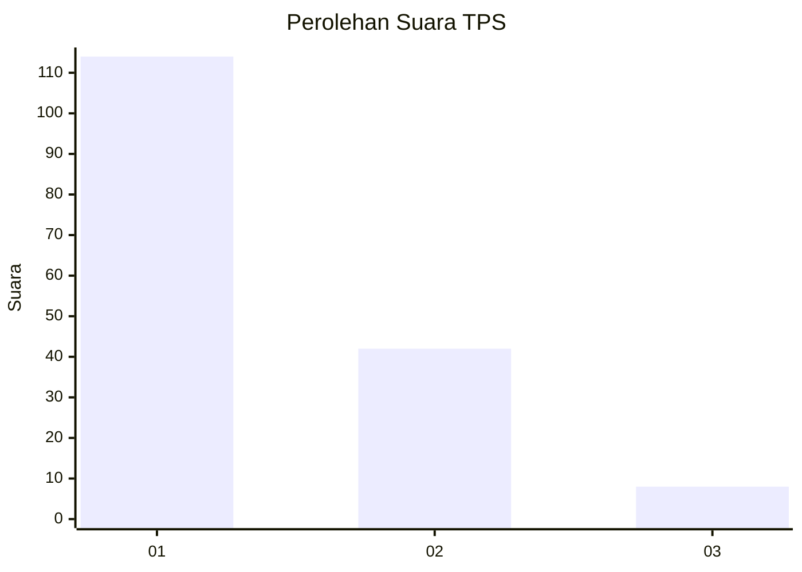
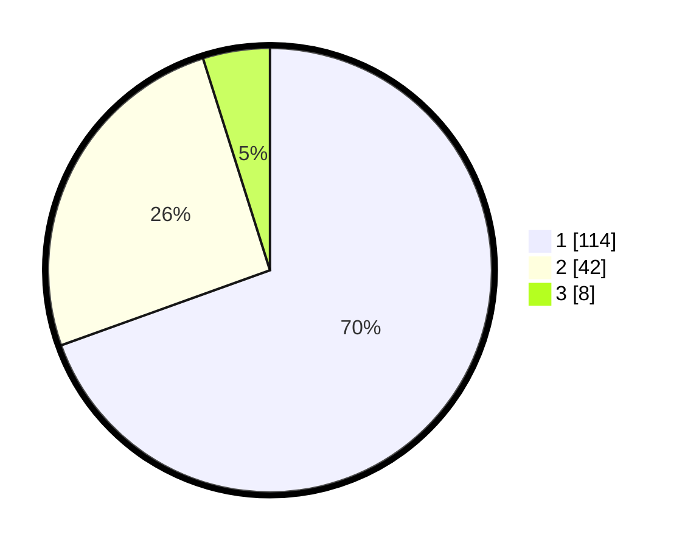

# Hasil

## Grafik

## Tabel

| No. | Nama Paslon    | Suara | Suara (raw) | Persentase |
|:--- |:-------------- | -----:| -----------:| ----------:|
| 1   | ANIES MUHAIMIN | 114   | [114][p-1]  | 69,51      |
| 2   | PRABOWO GIBRAN | 42    | [42][p-2]   | 25,61      |
| 3   | GANJAR MAHFUD  | 8     | [8][p-3]    | 4,88       |

[p-1]: https://github.com/gigit-pemilu/pemilu-2024-12-sumatera-utara/blob/main/pilpres/hitung-suara/sub/12-sumatera-utara/sub/71-kota-medan/sub/20-medan-timur/sub/1004-glugur-darat-i/sub/019-tps/sub/paslon-1.txt
[p-2]: https://github.com/gigit-pemilu/pemilu-2024-12-sumatera-utara/blob/main/pilpres/hitung-suara/sub/12-sumatera-utara/sub/71-kota-medan/sub/20-medan-timur/sub/1004-glugur-darat-i/sub/019-tps/sub/paslon-2.txt
[p-3]: https://github.com/gigit-pemilu/pemilu-2024-12-sumatera-utara/blob/main/pilpres/hitung-suara/sub/12-sumatera-utara/sub/71-kota-medan/sub/20-medan-timur/sub/1004-glugur-darat-i/sub/019-tps/sub/paslon-3.txt

## Foto C Plano

https://sirekap-obj-formc.kpu.go.id/a5c1/pemilu/ppwp/12/71/20/10/04/1271201004019-20240214-223957--65df742a-e6c5-4c28-b841-3e06a9e5ef7c.jpg

https://sirekap-obj-formc.kpu.go.id/a5c1/pemilu/ppwp/12/71/20/10/04/1271201004019-20240214-224630--b4d5ab71-9397-43e7-b8e6-3cd932f0c638.jpg

https://sirekap-obj-formc.kpu.go.id/a5c1/pemilu/ppwp/12/71/20/10/04/1271201004019-20240214-224446--25c3042e-108b-40f7-b96b-73bea6089011.jpg

## Metadata

| Key        | Value               |
| ---------- | ------------------- |
| Time Stamp | 2024-02-15 23:29:50 |

