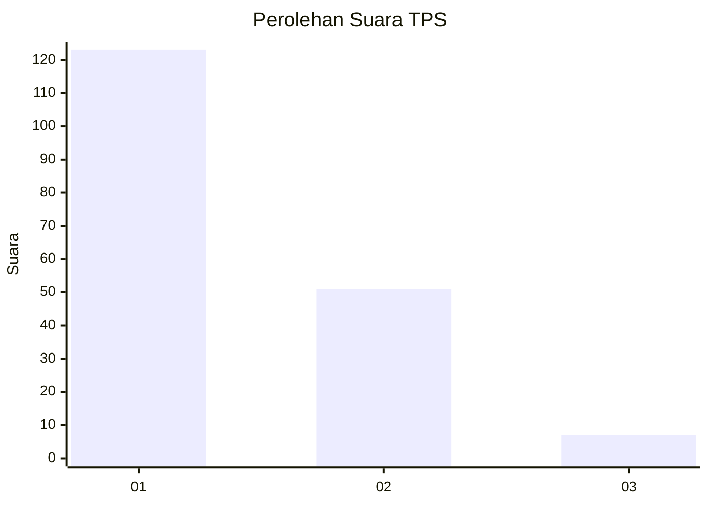
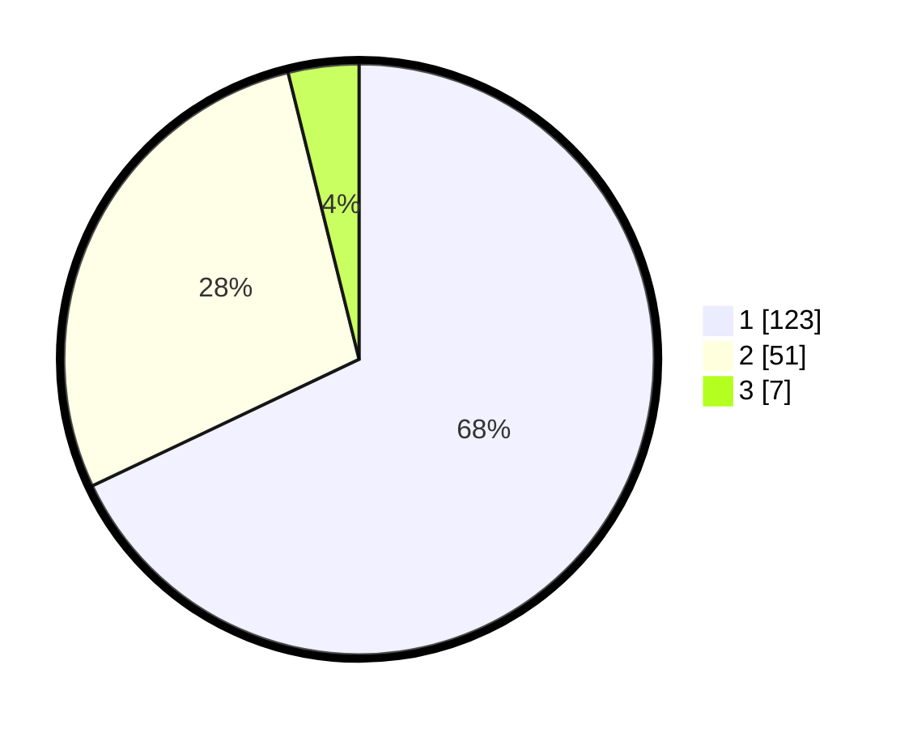

# Hasil

## Grafik

## Tabel

| No. | Nama Paslon    | Suara | Suara (raw) | Persentase |
|:--- |:-------------- | -----:| -----------:| ----------:|
| 1   | ANIES MUHAIMIN | 123   | [123][p-1]  | 67,96      |
| 2   | PRABOWO GIBRAN | 51    | [51][p-2]   | 28,18      |
| 3   | GANJAR MAHFUD  | 7     | [7][p-3]    | 3,87       |

[p-1]: https://github.com/gigit-pemilu/pemilu-2024/blob/main/pilpres/hitung-suara/sub/12-sumatera-utara/sub/71-kota-medan/sub/20-medan-timur/sub/1004-glugur-darat-i/sub/022-tps/sub/paslon-1.txt
[p-2]: https://github.com/gigit-pemilu/pemilu-2024/blob/main/pilpres/hitung-suara/sub/12-sumatera-utara/sub/71-kota-medan/sub/20-medan-timur/sub/1004-glugur-darat-i/sub/022-tps/sub/paslon-2.txt
[p-3]: https://github.com/gigit-pemilu/pemilu-2024/blob/main/pilpres/hitung-suara/sub/12-sumatera-utara/sub/71-kota-medan/sub/20-medan-timur/sub/1004-glugur-darat-i/sub/022-tps/sub/paslon-3.txt

## Foto C Plano

https://sirekap-obj-formc.kpu.go.id/7e67/pemilu/ppwp/12/71/20/10/04/1271201004022-20240215-040021--89bed490-c579-421b-b48a-a88ac178beb3.jpg

https://sirekap-obj-formc.kpu.go.id/7e67/pemilu/ppwp/12/71/20/10/04/1271201004022-20240215-040242--8816d6ba-d453-4fff-b1c5-2743df4aedbd.jpg

https://sirekap-obj-formc.kpu.go.id/7e67/pemilu/ppwp/12/71/20/10/04/1271201004022-20240215-040527--67b2df53-c34a-4beb-9c13-2a4f51a1f4f8.jpg

## Metadata

| Key        | Value               |
| ---------- | ------------------- |
| Time Stamp | 2024-02-16 23:00:00 |

