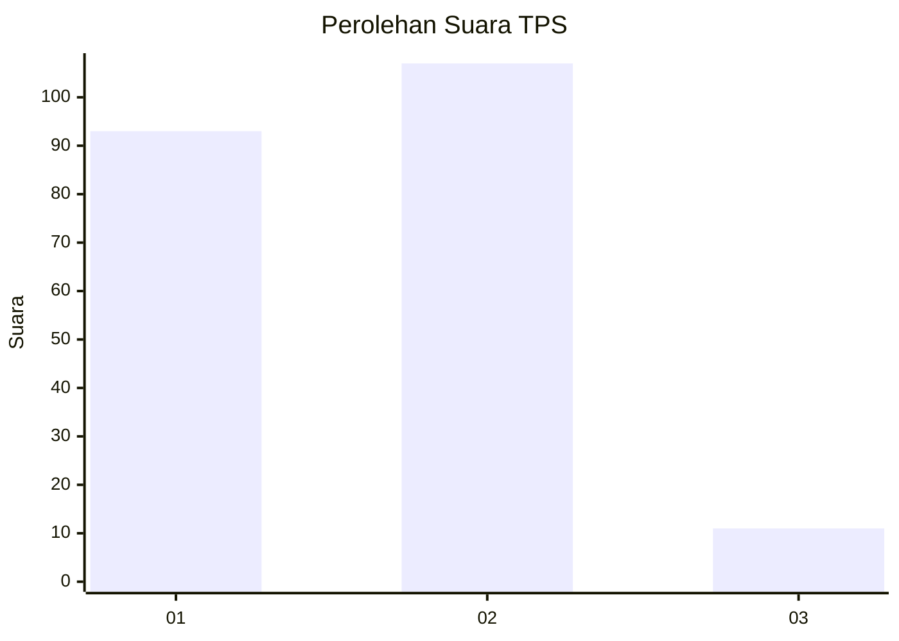
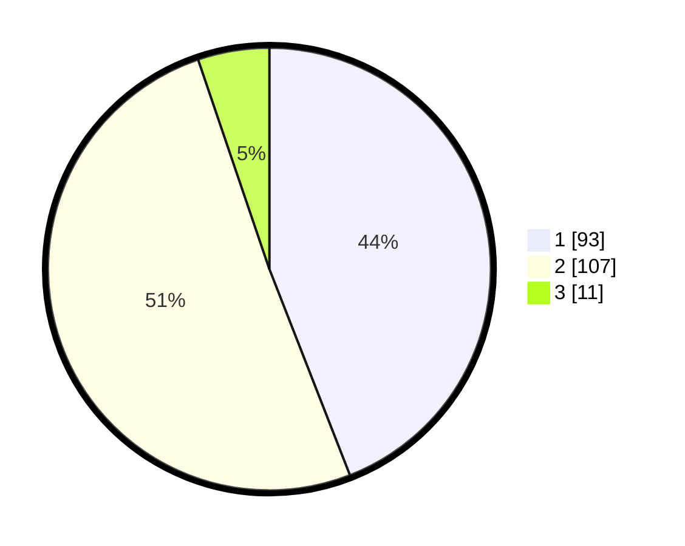

# Hasil

## Grafik

## Tabel

| No. | Nama Paslon    | Suara | Suara (raw) | Persentase |
|:--- |:-------------- | -----:| -----------:| ----------:|
| 1   | ANIES MUHAIMIN | 93    | [93][p-1]   | 44,08      |
| 2   | PRABOWO GIBRAN | 107   | [107][p-2]  | 50,71      |
| 3   | GANJAR MAHFUD  | 11    | [11][p-3]   | 5,21       |

[p-1]: https://github.com/gigit-pemilu/pemilu-2024/blob/main/pilpres/hitung-suara/sub/12-sumatera-utara/sub/71-kota-medan/sub/20-medan-timur/sub/1005-glugur-darat-ii/sub/018-tps/sub/paslon-1.txt
[p-2]: https://github.com/gigit-pemilu/pemilu-2024/blob/main/pilpres/hitung-suara/sub/12-sumatera-utara/sub/71-kota-medan/sub/20-medan-timur/sub/1005-glugur-darat-ii/sub/018-tps/sub/paslon-2.txt
[p-3]: https://github.com/gigit-pemilu/pemilu-2024/blob/main/pilpres/hitung-suara/sub/12-sumatera-utara/sub/71-kota-medan/sub/20-medan-timur/sub/1005-glugur-darat-ii/sub/018-tps/sub/paslon-3.txt

## Foto C Plano

https://sirekap-obj-formc.kpu.go.id/9a9b/pemilu/ppwp/12/71/20/10/05/1271201005018-20240214-193348--bbdcf91e-bfaa-4e95-aafe-7d5eeedda47d.jpg

https://sirekap-obj-formc.kpu.go.id/9a9b/pemilu/ppwp/12/71/20/10/05/1271201005018-20240214-193531--407c85fe-fbd4-4b3d-8445-cf2849d253fb.jpg

https://sirekap-obj-formc.kpu.go.id/9a9b/pemilu/ppwp/12/71/20/10/05/1271201005018-20240214-193645--11390cf8-dadb-41cc-9075-8cc855bf7adc.jpg

## Metadata

| Key        | Value               |
| ---------- | ------------------- |
| Time Stamp | 2024-02-16 23:45:47 |

