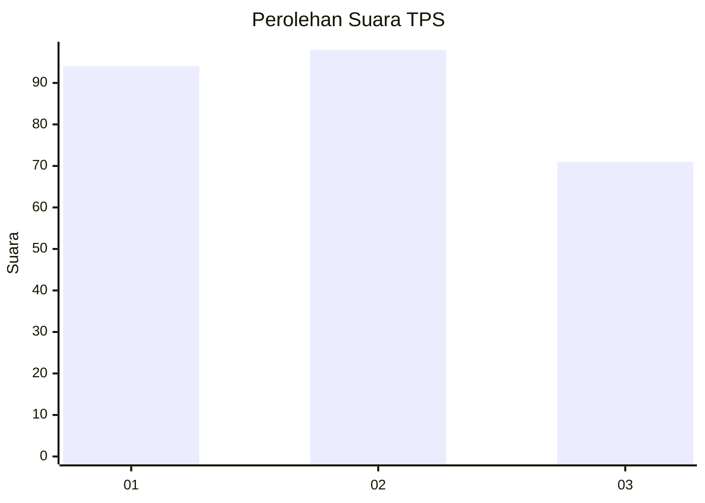
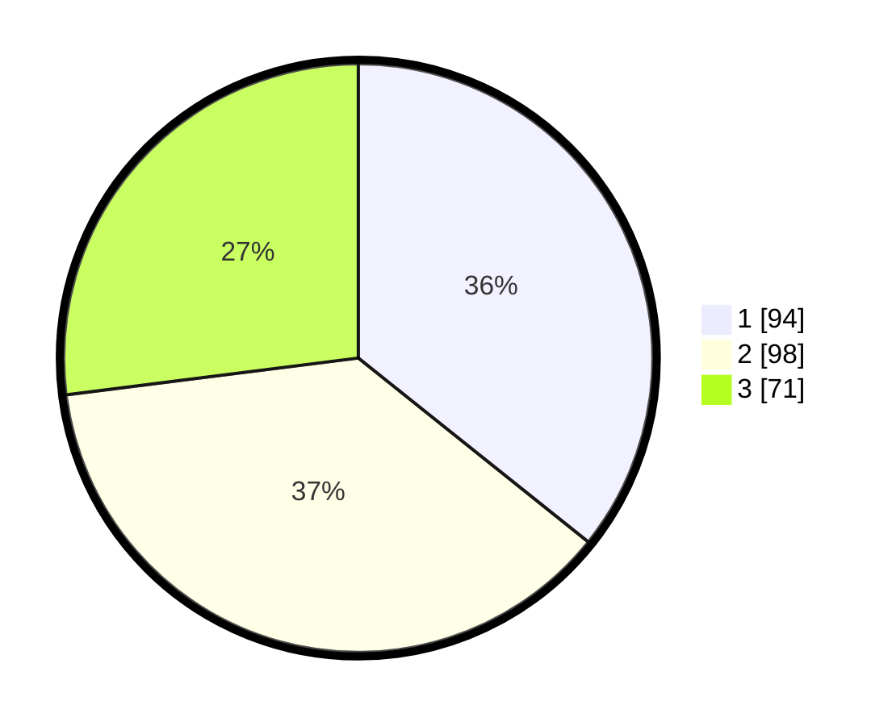

# Hasil

## Grafik

## Tabel

| No. | Nama Paslon    | Suara | Suara (raw) | Persentase |
|:--- |:-------------- | -----:| -----------:| ----------:|
| 1   | ANIES MUHAIMIN | 94    | [94][p-1]   | 35,74      |
| 2   | PRABOWO GIBRAN | 98    | [98][p-2]   | 37,26      |
| 3   | GANJAR MAHFUD  | 71    | [71][p-3]   | 27,00      |

[p-1]: https://github.com/gigit-pemilu/pemilu-2024-12-sumatera-utara/blob/main/pilpres/hitung-suara/sub/12-sumatera-utara/sub/71-kota-medan/sub/20-medan-timur/sub/1005-glugur-darat-ii/sub/019-tps/sub/paslon-1.txt
[p-2]: https://github.com/gigit-pemilu/pemilu-2024-12-sumatera-utara/blob/main/pilpres/hitung-suara/sub/12-sumatera-utara/sub/71-kota-medan/sub/20-medan-timur/sub/1005-glugur-darat-ii/sub/019-tps/sub/paslon-2.txt
[p-3]: https://github.com/gigit-pemilu/pemilu-2024-12-sumatera-utara/blob/main/pilpres/hitung-suara/sub/12-sumatera-utara/sub/71-kota-medan/sub/20-medan-timur/sub/1005-glugur-darat-ii/sub/019-tps/sub/paslon-3.txt

## Foto C Plano

https://sirekap-obj-formc.kpu.go.id/a46c/pemilu/ppwp/12/71/20/10/05/1271201005019-20240215-040149--d578f276-2e8a-4209-ad4c-ebd66b006cc5.jpg

https://sirekap-obj-formc.kpu.go.id/a46c/pemilu/ppwp/12/71/20/10/05/1271201005019-20240215-040239--2d397a2f-b313-44a0-96b5-7a56bedaf5ab.jpg

https://sirekap-obj-formc.kpu.go.id/a46c/pemilu/ppwp/12/71/20/10/05/1271201005019-20240215-040314--376238fd-d73f-40f2-904c-47b9e50ae342.jpg

## Metadata

| Key        | Value               |
| ---------- | ------------------- |
| Time Stamp | 2024-02-25 00:00:00 |

