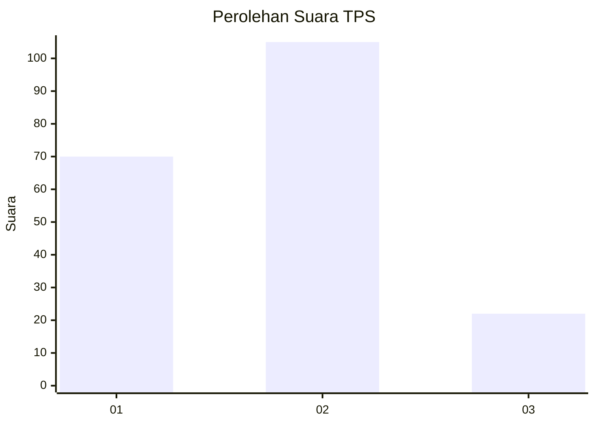
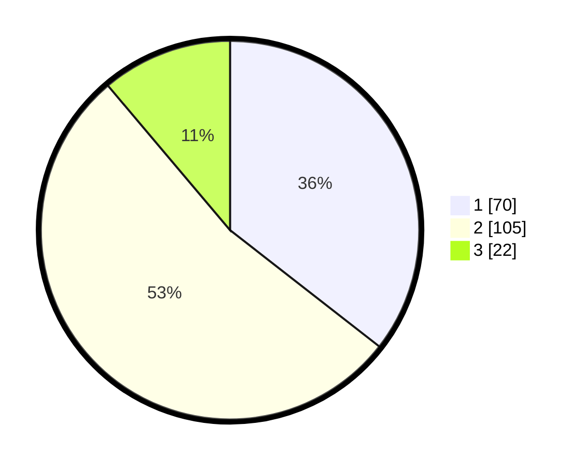

# Hasil

## Grafik

## Tabel

| No. | Nama Paslon    | Suara | Suara (raw) | Persentase |
|:--- |:-------------- | -----:| -----------:| ----------:|
| 1   | ANIES MUHAIMIN | 70    | [70][p-1]   | 35,53      |
| 2   | PRABOWO GIBRAN | 105   | [105][p-2]  | 53,30      |
| 3   | GANJAR MAHFUD  | 22    | [22][p-3]   | 11,17      |

[p-1]: https://github.com/gigit-pemilu/pemilu-2024/blob/main/pilpres/hitung-suara/sub/12-sumatera-utara/sub/71-kota-medan/sub/20-medan-timur/sub/1006-p-berayan-darat-i/sub/004-tps/sub/paslon-1.txt
[p-2]: https://github.com/gigit-pemilu/pemilu-2024/blob/main/pilpres/hitung-suara/sub/12-sumatera-utara/sub/71-kota-medan/sub/20-medan-timur/sub/1006-p-berayan-darat-i/sub/004-tps/sub/paslon-2.txt
[p-3]: https://github.com/gigit-pemilu/pemilu-2024/blob/main/pilpres/hitung-suara/sub/12-sumatera-utara/sub/71-kota-medan/sub/20-medan-timur/sub/1006-p-berayan-darat-i/sub/004-tps/sub/paslon-3.txt

## Foto C Plano

https://sirekap-obj-formc.kpu.go.id/f42a/pemilu/ppwp/12/71/20/10/06/1271201006004-20240214-223041--33f3d41b-ea91-475e-85be-25271e6939a6.jpg

https://sirekap-obj-formc.kpu.go.id/f42a/pemilu/ppwp/12/71/20/10/06/1271201006004-20240214-223153--9d43b932-af8f-4fda-a9cf-28e4d6c60339.jpg

https://sirekap-obj-formc.kpu.go.id/f42a/pemilu/ppwp/12/71/20/10/06/1271201006004-20240214-223436--a2e6fd13-986e-4289-be02-2712e2db1c78.jpg

## Metadata

| Key        | Value               |
| ---------- | ------------------- |
| Time Stamp | 2024-02-27 22:00:00 |

