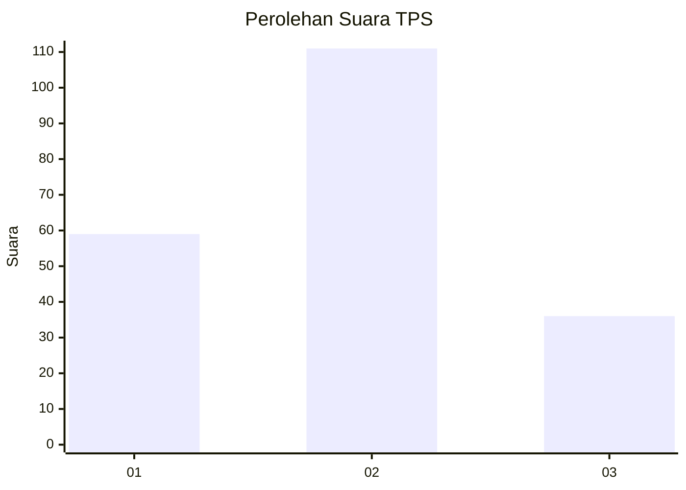
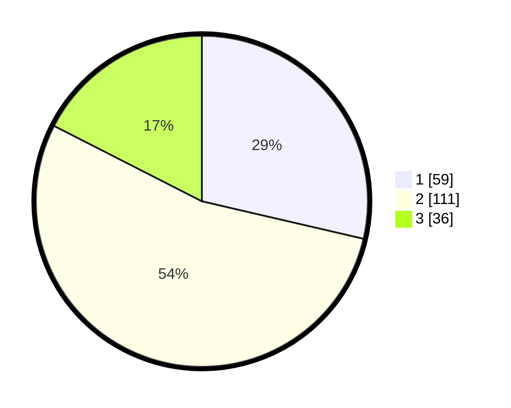

# Hasil

## Grafik

## Tabel

| No. | Nama Paslon    | Suara | Suara (raw) | Persentase |
|:--- |:-------------- | -----:| -----------:| ----------:|
| 1   | ANIES MUHAIMIN | 59    | [59][p-1]   | 28,64      |
| 2   | PRABOWO GIBRAN | 111   | [111][p-2]  | 53,88      |
| 3   | GANJAR MAHFUD  | 36    | [36][p-3]   | 17,48      |

[p-1]: https://github.com/gigit-pemilu/pemilu-2024/blob/main/pilpres/hitung-suara/sub/12-sumatera-utara/sub/71-kota-medan/sub/20-medan-timur/sub/1006-p-berayan-darat-i/sub/010-tps/sub/paslon-1.txt
[p-2]: https://github.com/gigit-pemilu/pemilu-2024/blob/main/pilpres/hitung-suara/sub/12-sumatera-utara/sub/71-kota-medan/sub/20-medan-timur/sub/1006-p-berayan-darat-i/sub/010-tps/sub/paslon-2.txt
[p-3]: https://github.com/gigit-pemilu/pemilu-2024/blob/main/pilpres/hitung-suara/sub/12-sumatera-utara/sub/71-kota-medan/sub/20-medan-timur/sub/1006-p-berayan-darat-i/sub/010-tps/sub/paslon-3.txt

## Foto C Plano

https://sirekap-obj-formc.kpu.go.id/c87f/pemilu/ppwp/12/71/20/10/06/1271201006010-20240214-200000--97b89a45-63a8-4289-95eb-2a251545c74e.jpg

https://sirekap-obj-formc.kpu.go.id/c87f/pemilu/ppwp/12/71/20/10/06/1271201006010-20240214-200240--7ce67008-230c-45d1-bf8a-c3e10c8a2818.jpg

https://sirekap-obj-formc.kpu.go.id/c87f/pemilu/ppwp/12/71/20/10/06/1271201006010-20240214-211731--941314a0-bc27-425d-bc83-67f77073707d.jpg

## Metadata

| Key        | Value               |
| ---------- | ------------------- |
| Time Stamp | 2024-02-15 00:41:44 |

## DATA PEMILIH TETAP

Jumlah pemilih dalam DPT: **966**.
 * L: **436**.
 * P: **439**.

## DATA PENGGUNA HAK PILIH

Jumlah pengguna hak pilih dalam DPT: **292**.
 * L: **984**.
 * P: **403**.

Jumlah pengguna hak pilih dalam DPTb: **492**.
 * L: **642**.
 * P: **87**.

Jumlah pengguna hak pilih dalam DPK: **9**.
 * L: **203**.
 * P: **222**.

Jumlah pengguna hak pilih: **229**.
 * L: **492**.
 * P: **488**.

## JUMLAH SUARA SAH DAN TIDAK SAH

JUMLAH SELURUH SUARA SAH: **206**.

JUMLAH SUARA TIDAK SAH: **3**.

JUMLAH SELURUH SUARA SAH DAN SUARA TIDAK SAH: **209**.

