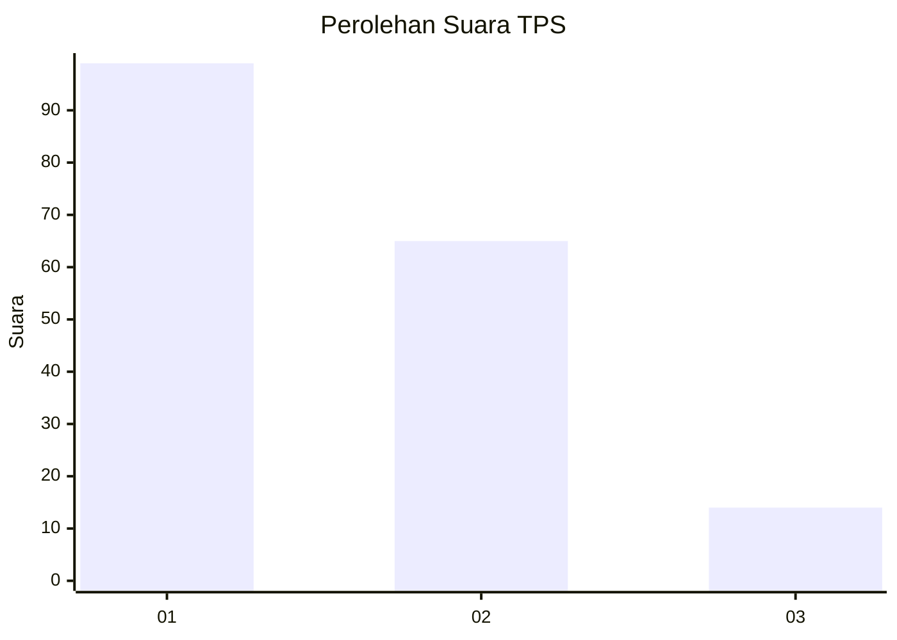
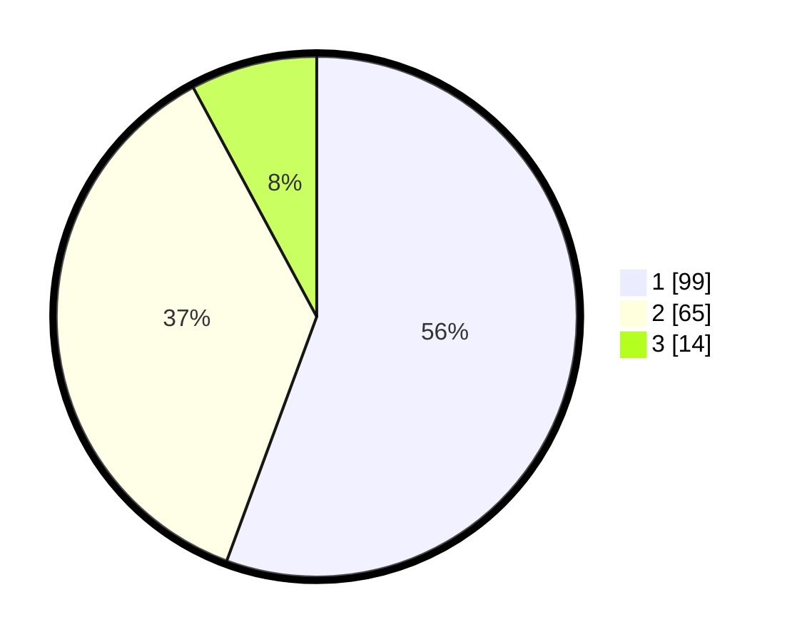

# Hasil

## Grafik

## Tabel

| No. | Nama Paslon    | Suara | Suara (raw) | Persentase |
|:--- |:-------------- | -----:| -----------:| ----------:|
| 1   | ANIES MUHAIMIN | 99    | [99][p-1]   | 55,62      |
| 2   | PRABOWO GIBRAN | 65    | [65][p-2]   | 36,52      |
| 3   | GANJAR MAHFUD  | 14    | [14][p-3]   | 7,87       |

[p-1]: https://github.com/gigit-pemilu/pemilu-2024/blob/main/pilpres/hitung-suara/sub/12-sumatera-utara/sub/71-kota-medan/sub/20-medan-timur/sub/1007-p-berayan-darat-ii/sub/007-tps/sub/paslon-1.txt
[p-2]: https://github.com/gigit-pemilu/pemilu-2024/blob/main/pilpres/hitung-suara/sub/12-sumatera-utara/sub/71-kota-medan/sub/20-medan-timur/sub/1007-p-berayan-darat-ii/sub/007-tps/sub/paslon-2.txt
[p-3]: https://github.com/gigit-pemilu/pemilu-2024/blob/main/pilpres/hitung-suara/sub/12-sumatera-utara/sub/71-kota-medan/sub/20-medan-timur/sub/1007-p-berayan-darat-ii/sub/007-tps/sub/paslon-3.txt

## Foto C Plano

https://sirekap-obj-formc.kpu.go.id/8ef6/pemilu/ppwp/12/71/20/10/07/1271201007007-20240215-035206--24b9081a-4ffd-4144-9575-c46183058c97.jpg

https://sirekap-obj-formc.kpu.go.id/8ef6/pemilu/ppwp/12/71/20/10/07/1271201007007-20240215-035322--4df63120-86b4-4434-8589-093132dc9b23.jpg

https://sirekap-obj-formc.kpu.go.id/8ef6/pemilu/ppwp/12/71/20/10/07/1271201007007-20240215-035532--fdf1349f-5e86-415f-bd0d-4ff2a537c163.jpg

## Metadata

| Key        | Value               |
| ---------- | ------------------- |
| Time Stamp | 2024-02-25 16:00:00 |

