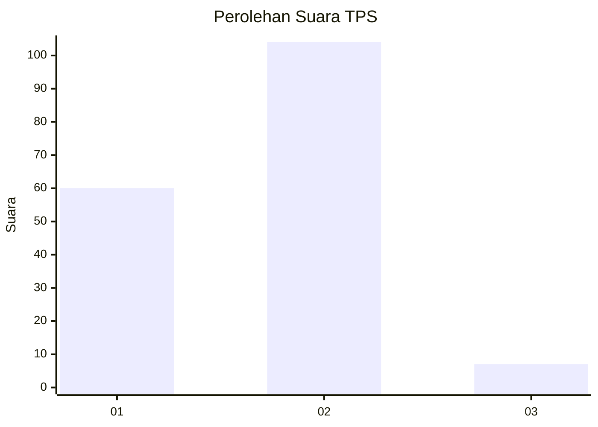
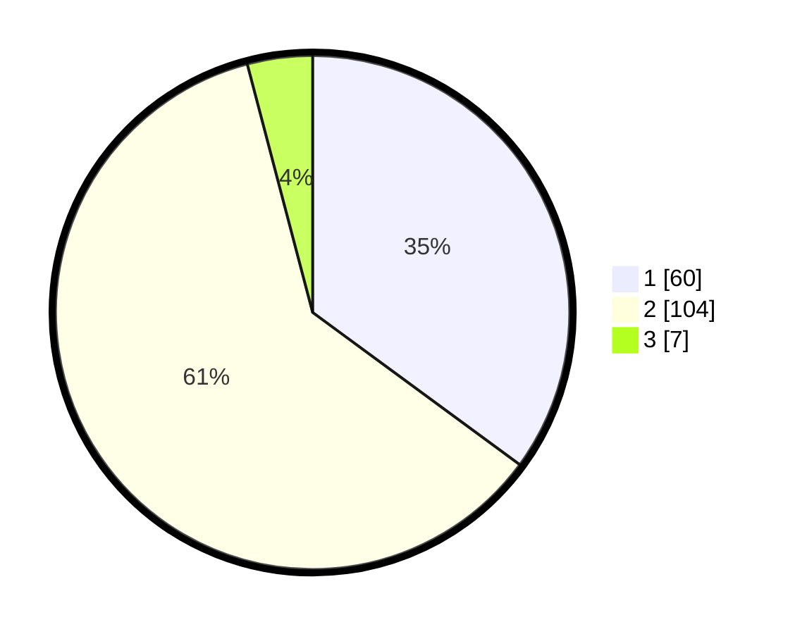

# Hasil

## Grafik

## Tabel

| No. | Nama Paslon    | Suara | Suara (raw) | Persentase |
|:--- |:-------------- | -----:| -----------:| ----------:|
| 1   | ANIES MUHAIMIN | 60    | [60][p-1]   | 35,09      |
| 2   | PRABOWO GIBRAN | 104   | [104][p-2]  | 60,82      |
| 3   | GANJAR MAHFUD  | 7     | [7][p-3]    | 4,09       |

[p-1]: https://github.com/gigit-pemilu/pemilu-2024/blob/main/pilpres/hitung-suara/sub/12-sumatera-utara/sub/71-kota-medan/sub/20-medan-timur/sub/1009-pb-bengkel-baru/sub/017-tps/sub/paslon-1.txt
[p-2]: https://github.com/gigit-pemilu/pemilu-2024/blob/main/pilpres/hitung-suara/sub/12-sumatera-utara/sub/71-kota-medan/sub/20-medan-timur/sub/1009-pb-bengkel-baru/sub/017-tps/sub/paslon-2.txt
[p-3]: https://github.com/gigit-pemilu/pemilu-2024/blob/main/pilpres/hitung-suara/sub/12-sumatera-utara/sub/71-kota-medan/sub/20-medan-timur/sub/1009-pb-bengkel-baru/sub/017-tps/sub/paslon-3.txt

## Foto C Plano

https://sirekap-obj-formc.kpu.go.id/cb43/pemilu/ppwp/12/71/20/10/09/1271201009017-20240214-191607--48153866-d652-4d11-9b1e-94bdd091b8c0.jpg

https://sirekap-obj-formc.kpu.go.id/cb43/pemilu/ppwp/12/71/20/10/09/1271201009017-20240214-191643--2f8e75aa-e837-45ea-97c6-2dd8695c590e.jpg

https://sirekap-obj-formc.kpu.go.id/cb43/pemilu/ppwp/12/71/20/10/09/1271201009017-20240214-191701--45a6ef23-00cb-499d-8888-a4b570b4c330.jpg

## Metadata

| Key        | Value               |
| ---------- | ------------------- |
| Time Stamp | 2024-02-25 15:00:00 |

