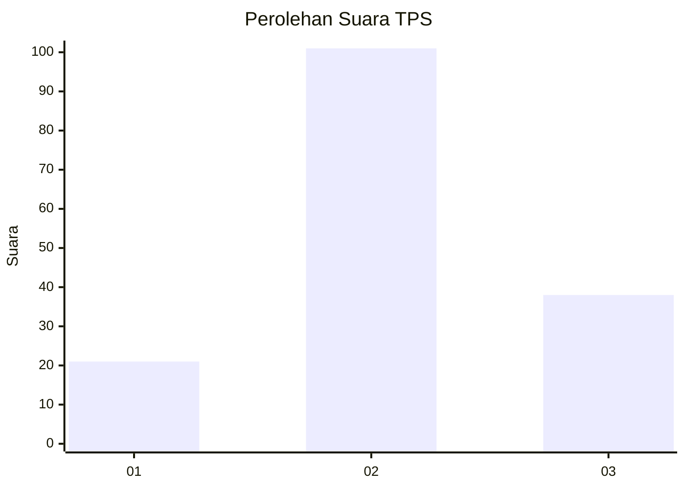
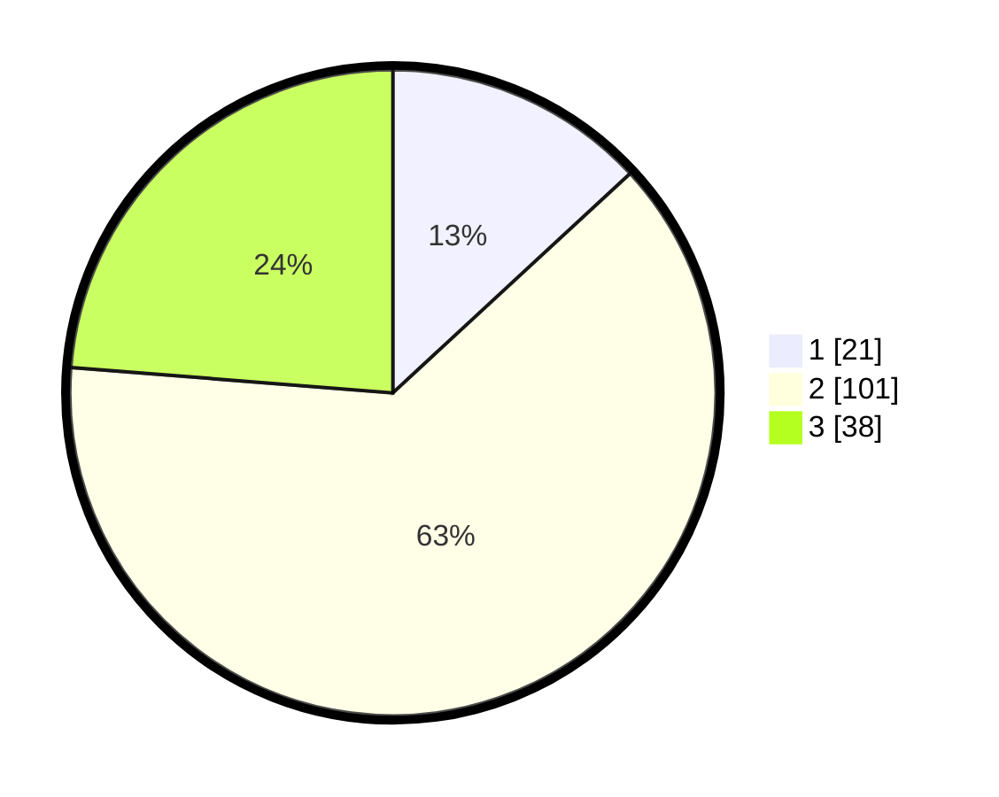

# Hasil

## Grafik

## Tabel

| No. | Nama Paslon    | Suara | Suara (raw) | Persentase |
|:--- |:-------------- | -----:| -----------:| ----------:|
| 1   | ANIES MUHAIMIN | 21    | [21][p-1]   | 13,13      |
| 2   | PRABOWO GIBRAN | 101   | [101][p-2]  | 63,13      |
| 3   | GANJAR MAHFUD  | 38    | [38][p-3]   | 23,75      |

[p-1]: https://github.com/gigit-pemilu/pemilu-2024/blob/main/pilpres/hitung-suara/sub/12-sumatera-utara/sub/71-kota-medan/sub/21-medan-selayang/sub/1001-asam-kumbang/sub/001-tps/sub/paslon-1.txt
[p-2]: https://github.com/gigit-pemilu/pemilu-2024/blob/main/pilpres/hitung-suara/sub/12-sumatera-utara/sub/71-kota-medan/sub/21-medan-selayang/sub/1001-asam-kumbang/sub/001-tps/sub/paslon-2.txt
[p-3]: https://github.com/gigit-pemilu/pemilu-2024/blob/main/pilpres/hitung-suara/sub/12-sumatera-utara/sub/71-kota-medan/sub/21-medan-selayang/sub/1001-asam-kumbang/sub/001-tps/sub/paslon-3.txt

## Foto C Plano

https://sirekap-obj-formc.kpu.go.id/5e37/pemilu/ppwp/12/71/21/10/01/1271211001001-20240214-223540--d7f401d8-572c-47b6-98d7-c08339eb8c83.jpg

https://sirekap-obj-formc.kpu.go.id/5e37/pemilu/ppwp/12/71/21/10/01/1271211001001-20240214-204021--9d0aaca1-6b0d-4177-80c3-e3739f45d713.jpg

https://sirekap-obj-formc.kpu.go.id/5e37/pemilu/ppwp/12/71/21/10/01/1271211001001-20240214-204106--14d38987-8f21-4e7f-a87a-265773b65a79.jpg

## Metadata

| Key        | Value               |
| ---------- | ------------------- |
| Time Stamp | 2024-02-21 22:00:00 |

