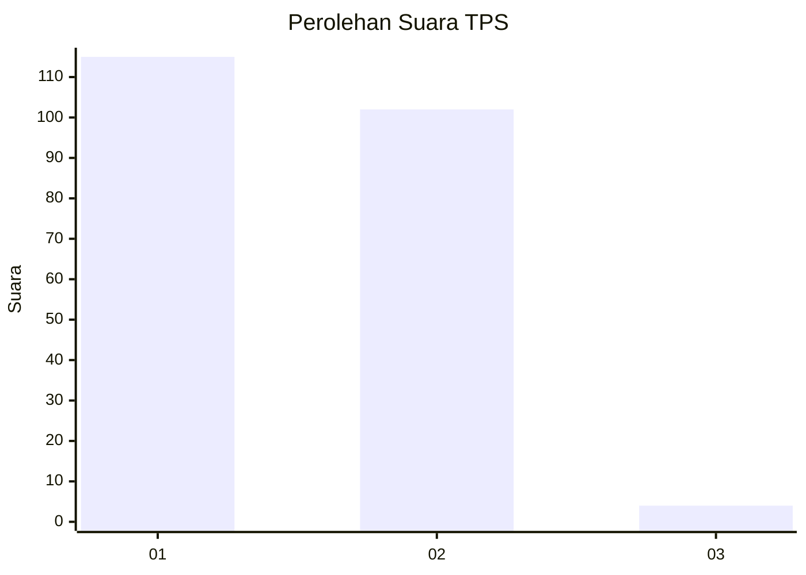
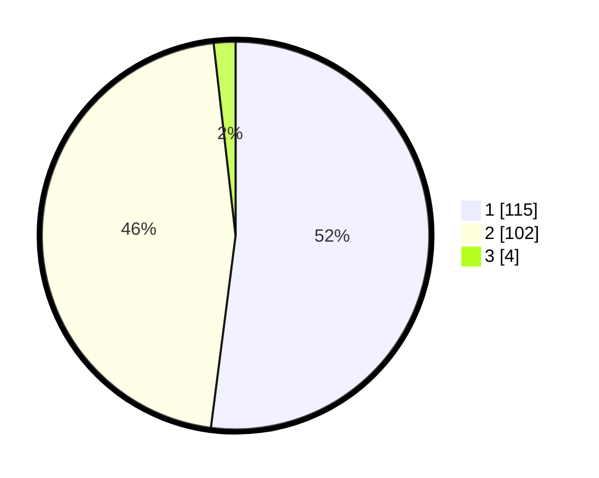

# Hasil

## Grafik

## Tabel

| No. | Nama Paslon    | Suara | Suara (raw) | Persentase |
|:--- |:-------------- | -----:| -----------:| ----------:|
| 1   | ANIES MUHAIMIN | 115   | [115][p-1]  | 52,04      |
| 2   | PRABOWO GIBRAN | 102   | [102][p-2]  | 46,15      |
| 3   | GANJAR MAHFUD  | 4     | [4][p-3]    | 1,81       |

[p-1]: https://github.com/gigit-pemilu/pemilu-2024/blob/main/pilpres/hitung-suara/sub/12-sumatera-utara/sub/71-kota-medan/sub/21-medan-selayang/sub/1001-asam-kumbang/sub/006-tps/sub/paslon-1.txt
[p-2]: https://github.com/gigit-pemilu/pemilu-2024/blob/main/pilpres/hitung-suara/sub/12-sumatera-utara/sub/71-kota-medan/sub/21-medan-selayang/sub/1001-asam-kumbang/sub/006-tps/sub/paslon-2.txt
[p-3]: https://github.com/gigit-pemilu/pemilu-2024/blob/main/pilpres/hitung-suara/sub/12-sumatera-utara/sub/71-kota-medan/sub/21-medan-selayang/sub/1001-asam-kumbang/sub/006-tps/sub/paslon-3.txt

## Foto C Plano

https://sirekap-obj-formc.kpu.go.id/4953/pemilu/ppwp/12/71/21/10/01/1271211001006-20240215-004319--df22f06d-f879-4719-b0b5-26d8fa0667f4.jpg

https://sirekap-obj-formc.kpu.go.id/4953/pemilu/ppwp/12/71/21/10/01/1271211001006-20240215-004324--8317a7b7-02c4-4035-83d2-a7942c282607.jpg

https://sirekap-obj-formc.kpu.go.id/4953/pemilu/ppwp/12/71/21/10/01/1271211001006-20240215-004327--451e129a-1104-4cac-a315-d408d1f6fdc9.jpg

## Metadata

| Key        | Value               |
| ---------- | ------------------- |
| Time Stamp | 2024-02-25 21:00:00 |

