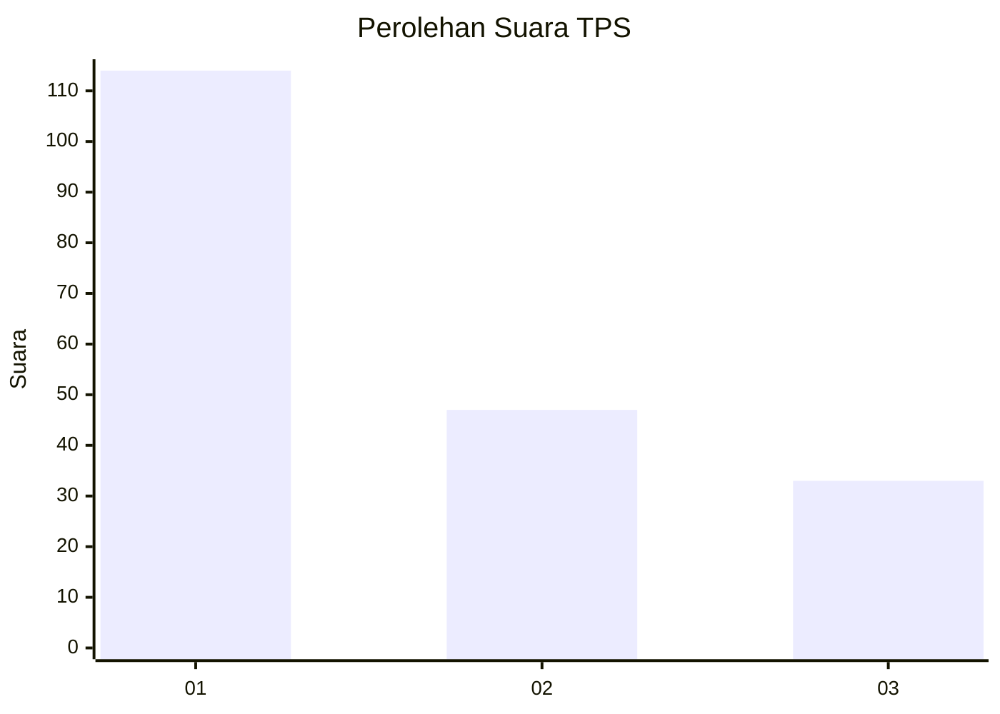
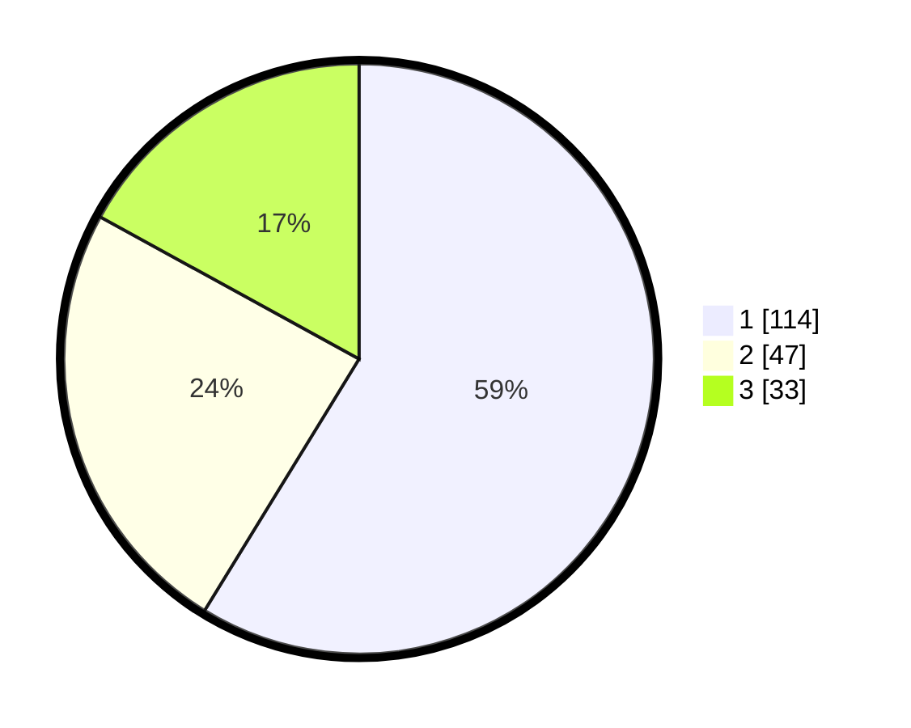

# Hasil

## Grafik

## Tabel

| No. | Nama Paslon    | Suara | Suara (raw) | Persentase |
|:--- |:-------------- | -----:| -----------:| ----------:|
| 1   | ANIES MUHAIMIN | 114   | [114][p-1]  | 58,76      |
| 2   | PRABOWO GIBRAN | 47    | [47][p-2]   | 24,23      |
| 3   | GANJAR MAHFUD  | 33    | [33][p-3]   | 17,01      |

[p-1]: https://github.com/gigit-pemilu/pemilu-2024-12-sumatera-utara/blob/main/pilpres/hitung-suara/sub/12-sumatera-utara/sub/71-kota-medan/sub/21-medan-selayang/sub/1002-tanjungsari/sub/008-tps/sub/paslon-1.txt
[p-2]: https://github.com/gigit-pemilu/pemilu-2024-12-sumatera-utara/blob/main/pilpres/hitung-suara/sub/12-sumatera-utara/sub/71-kota-medan/sub/21-medan-selayang/sub/1002-tanjungsari/sub/008-tps/sub/paslon-2.txt
[p-3]: https://github.com/gigit-pemilu/pemilu-2024-12-sumatera-utara/blob/main/pilpres/hitung-suara/sub/12-sumatera-utara/sub/71-kota-medan/sub/21-medan-selayang/sub/1002-tanjungsari/sub/008-tps/sub/paslon-3.txt

## Foto C Plano

https://sirekap-obj-formc.kpu.go.id/5d64/pemilu/ppwp/12/71/21/10/02/1271211002008-20240215-024708--6709fa12-5aa3-422d-8b26-ff5c6195ad2c.jpg

https://sirekap-obj-formc.kpu.go.id/5d64/pemilu/ppwp/12/71/21/10/02/1271211002008-20240215-024510--c38df692-c23e-4d74-8c34-45f0d07d8487.jpg

https://sirekap-obj-formc.kpu.go.id/5d64/pemilu/ppwp/12/71/21/10/02/1271211002008-20240215-024409--3ab64491-5489-4317-93ae-f70fee7856ee.jpg

## Metadata

| Key        | Value               |
| ---------- | ------------------- |
| Time Stamp | 2024-02-25 11:00:00 |

