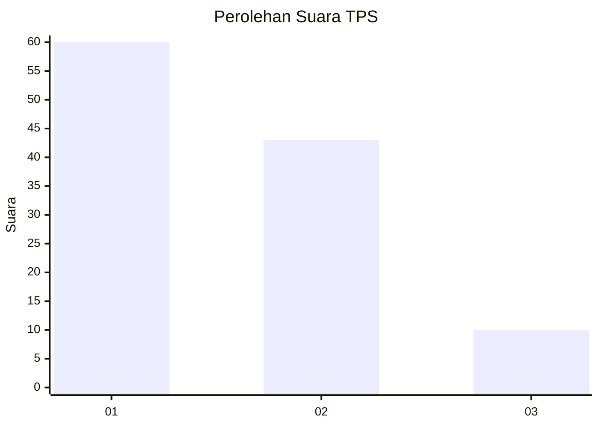
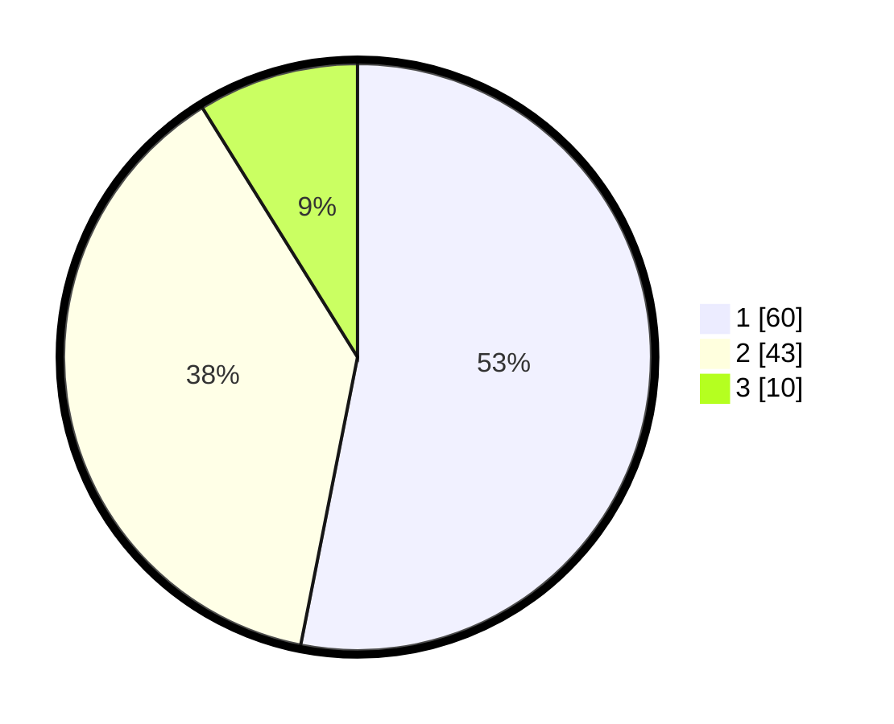

# Hasil

## Grafik

## Tabel

| No. | Nama Paslon    | Suara | Suara (raw) | Persentase |
|:--- |:-------------- | -----:| -----------:| ----------:|
| 1   | ANIES MUHAIMIN | 60    | [60][p-1]   | 53,10      |
| 2   | PRABOWO GIBRAN | 43    | [43][p-2]   | 38,05      |
| 3   | GANJAR MAHFUD  | 10    | [10][p-3]   | 8,85       |

[p-1]: https://github.com/gigit-pemilu/pemilu-2024-12-sumatera-utara/blob/main/pilpres/hitung-suara/sub/12-sumatera-utara/sub/71-kota-medan/sub/21-medan-selayang/sub/1002-tanjungsari/sub/021-tps/sub/paslon-1.txt
[p-2]: https://github.com/gigit-pemilu/pemilu-2024-12-sumatera-utara/blob/main/pilpres/hitung-suara/sub/12-sumatera-utara/sub/71-kota-medan/sub/21-medan-selayang/sub/1002-tanjungsari/sub/021-tps/sub/paslon-2.txt
[p-3]: https://github.com/gigit-pemilu/pemilu-2024-12-sumatera-utara/blob/main/pilpres/hitung-suara/sub/12-sumatera-utara/sub/71-kota-medan/sub/21-medan-selayang/sub/1002-tanjungsari/sub/021-tps/sub/paslon-3.txt

## Foto C Plano

https://sirekap-obj-formc.kpu.go.id/850c/pemilu/ppwp/12/71/21/10/02/1271211002021-20240214-221027--eba2099c-37d6-463a-a405-ea936c0f83b9.jpg

https://sirekap-obj-formc.kpu.go.id/850c/pemilu/ppwp/12/71/21/10/02/1271211002021-20240214-220955--dd8f1bb5-ab3b-4918-ae8e-54bf25e6e1f7.jpg

https://sirekap-obj-formc.kpu.go.id/850c/pemilu/ppwp/12/71/21/10/02/1271211002021-20240215-013746--054121ef-a205-4c3b-8e4a-093c554124a3.jpg

## Metadata

| Key        | Value               |
| ---------- | ------------------- |
| Time Stamp | 2024-02-24 22:31:28 |

