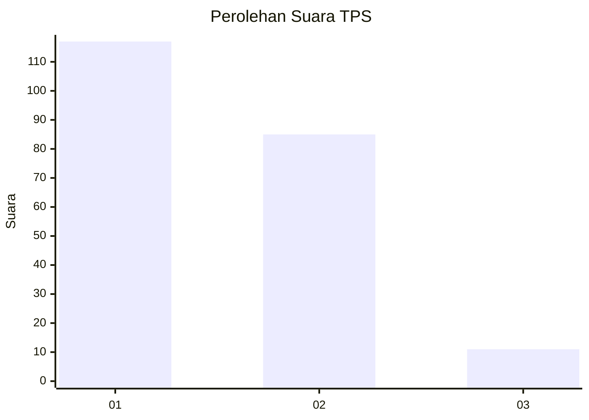
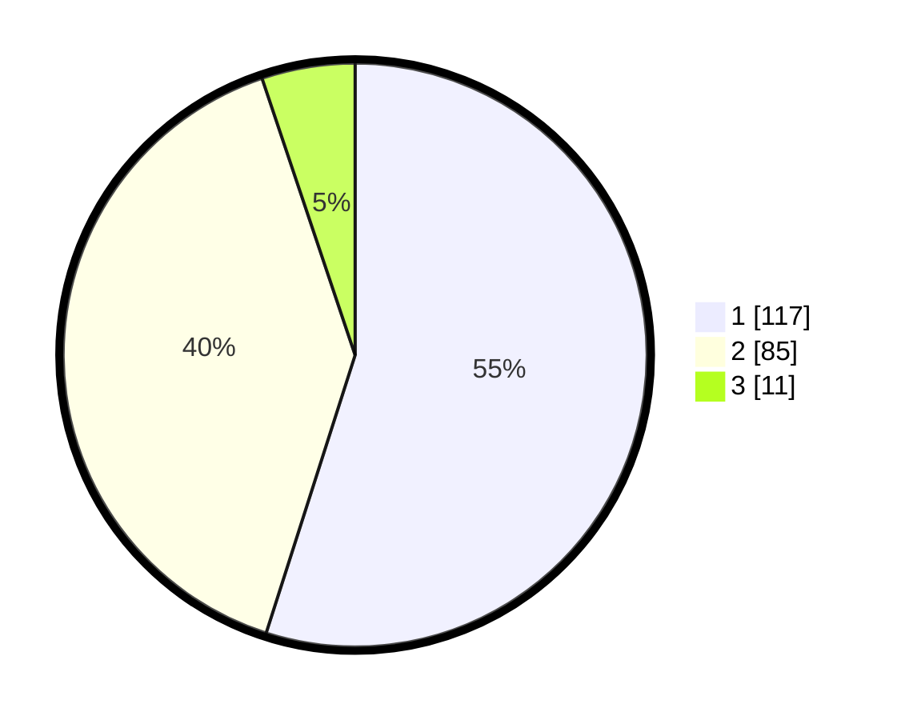

# Hasil

## Grafik

## Tabel

| No. | Nama Paslon    | Suara | Suara (raw) | Persentase |
|:--- |:-------------- | -----:| -----------:| ----------:|
| 1   | ANIES MUHAIMIN | 117   | [117][p-1]  | 54,93      |
| 2   | PRABOWO GIBRAN | 85    | [85][p-2]   | 39,91      |
| 3   | GANJAR MAHFUD  | 11    | [11][p-3]   | 5,16       |

[p-1]: https://github.com/gigit-pemilu/pemilu-2024-12-sumatera-utara/blob/main/pilpres/hitung-suara/sub/12-sumatera-utara/sub/71-kota-medan/sub/21-medan-selayang/sub/1003-p-bulan-selayang-ii/sub/007-tps/sub/paslon-1.txt
[p-2]: https://github.com/gigit-pemilu/pemilu-2024-12-sumatera-utara/blob/main/pilpres/hitung-suara/sub/12-sumatera-utara/sub/71-kota-medan/sub/21-medan-selayang/sub/1003-p-bulan-selayang-ii/sub/007-tps/sub/paslon-2.txt
[p-3]: https://github.com/gigit-pemilu/pemilu-2024-12-sumatera-utara/blob/main/pilpres/hitung-suara/sub/12-sumatera-utara/sub/71-kota-medan/sub/21-medan-selayang/sub/1003-p-bulan-selayang-ii/sub/007-tps/sub/paslon-3.txt

## Foto C Plano

https://sirekap-obj-formc.kpu.go.id/8ea1/pemilu/ppwp/12/71/21/10/03/1271211003007-20240215-003053--2c0f6bd9-153d-4612-86a2-49a93bfcce38.jpg

https://sirekap-obj-formc.kpu.go.id/8ea1/pemilu/ppwp/12/71/21/10/03/1271211003007-20240215-003328--f60a75a2-6f94-451e-8dea-e43998713a9e.jpg

https://sirekap-obj-formc.kpu.go.id/8ea1/pemilu/ppwp/12/71/21/10/03/1271211003007-20240215-003357--c7dac147-ebb6-47a5-b2b5-2f6c1e9868f2.jpg

## Metadata

| Key        | Value               |
| ---------- | ------------------- |
| Time Stamp | 2024-02-25 23:00:00 |

