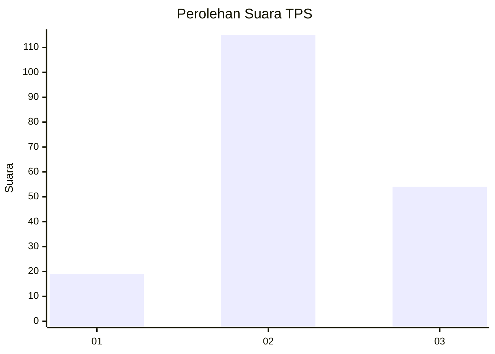
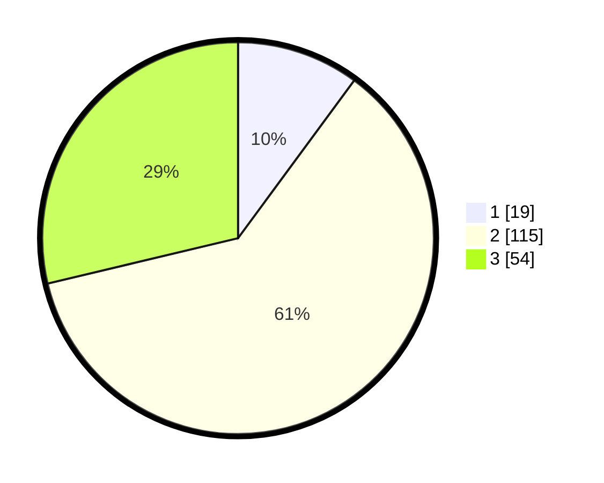

# Hasil

## Grafik

## Tabel

| No. | Nama Paslon    | Suara | Suara (raw) | Persentase |
|:--- |:-------------- | -----:| -----------:| ----------:|
| 1   | ANIES MUHAIMIN | 19    | [19][p-1]   | 10,11      |
| 2   | PRABOWO GIBRAN | 115   | [115][p-2]  | 61,17      |
| 3   | GANJAR MAHFUD  | 54    | [54][p-3]   | 28,72      |

[p-1]: https://github.com/gigit-pemilu/pemilu-2024/blob/main/pilpres/hitung-suara/sub/12-sumatera-utara/sub/71-kota-medan/sub/21-medan-selayang/sub/1004-beringin/sub/013-tps/sub/paslon-1.txt
[p-2]: https://github.com/gigit-pemilu/pemilu-2024/blob/main/pilpres/hitung-suara/sub/12-sumatera-utara/sub/71-kota-medan/sub/21-medan-selayang/sub/1004-beringin/sub/013-tps/sub/paslon-2.txt
[p-3]: https://github.com/gigit-pemilu/pemilu-2024/blob/main/pilpres/hitung-suara/sub/12-sumatera-utara/sub/71-kota-medan/sub/21-medan-selayang/sub/1004-beringin/sub/013-tps/sub/paslon-3.txt

## Foto C Plano

https://sirekap-obj-formc.kpu.go.id/809b/pemilu/ppwp/12/71/21/10/04/1271211004013-20240218-132253--182159f3-22fb-41d6-ab86-ec11c1e0c42b.jpg

https://sirekap-obj-formc.kpu.go.id/809b/pemilu/ppwp/12/71/21/10/04/1271211004013-20240218-132331--03345a42-8fd1-48ec-8600-f4196a05a4de.jpg

https://sirekap-obj-formc.kpu.go.id/809b/pemilu/ppwp/12/71/21/10/04/1271211004013-20240218-132415--00261cf5-15d5-4656-bc31-fb52761e2a43.jpg

## Metadata

| Key        | Value               |
| ---------- | ------------------- |
| Time Stamp | 2024-02-19 12:00:00 |

## DATA PEMILIH TETAP

Jumlah pemilih dalam DPT: **352**.
 * L: **424**.
 * P: **32**.

## DATA PENGGUNA HAK PILIH

Jumlah pengguna hak pilih dalam DPT: **622**.
 * L: **80**.
 * P: **2**.

Jumlah pengguna hak pilih dalam DPTb: **223**.
 * L: **72**.
 * P: **232**.

Jumlah pengguna hak pilih dalam DPK: **5**.
 * L: **20**.
 * P: **0**.

Jumlah pengguna hak pilih: **82**.
 * L: **28**.
 * P: **408**.

## JUMLAH SUARA SAH DAN TIDAK SAH

JUMLAH SELURUH SUARA SAH: **188**.

JUMLAH SUARA TIDAK SAH: **1**.

JUMLAH SELURUH SUARA SAH DAN SUARA TIDAK SAH: **189**.

