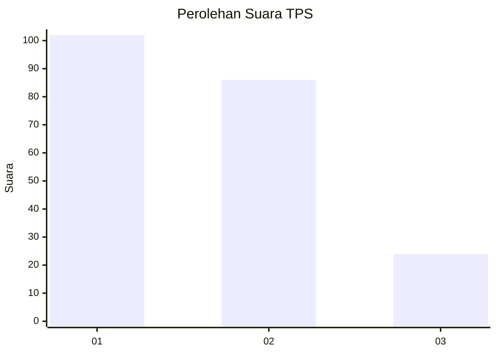
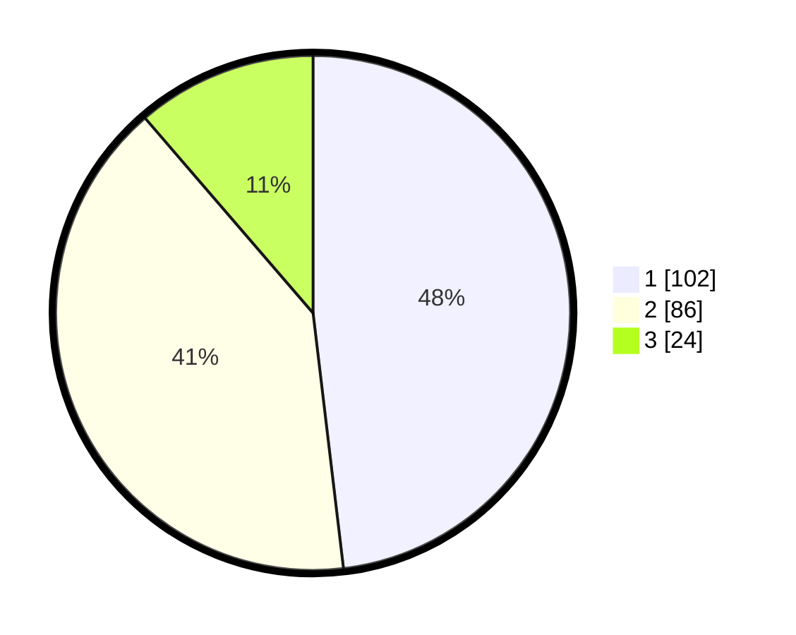

# Hasil

## Grafik

## Tabel

| No. | Nama Paslon    | Suara | Suara (raw) | Persentase |
|:--- |:-------------- | -----:| -----------:| ----------:|
| 1   | ANIES MUHAIMIN | 102   | [102][p-1]  | 48,11      |
| 2   | PRABOWO GIBRAN | 86    | [86][p-2]   | 40,57      |
| 3   | GANJAR MAHFUD  | 24    | [24][p-3]   | 11,32      |

[p-1]: https://github.com/gigit-pemilu/pemilu-2024/blob/main/pilpres/hitung-suara/sub/12-sumatera-utara/sub/71-kota-medan/sub/21-medan-selayang/sub/1005-p-bulan-selayang-i/sub/003-tps/sub/paslon-1.txt
[p-2]: https://github.com/gigit-pemilu/pemilu-2024/blob/main/pilpres/hitung-suara/sub/12-sumatera-utara/sub/71-kota-medan/sub/21-medan-selayang/sub/1005-p-bulan-selayang-i/sub/003-tps/sub/paslon-2.txt
[p-3]: https://github.com/gigit-pemilu/pemilu-2024/blob/main/pilpres/hitung-suara/sub/12-sumatera-utara/sub/71-kota-medan/sub/21-medan-selayang/sub/1005-p-bulan-selayang-i/sub/003-tps/sub/paslon-3.txt

## Foto C Plano

https://sirekap-obj-formc.kpu.go.id/64fd/pemilu/ppwp/12/71/21/10/05/1271211005003-20240215-083216--c33155fe-f705-45cd-b0e2-b0f584c90c99.jpg

https://sirekap-obj-formc.kpu.go.id/64fd/pemilu/ppwp/12/71/21/10/05/1271211005003-20240215-083354--00f3cf10-a925-4a0e-accd-5c3a3936b19c.jpg

https://sirekap-obj-formc.kpu.go.id/64fd/pemilu/ppwp/12/71/21/10/05/1271211005003-20240215-083502--1aa69c0c-f943-45dc-a7f4-1ba586829e06.jpg

## Metadata

| Key        | Value               |
| ---------- | ------------------- |
| Time Stamp | 2024-02-24 22:31:28 |

