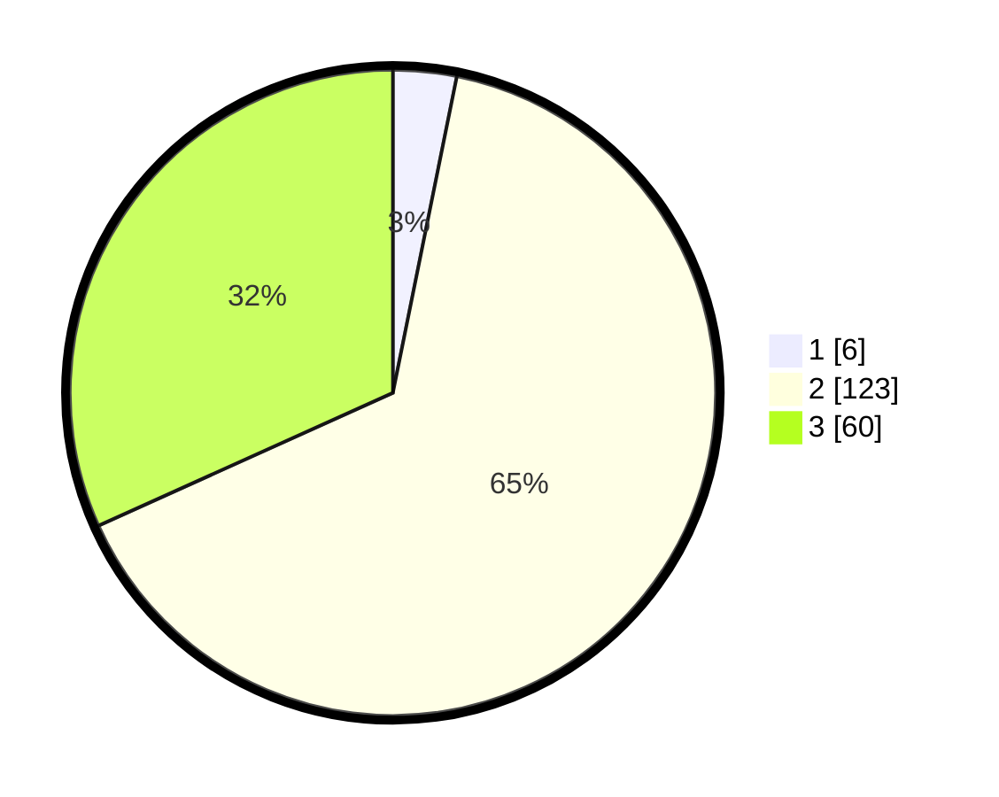

# Hasil

## Grafik

## Tabel

| No. | Nama Paslon    | Suara | Suara (raw) | Persentase |
|:--- |:-------------- | -----:| -----------:| ----------:|
| 1   | ANIES MUHAIMIN | 6     | [6][p-1]    | 3,17       |
| 2   | PRABOWO GIBRAN | 123   | [123][p-2]  | 65,08      |
| 3   | GANJAR MAHFUD  | 60    | [60][p-3]   | 31,75      |

[p-1]: https://github.com/gigit-pemilu/pemilu-2024/blob/main/pilpres/hitung-suara/sub/12-sumatera-utara/sub/72-kota-pematangsiantar/sub/01-siantar-timur/sub/1001-kebun-sayur/sub/001-tps/sub/paslon-1.txt
[p-2]: https://github.com/gigit-pemilu/pemilu-2024/blob/main/pilpres/hitung-suara/sub/12-sumatera-utara/sub/72-kota-pematangsiantar/sub/01-siantar-timur/sub/1001-kebun-sayur/sub/001-tps/sub/paslon-2.txt
[p-3]: https://github.com/gigit-pemilu/pemilu-2024/blob/main/pilpres/hitung-suara/sub/12-sumatera-utara/sub/72-kota-pematangsiantar/sub/01-siantar-timur/sub/1001-kebun-sayur/sub/001-tps/sub/paslon-3.txt

## Foto C Plano

https://sirekap-obj-formc.kpu.go.id/1607/pemilu/ppwp/12/72/01/10/01/1272011001001-20240214-233906--6a31df79-e192-4081-992a-627323426073.jpg

https://sirekap-obj-formc.kpu.go.id/1607/pemilu/ppwp/12/72/01/10/01/1272011001001-20240214-234028--56c6907d-2561-4df0-b9b9-281c0b1acb93.jpg

https://sirekap-obj-formc.kpu.go.id/1607/pemilu/ppwp/12/72/01/10/01/1272011001001-20240214-233624--3899be2b-9344-4e34-8f9c-c846419fe179.jpg

## Metadata

| Key        | Value               |
| ---------- | ------------------- |
| Time Stamp | 2024-02-15 22:00:27 |

