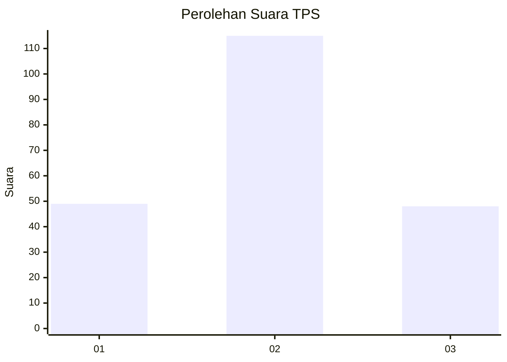
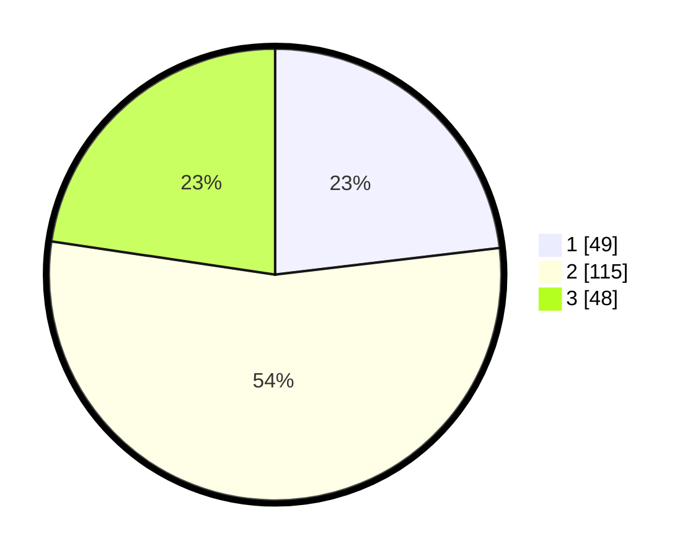

# Hasil

## Grafik

## Tabel

| No. | Nama Paslon    | Suara | Suara (raw) | Persentase |
|:--- |:-------------- | -----:| -----------:| ----------:|
| 1   | ANIES MUHAIMIN | 49    | [49][p-1]   | 23,11      |
| 2   | PRABOWO GIBRAN | 115   | [115][p-2]  | 54,25      |
| 3   | GANJAR MAHFUD  | 48    | [48][p-3]   | 22,64      |

[p-1]: https://github.com/gigit-pemilu/pemilu-2024/blob/main/pilpres/hitung-suara/sub/12-sumatera-utara/sub/72-kota-pematangsiantar/sub/01-siantar-timur/sub/1001-kebun-sayur/sub/006-tps/sub/paslon-1.txt
[p-2]: https://github.com/gigit-pemilu/pemilu-2024/blob/main/pilpres/hitung-suara/sub/12-sumatera-utara/sub/72-kota-pematangsiantar/sub/01-siantar-timur/sub/1001-kebun-sayur/sub/006-tps/sub/paslon-2.txt
[p-3]: https://github.com/gigit-pemilu/pemilu-2024/blob/main/pilpres/hitung-suara/sub/12-sumatera-utara/sub/72-kota-pematangsiantar/sub/01-siantar-timur/sub/1001-kebun-sayur/sub/006-tps/sub/paslon-3.txt

## Foto C Plano

https://sirekap-obj-formc.kpu.go.id/88e4/pemilu/ppwp/12/72/01/10/01/1272011001006-20240215-003738--5bed468a-701e-4c20-bdd7-17d262ec4328.jpg

https://sirekap-obj-formc.kpu.go.id/88e4/pemilu/ppwp/12/72/01/10/01/1272011001006-20240215-003855--bdad82e6-3a53-4705-939b-74486857ebd9.jpg

https://sirekap-obj-formc.kpu.go.id/88e4/pemilu/ppwp/12/72/01/10/01/1272011001006-20240215-004049--379bc635-f96f-4879-95f9-f866789fcb4c.jpg

## Metadata

| Key        | Value               |
| ---------- | ------------------- |
| Time Stamp | 2024-02-15 23:29:50 |

