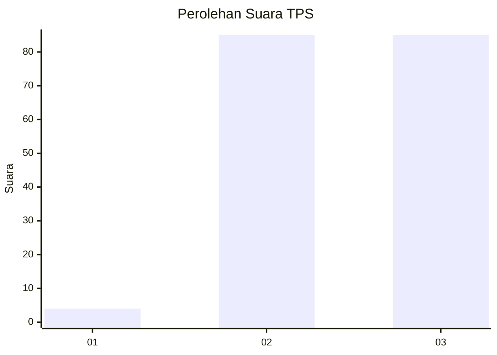
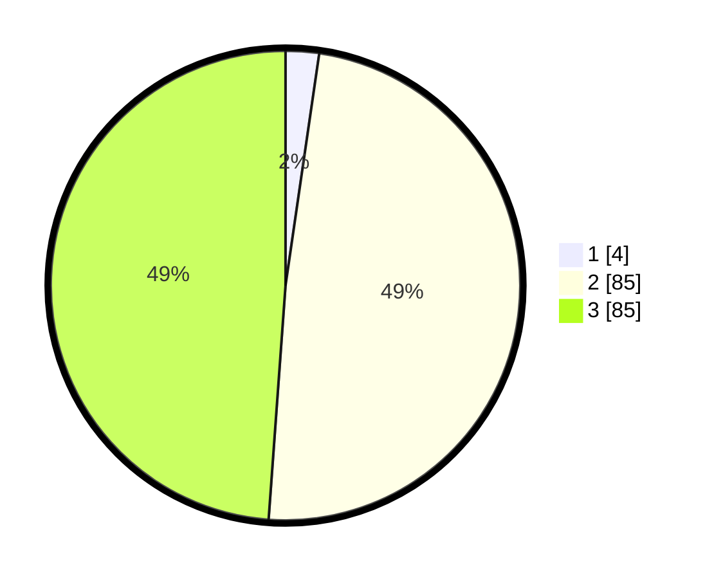

# Hasil

## Grafik

## Tabel

| No. | Nama Paslon    | Suara | Suara (raw) | Persentase |
|:--- |:-------------- | -----:| -----------:| ----------:|
| 1   | ANIES MUHAIMIN | 4     | [4][p-1]    | 2,30       |
| 2   | PRABOWO GIBRAN | 85    | [85][p-2]   | 48,85      |
| 3   | GANJAR MAHFUD  | 85    | [85][p-3]   | 48,85      |

[p-1]: https://github.com/gigit-pemilu/pemilu-2024/blob/main/pilpres/hitung-suara/sub/12-sumatera-utara/sub/72-kota-pematangsiantar/sub/02-siantar-barat/sub/1001-dwikora/sub/003-tps/sub/paslon-1.txt
[p-2]: https://github.com/gigit-pemilu/pemilu-2024/blob/main/pilpres/hitung-suara/sub/12-sumatera-utara/sub/72-kota-pematangsiantar/sub/02-siantar-barat/sub/1001-dwikora/sub/003-tps/sub/paslon-2.txt
[p-3]: https://github.com/gigit-pemilu/pemilu-2024/blob/main/pilpres/hitung-suara/sub/12-sumatera-utara/sub/72-kota-pematangsiantar/sub/02-siantar-barat/sub/1001-dwikora/sub/003-tps/sub/paslon-3.txt

## Foto C Plano

https://sirekap-obj-formc.kpu.go.id/22c3/pemilu/ppwp/12/72/02/10/01/1272021001003-20240215-000304--599bead2-09d3-4496-bcd2-a0b09afd56ab.jpg

https://sirekap-obj-formc.kpu.go.id/22c3/pemilu/ppwp/12/72/02/10/01/1272021001003-20240215-000317--2da156d4-be9b-46b2-b65e-b72a3631a3ae.jpg

https://sirekap-obj-formc.kpu.go.id/22c3/pemilu/ppwp/12/72/02/10/01/1272021001003-20240215-001400--0b7b9658-f6a1-409a-82eb-e3f53c101431.jpg

## Metadata

| Key        | Value               |
| ---------- | ------------------- |
| Time Stamp | 2024-02-25 02:00:00 |

