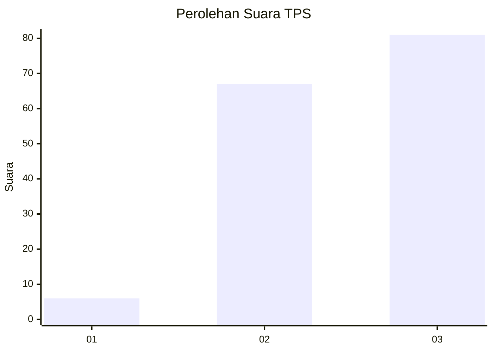
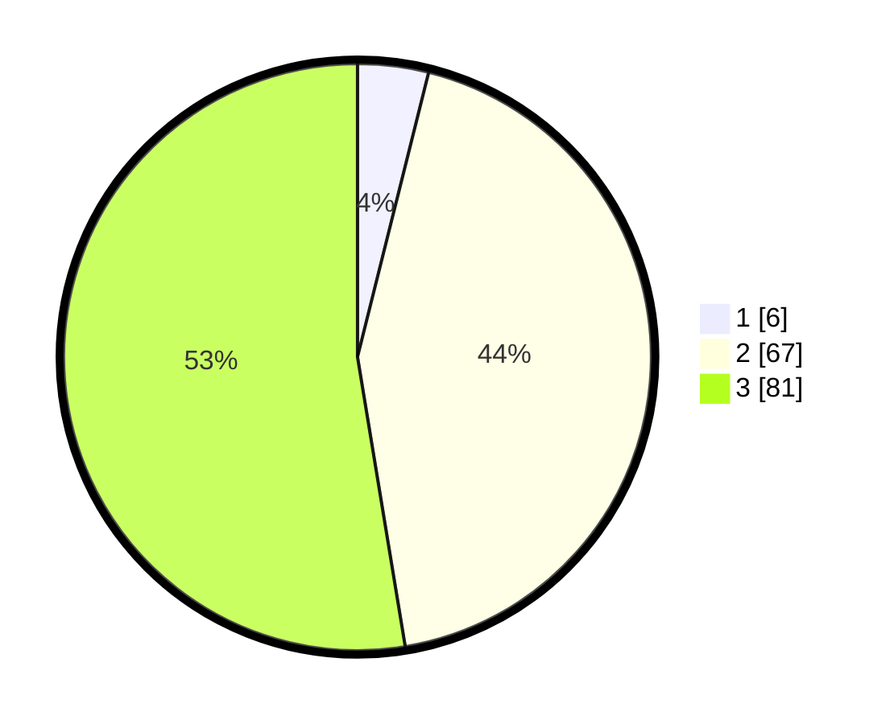

# Hasil

## Grafik

## Tabel

| No. | Nama Paslon    | Suara | Suara (raw) | Persentase |
|:--- |:-------------- | -----:| -----------:| ----------:|
| 1   | ANIES MUHAIMIN | 6     | [6][p-1]    | 3,90       |
| 2   | PRABOWO GIBRAN | 67    | [67][p-2]   | 43,51      |
| 3   | GANJAR MAHFUD  | 81    | [81][p-3]   | 52,60      |

[p-1]: https://github.com/gigit-pemilu/pemilu-2024-12-sumatera-utara/blob/main/pilpres/hitung-suara/sub/12-sumatera-utara/sub/72-kota-pematangsiantar/sub/02-siantar-barat/sub/1001-dwikora/sub/005-tps/sub/paslon-1.txt
[p-2]: https://github.com/gigit-pemilu/pemilu-2024-12-sumatera-utara/blob/main/pilpres/hitung-suara/sub/12-sumatera-utara/sub/72-kota-pematangsiantar/sub/02-siantar-barat/sub/1001-dwikora/sub/005-tps/sub/paslon-2.txt
[p-3]: https://github.com/gigit-pemilu/pemilu-2024-12-sumatera-utara/blob/main/pilpres/hitung-suara/sub/12-sumatera-utara/sub/72-kota-pematangsiantar/sub/02-siantar-barat/sub/1001-dwikora/sub/005-tps/sub/paslon-3.txt

## Foto C Plano

https://sirekap-obj-formc.kpu.go.id/6510/pemilu/ppwp/12/72/02/10/01/1272021001005-20240214-205940--b613eb4f-0a0f-4d44-89e9-6bff3e3bc61e.jpg

https://sirekap-obj-formc.kpu.go.id/6510/pemilu/ppwp/12/72/02/10/01/1272021001005-20240214-210231--0fbce16d-a54d-4e8f-8e98-16c20a3e345a.jpg

https://sirekap-obj-formc.kpu.go.id/6510/pemilu/ppwp/12/72/02/10/01/1272021001005-20240214-210320--be8b7292-4d0b-428d-b23f-0662ca19864d.jpg

## Metadata

| Key        | Value               |
| ---------- | ------------------- |
| Time Stamp | 2024-02-15 23:29:50 |

