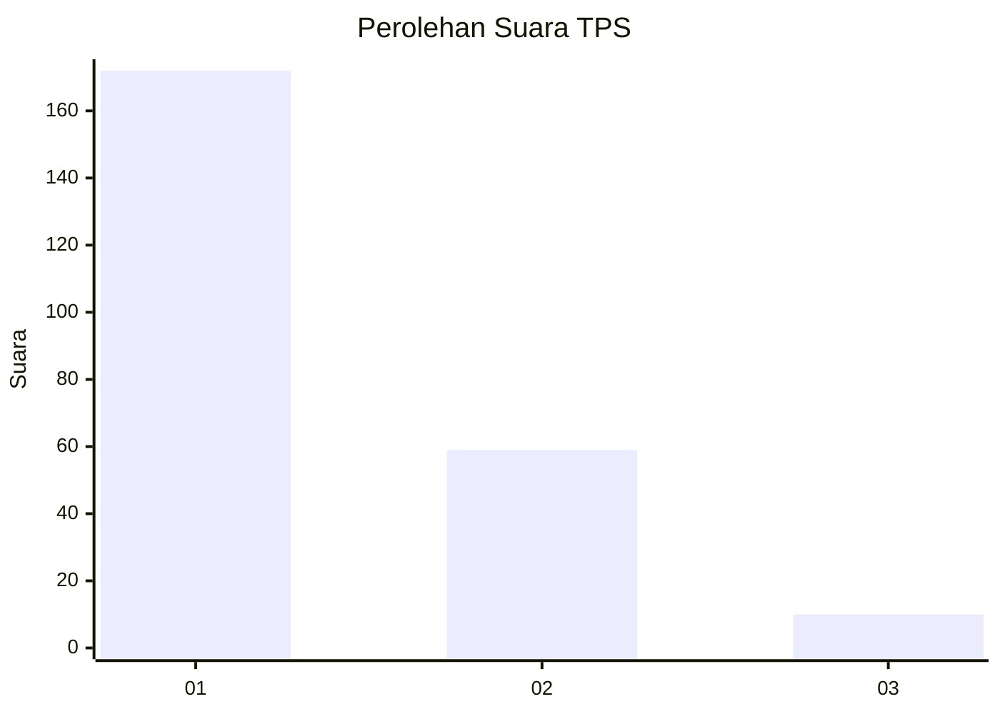
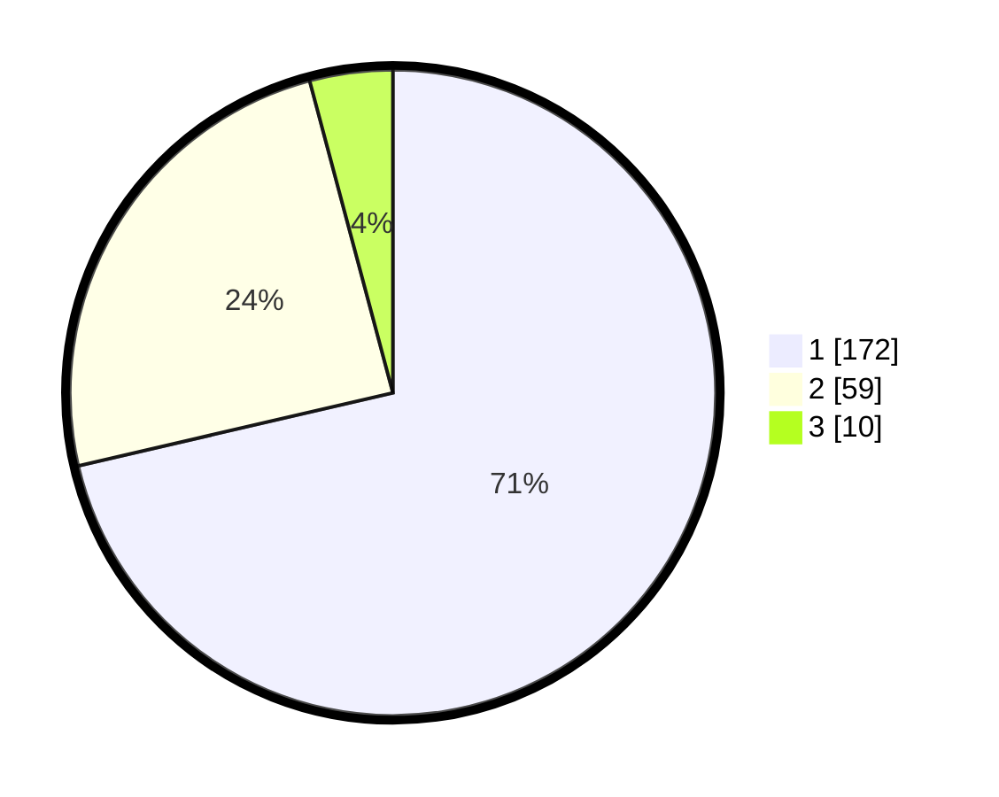

# Hasil

## Grafik

## Tabel

| No. | Nama Paslon    | Suara | Suara (raw) | Persentase |
|:--- |:-------------- | -----:| -----------:| ----------:|
| 1   | ANIES MUHAIMIN | 172   | [172][p-1]  | 71,37      |
| 2   | PRABOWO GIBRAN | 59    | [59][p-2]   | 24,48      |
| 3   | GANJAR MAHFUD  | 10    | [10][p-3]   | 4,15       |

[p-1]: https://github.com/gigit-pemilu/pemilu-2024/blob/main/pilpres/hitung-suara/sub/12-sumatera-utara/sub/72-kota-pematangsiantar/sub/02-siantar-barat/sub/1004-timbang-galung/sub/002-tps/sub/paslon-1.txt
[p-2]: https://github.com/gigit-pemilu/pemilu-2024/blob/main/pilpres/hitung-suara/sub/12-sumatera-utara/sub/72-kota-pematangsiantar/sub/02-siantar-barat/sub/1004-timbang-galung/sub/002-tps/sub/paslon-2.txt
[p-3]: https://github.com/gigit-pemilu/pemilu-2024/blob/main/pilpres/hitung-suara/sub/12-sumatera-utara/sub/72-kota-pematangsiantar/sub/02-siantar-barat/sub/1004-timbang-galung/sub/002-tps/sub/paslon-3.txt

## Foto C Plano

https://sirekap-obj-formc.kpu.go.id/536b/pemilu/ppwp/12/72/02/10/04/1272021004002-20240214-201015--67d9cb96-a016-486a-b68f-31a4a01bd6d1.jpg

https://sirekap-obj-formc.kpu.go.id/536b/pemilu/ppwp/12/72/02/10/04/1272021004002-20240215-014121--3d319615-c197-4393-8cc0-b58c9e1b6a6c.jpg

https://sirekap-obj-formc.kpu.go.id/536b/pemilu/ppwp/12/72/02/10/04/1272021004002-20240214-235029--e5494b69-22f2-4823-a8a8-a98b33a1b746.jpg

## Metadata

| Key        | Value               |
| ---------- | ------------------- |
| Time Stamp | 2024-02-15 23:29:50 |

