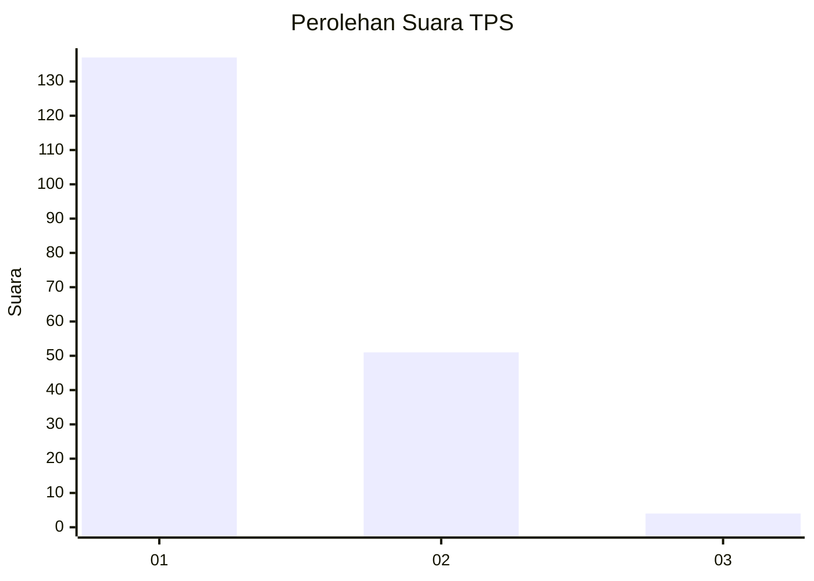
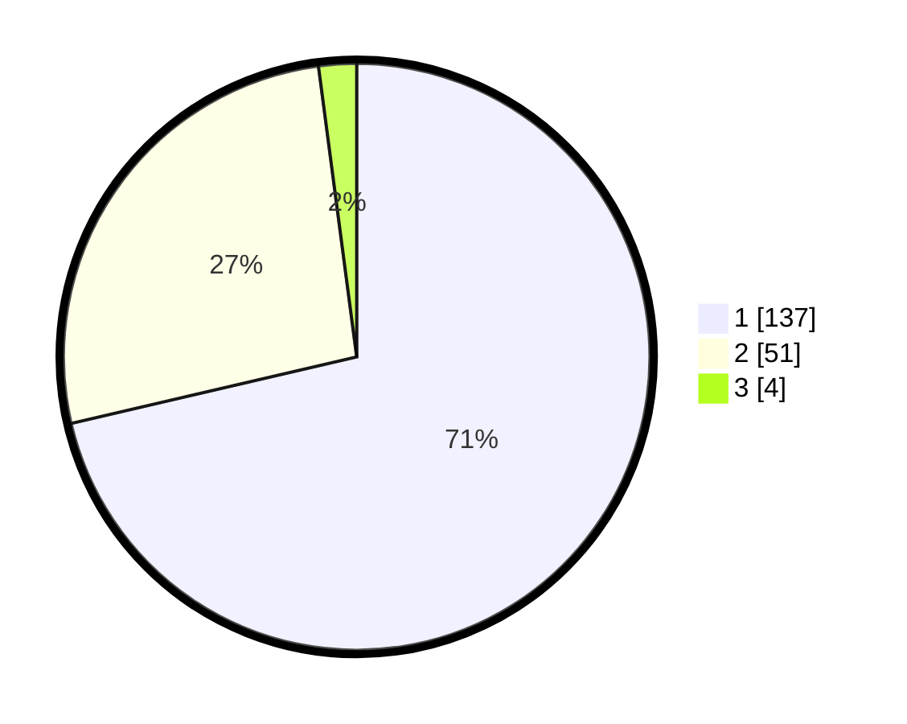

# Hasil

## Grafik

## Tabel

| No. | Nama Paslon    | Suara | Suara (raw) | Persentase |
|:--- |:-------------- | -----:| -----------:| ----------:|
| 1   | ANIES MUHAIMIN | 137   | [137][p-1]  | 71,35      |
| 2   | PRABOWO GIBRAN | 51    | [51][p-2]   | 26,56      |
| 3   | GANJAR MAHFUD  | 4     | [4][p-3]    | 2,08       |

[p-1]: https://github.com/gigit-pemilu/pemilu-2024-12-sumatera-utara/blob/main/pilpres/hitung-suara/sub/12-sumatera-utara/sub/72-kota-pematangsiantar/sub/02-siantar-barat/sub/1005-simarito/sub/014-tps/sub/paslon-1.txt
[p-2]: https://github.com/gigit-pemilu/pemilu-2024-12-sumatera-utara/blob/main/pilpres/hitung-suara/sub/12-sumatera-utara/sub/72-kota-pematangsiantar/sub/02-siantar-barat/sub/1005-simarito/sub/014-tps/sub/paslon-2.txt
[p-3]: https://github.com/gigit-pemilu/pemilu-2024-12-sumatera-utara/blob/main/pilpres/hitung-suara/sub/12-sumatera-utara/sub/72-kota-pematangsiantar/sub/02-siantar-barat/sub/1005-simarito/sub/014-tps/sub/paslon-3.txt

## Foto C Plano

https://sirekap-obj-formc.kpu.go.id/e4b0/pemilu/ppwp/12/72/02/10/05/1272021005014-20240214-232609--6501888f-4db3-4bf7-952a-6cb88863c519.jpg

https://sirekap-obj-formc.kpu.go.id/e4b0/pemilu/ppwp/12/72/02/10/05/1272021005014-20240214-215934--4ace6dc2-a201-4684-a0c6-2a75400157ef.jpg

https://sirekap-obj-formc.kpu.go.id/e4b0/pemilu/ppwp/12/72/02/10/05/1272021005014-20240214-233045--561f4603-81ed-4f2a-8587-b439f0ac9c47.jpg

## Metadata

| Key        | Value               |
| ---------- | ------------------- |
| Time Stamp | 2024-02-16 01:00:27 |

