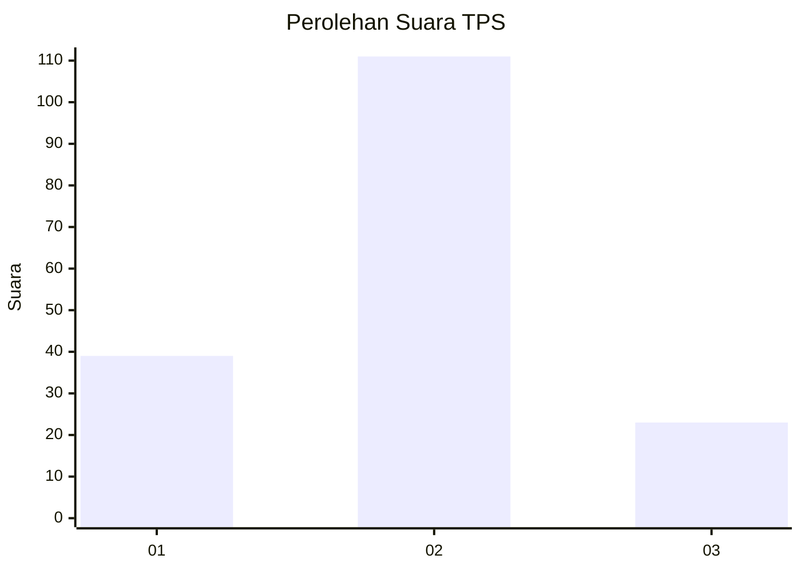
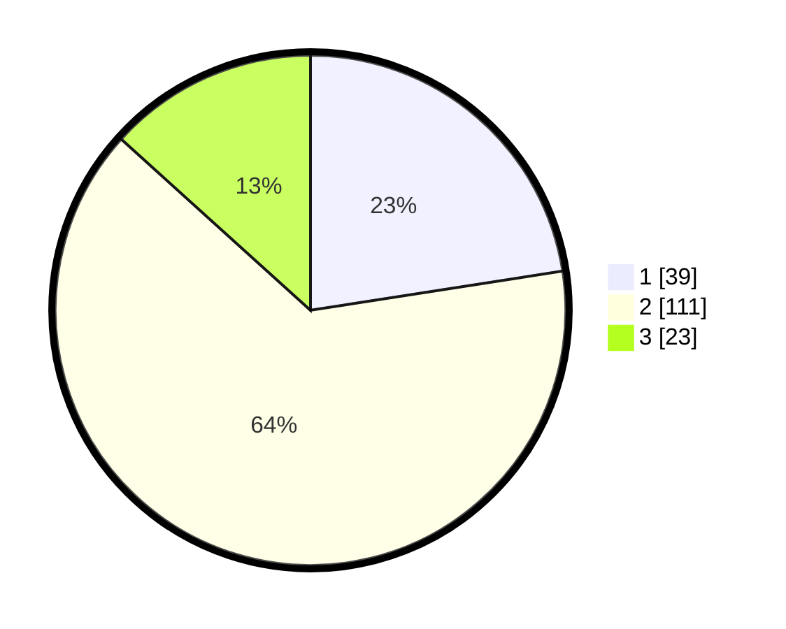

# Hasil

## Grafik

## Tabel

| No. | Nama Paslon    | Suara | Suara (raw) | Persentase |
|:--- |:-------------- | -----:| -----------:| ----------:|
| 1   | ANIES MUHAIMIN | 39    | [39][p-1]   | 22,54      |
| 2   | PRABOWO GIBRAN | 111   | [111][p-2]  | 64,16      |
| 3   | GANJAR MAHFUD  | 23    | [23][p-3]   | 13,29      |

[p-1]: https://github.com/gigit-pemilu/pemilu-2024/blob/main/pilpres/hitung-suara/sub/12-sumatera-utara/sub/72-kota-pematangsiantar/sub/02-siantar-barat/sub/1006-sipinggolpinggol/sub/003-tps/sub/paslon-1.txt
[p-2]: https://github.com/gigit-pemilu/pemilu-2024/blob/main/pilpres/hitung-suara/sub/12-sumatera-utara/sub/72-kota-pematangsiantar/sub/02-siantar-barat/sub/1006-sipinggolpinggol/sub/003-tps/sub/paslon-2.txt
[p-3]: https://github.com/gigit-pemilu/pemilu-2024/blob/main/pilpres/hitung-suara/sub/12-sumatera-utara/sub/72-kota-pematangsiantar/sub/02-siantar-barat/sub/1006-sipinggolpinggol/sub/003-tps/sub/paslon-3.txt

## Foto C Plano

https://sirekap-obj-formc.kpu.go.id/c68a/pemilu/ppwp/12/72/02/10/06/1272021006003-20240214-232913--d6ab754f-c059-4abb-995e-4a9121ea0d39.jpg

https://sirekap-obj-formc.kpu.go.id/c68a/pemilu/ppwp/12/72/02/10/06/1272021006003-20240215-020118--d2b8b4a4-0565-45df-9de3-a41f706a899c.jpg

https://sirekap-obj-formc.kpu.go.id/c68a/pemilu/ppwp/12/72/02/10/06/1272021006003-20240215-020224--f652d2a4-4cb9-450e-8923-08bcb09dd7a6.jpg

## Metadata

| Key        | Value               |
| ---------- | ------------------- |
| Time Stamp | 2024-02-16 01:00:27 |

