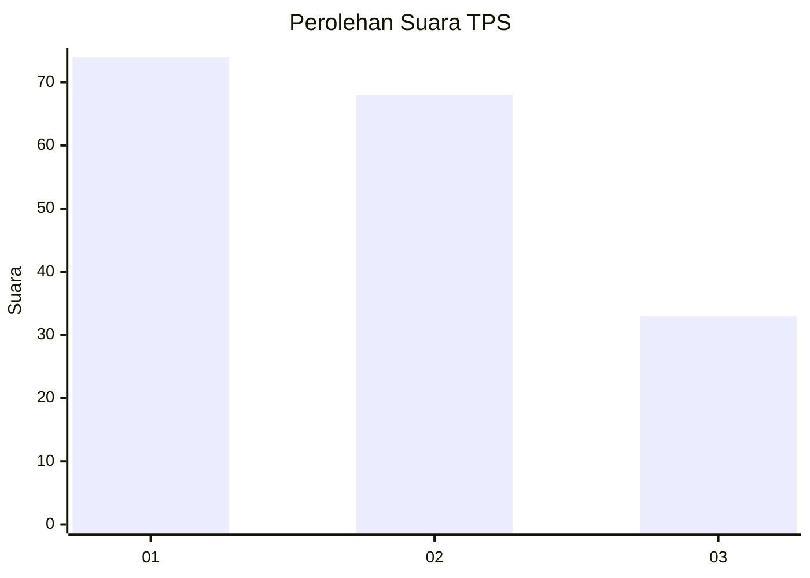
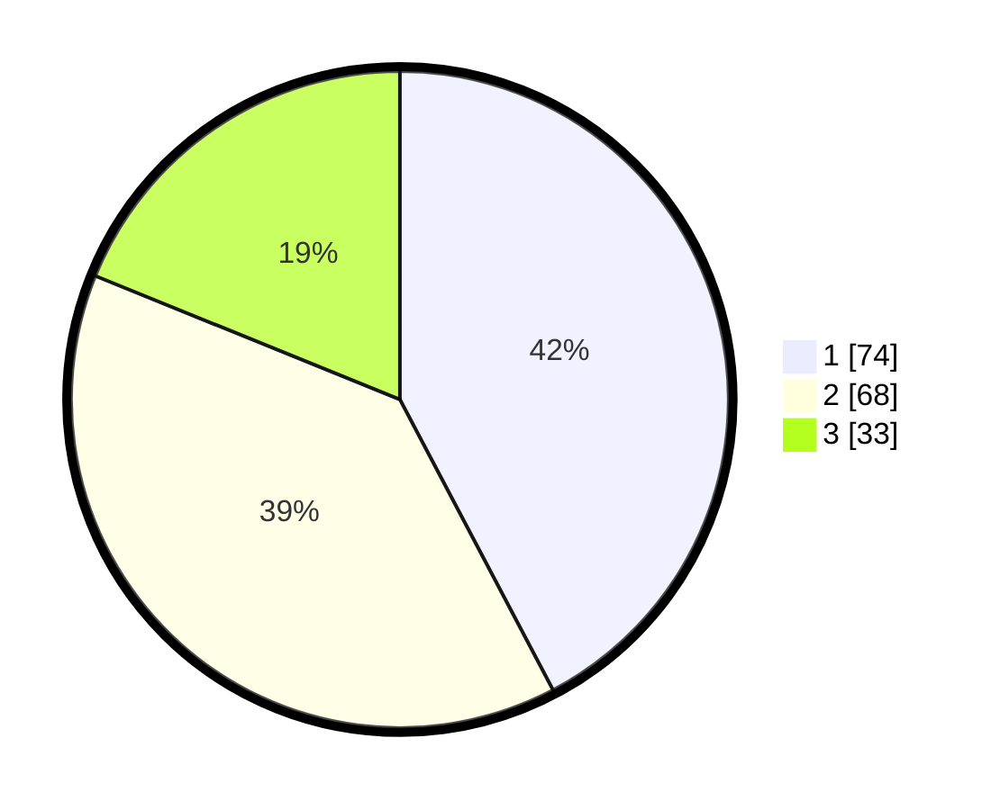

# Hasil

## Grafik

## Tabel

| No. | Nama Paslon    | Suara | Suara (raw) | Persentase |
|:--- |:-------------- | -----:| -----------:| ----------:|
| 1   | ANIES MUHAIMIN | 74    | [74][p-1]   | 42,29      |
| 2   | PRABOWO GIBRAN | 68    | [68][p-2]   | 38,86      |
| 3   | GANJAR MAHFUD  | 33    | [33][p-3]   | 18,86      |

[p-1]: https://github.com/gigit-pemilu/pemilu-2024/blob/main/pilpres/hitung-suara/sub/12-sumatera-utara/sub/72-kota-pematangsiantar/sub/03-siantar-utara/sub/1001-melayu/sub/003-tps/sub/paslon-1.txt
[p-2]: https://github.com/gigit-pemilu/pemilu-2024/blob/main/pilpres/hitung-suara/sub/12-sumatera-utara/sub/72-kota-pematangsiantar/sub/03-siantar-utara/sub/1001-melayu/sub/003-tps/sub/paslon-2.txt
[p-3]: https://github.com/gigit-pemilu/pemilu-2024/blob/main/pilpres/hitung-suara/sub/12-sumatera-utara/sub/72-kota-pematangsiantar/sub/03-siantar-utara/sub/1001-melayu/sub/003-tps/sub/paslon-3.txt

## Foto C Plano

https://sirekap-obj-formc.kpu.go.id/287e/pemilu/ppwp/12/72/03/10/01/1272031001003-20240215-173419--7200ddba-38d7-478d-8961-1517fb693eb7.jpg

https://sirekap-obj-formc.kpu.go.id/287e/pemilu/ppwp/12/72/03/10/01/1272031001003-20240215-173437--c0123d60-9d58-456c-9873-0356a3860ada.jpg

https://sirekap-obj-formc.kpu.go.id/287e/pemilu/ppwp/12/72/03/10/01/1272031001003-20240215-181739--ba56191e-9438-4ea1-946f-aba38aacd823.jpg

## Metadata

| Key        | Value               |
| ---------- | ------------------- |
| Time Stamp | 2024-02-20 21:00:00 |

