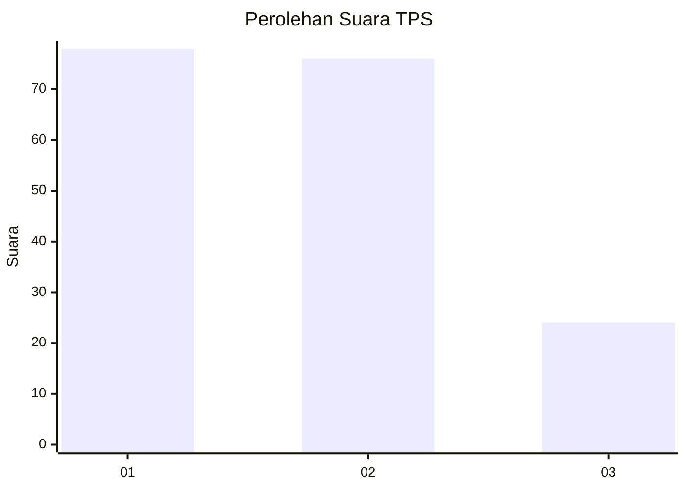
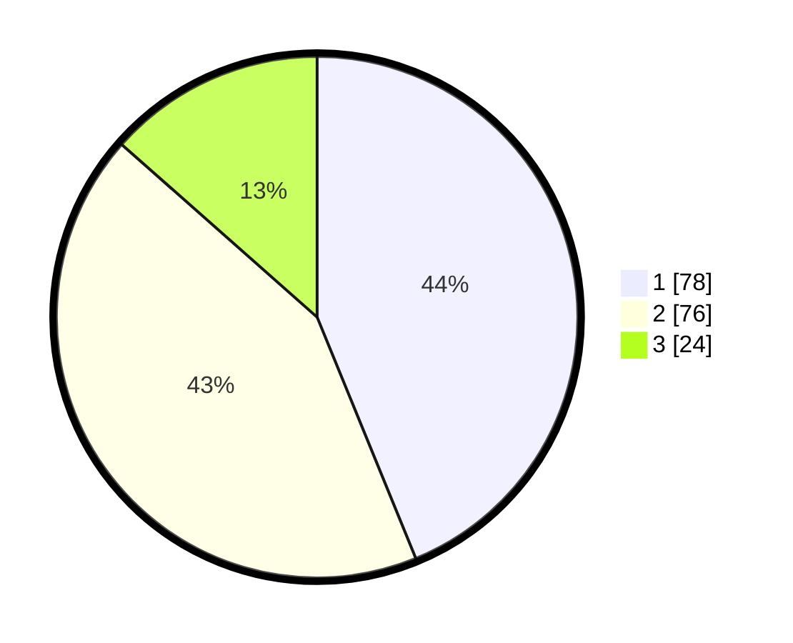

# Hasil

## Grafik

## Tabel

| No. | Nama Paslon    | Suara | Suara (raw) | Persentase |
|:--- |:-------------- | -----:| -----------:| ----------:|
| 1   | ANIES MUHAIMIN | 78    | [78][p-1]   | 43,82      |
| 2   | PRABOWO GIBRAN | 76    | [76][p-2]   | 42,70      |
| 3   | GANJAR MAHFUD  | 24    | [24][p-3]   | 13,48      |

[p-1]: https://github.com/gigit-pemilu/pemilu-2024/blob/main/pilpres/hitung-suara/sub/12-sumatera-utara/sub/72-kota-pematangsiantar/sub/03-siantar-utara/sub/1001-melayu/sub/004-tps/sub/paslon-1.txt
[p-2]: https://github.com/gigit-pemilu/pemilu-2024/blob/main/pilpres/hitung-suara/sub/12-sumatera-utara/sub/72-kota-pematangsiantar/sub/03-siantar-utara/sub/1001-melayu/sub/004-tps/sub/paslon-2.txt
[p-3]: https://github.com/gigit-pemilu/pemilu-2024/blob/main/pilpres/hitung-suara/sub/12-sumatera-utara/sub/72-kota-pematangsiantar/sub/03-siantar-utara/sub/1001-melayu/sub/004-tps/sub/paslon-3.txt

## Foto C Plano

https://sirekap-obj-formc.kpu.go.id/ce85/pemilu/ppwp/12/72/03/10/01/1272031001004-20240215-013401--b9a54267-4cc1-4e33-aeb1-6e1dab2b2cb1.jpg

https://sirekap-obj-formc.kpu.go.id/ce85/pemilu/ppwp/12/72/03/10/01/1272031001004-20240215-013459--9a9fe51c-1231-4618-a134-edb12b52a79d.jpg

https://sirekap-obj-formc.kpu.go.id/ce85/pemilu/ppwp/12/72/03/10/01/1272031001004-20240215-013548--d4e2cfa4-b2f6-4920-8e91-92df4c8ccac8.jpg

## Metadata

| Key        | Value               |
| ---------- | ------------------- |
| Time Stamp | 2024-02-19 08:00:00 |

