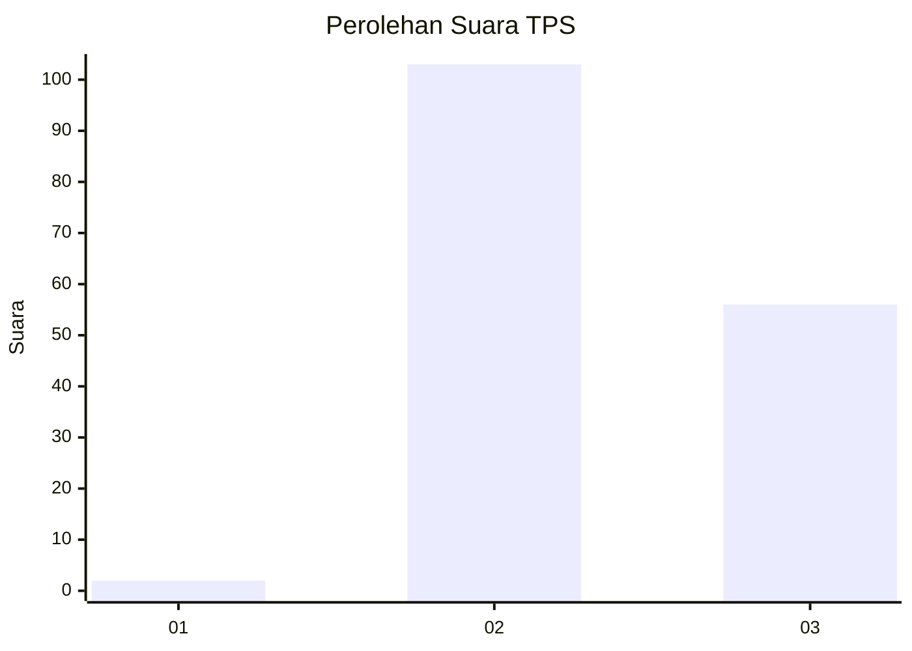
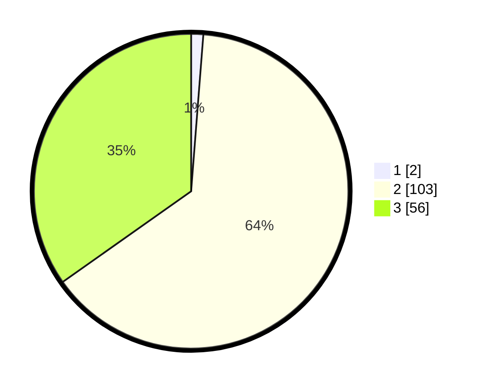

# Hasil

## Grafik

## Tabel

| No. | Nama Paslon    | Suara | Suara (raw) | Persentase |
|:--- |:-------------- | -----:| -----------:| ----------:|
| 1   | ANIES MUHAIMIN | 2     | [2][p-1]    | 1,24       |
| 2   | PRABOWO GIBRAN | 103   | [103][p-2]  | 63,98      |
| 3   | GANJAR MAHFUD  | 56    | [56][p-3]   | 34,78      |

[p-1]: https://github.com/gigit-pemilu/pemilu-2024-12-sumatera-utara/blob/main/pilpres/hitung-suara/sub/12-sumatera-utara/sub/72-kota-pematangsiantar/sub/04-siantar-selatan/sub/1001-toba/sub/003-tps/sub/paslon-1.txt
[p-2]: https://github.com/gigit-pemilu/pemilu-2024-12-sumatera-utara/blob/main/pilpres/hitung-suara/sub/12-sumatera-utara/sub/72-kota-pematangsiantar/sub/04-siantar-selatan/sub/1001-toba/sub/003-tps/sub/paslon-2.txt
[p-3]: https://github.com/gigit-pemilu/pemilu-2024-12-sumatera-utara/blob/main/pilpres/hitung-suara/sub/12-sumatera-utara/sub/72-kota-pematangsiantar/sub/04-siantar-selatan/sub/1001-toba/sub/003-tps/sub/paslon-3.txt

## Foto C Plano

https://sirekap-obj-formc.kpu.go.id/5613/pemilu/ppwp/12/72/04/10/01/1272041001003-20240214-215119--7f0390e4-ff04-46da-aba6-f50f17a43a01.jpg

https://sirekap-obj-formc.kpu.go.id/5613/pemilu/ppwp/12/72/04/10/01/1272041001003-20240214-214802--fbdf509b-f407-485b-8808-17ab82ee0bb3.jpg

https://sirekap-obj-formc.kpu.go.id/5613/pemilu/ppwp/12/72/04/10/01/1272041001003-20240214-200843--9d68d5a6-5f80-4080-a5de-0f9bd0313a12.jpg

## Metadata

| Key        | Value               |
| ---------- | ------------------- |
| Time Stamp | 2024-02-21 10:00:00 |

