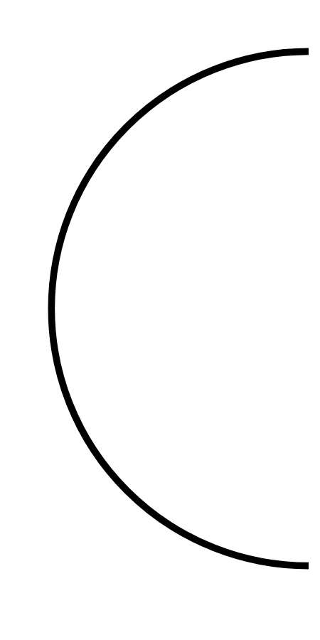

# Hasil

## Grafik

```mermaid
xychart-beta
    title "Perolehan Suara TPS"
    x-axis []
    y-axis "Suara" 0 --> 0
    bar []
```



## Tabel

| No. | Nama Paslon | Suara | Suara (raw) | Persentase |
|:--- |:----------- | -----:| -----------:| ----------:|


[p-1]: https://github.com/gigit-pemilu/pemilu-2024/blob/main/pilpres/hitung-suara/sub/12-sumatera-utara/sub/72-kota-pematangsiantar/sub/04-siantar-selatan/sub/1006-aek-nauli/sub/001-tps/sub/paslon-1.txt
[p-2]: https://github.com/gigit-pemilu/pemilu-2024/blob/main/pilpres/hitung-suara/sub/12-sumatera-utara/sub/72-kota-pematangsiantar/sub/04-siantar-selatan/sub/1006-aek-nauli/sub/001-tps/sub/paslon-2.txt
[p-3]: https://github.com/gigit-pemilu/pemilu-2024/blob/main/pilpres/hitung-suara/sub/12-sumatera-utara/sub/72-kota-pematangsiantar/sub/04-siantar-selatan/sub/1006-aek-nauli/sub/001-tps/sub/paslon-3.txt

## Foto C Plano

https://sirekap-obj-formc.kpu.go.id/3b3b/pemilu/ppwp/12/72/04/10/06/1272041006001-20240220-165039--d0bf6e99-7582-45be-9bf8-6a2d25c1932d.jpg

https://sirekap-obj-formc.kpu.go.id/3b3b/pemilu/ppwp/12/72/04/10/06/1272041006001-20240220-165837--3ac6d9a4-b2ec-42fd-89ba-e249a12812a8.jpg

https://sirekap-obj-formc.kpu.go.id/3b3b/pemilu/ppwp/12/72/04/10/06/1272041006001-20240220-170547--9a7289fd-ec6d-4528-a291-27dbfefce89b.jpg


## Metadata

| Key        | Value               |
| ---------- | ------------------- |
| Time Stamp | 2024-02-20 18:00:00 |


## DATA PEMILIH TETAP

Jumlah pemilih dalam DPT: **110**.
 * L: **205**.
 * P: **520**.

## DATA PENGGUNA HAK PILIH

Jumlah pengguna hak pilih dalam DPT: **110**.
 * L: **500**.
 * P: **255**.

Jumlah pengguna hak pilih dalam DPTb: **104**.
 * L: **290**.
 * P: **384**.

Jumlah pengguna hak pilih dalam DPK: **128**.
 * L: **255**.
 * P: **60**.

Jumlah pengguna hak pilih: **315**.
 * L: **560**.
 * P: **833**.

## JUMLAH SUARA SAH DAN TIDAK SAH

JUMLAH SELURUH SUARA SAH: **140**.

JUMLAH SUARA TIDAK SAH: **100**.

JUMLAH SELURUH SUARA SAH DAN SUARA TIDAK SAH: **7**.


