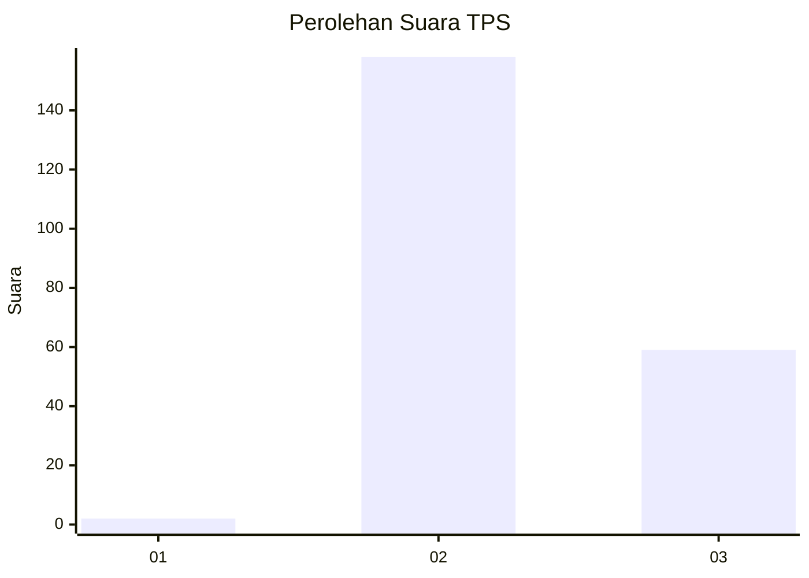
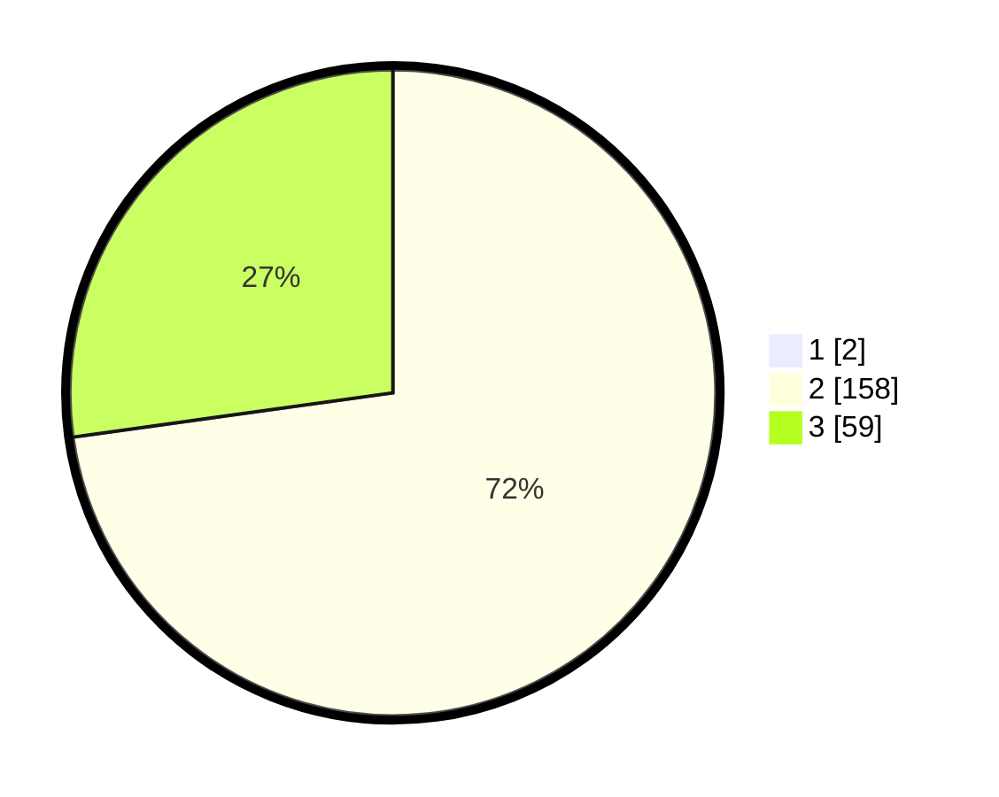

# Hasil

## Grafik

## Tabel

| No. | Nama Paslon    | Suara | Suara (raw) | Persentase |
|:--- |:-------------- | -----:| -----------:| ----------:|
| 1   | ANIES MUHAIMIN | 2     | [2][p-1]    | 0,91       |
| 2   | PRABOWO GIBRAN | 158   | [158][p-2]  | 72,15      |
| 3   | GANJAR MAHFUD  | 59    | [59][p-3]   | 26,94      |

[p-1]: https://github.com/gigit-pemilu/pemilu-2024/blob/main/pilpres/hitung-suara/sub/12-sumatera-utara/sub/72-kota-pematangsiantar/sub/05-siantar-marihat/sub/1002-sukaraja/sub/002-tps/sub/paslon-1.txt
[p-2]: https://github.com/gigit-pemilu/pemilu-2024/blob/main/pilpres/hitung-suara/sub/12-sumatera-utara/sub/72-kota-pematangsiantar/sub/05-siantar-marihat/sub/1002-sukaraja/sub/002-tps/sub/paslon-2.txt
[p-3]: https://github.com/gigit-pemilu/pemilu-2024/blob/main/pilpres/hitung-suara/sub/12-sumatera-utara/sub/72-kota-pematangsiantar/sub/05-siantar-marihat/sub/1002-sukaraja/sub/002-tps/sub/paslon-3.txt

## Foto C Plano

https://sirekap-obj-formc.kpu.go.id/d0be/pemilu/ppwp/12/72/05/10/02/1272051002002-20240214-184841--cbaef4b3-b308-4e53-9861-7872dedd2aa0.jpg

https://sirekap-obj-formc.kpu.go.id/d0be/pemilu/ppwp/12/72/05/10/02/1272051002002-20240214-184853--4ce645ac-3f2b-4853-86b8-ef693d00a5ab.jpg

https://sirekap-obj-formc.kpu.go.id/d0be/pemilu/ppwp/12/72/05/10/02/1272051002002-20240215-082415--58382e79-0105-4ae0-bed0-3212e4adc993.jpg

## Metadata

| Key        | Value               |
| ---------- | ------------------- |
| Time Stamp | 2024-02-15 09:00:24 |

