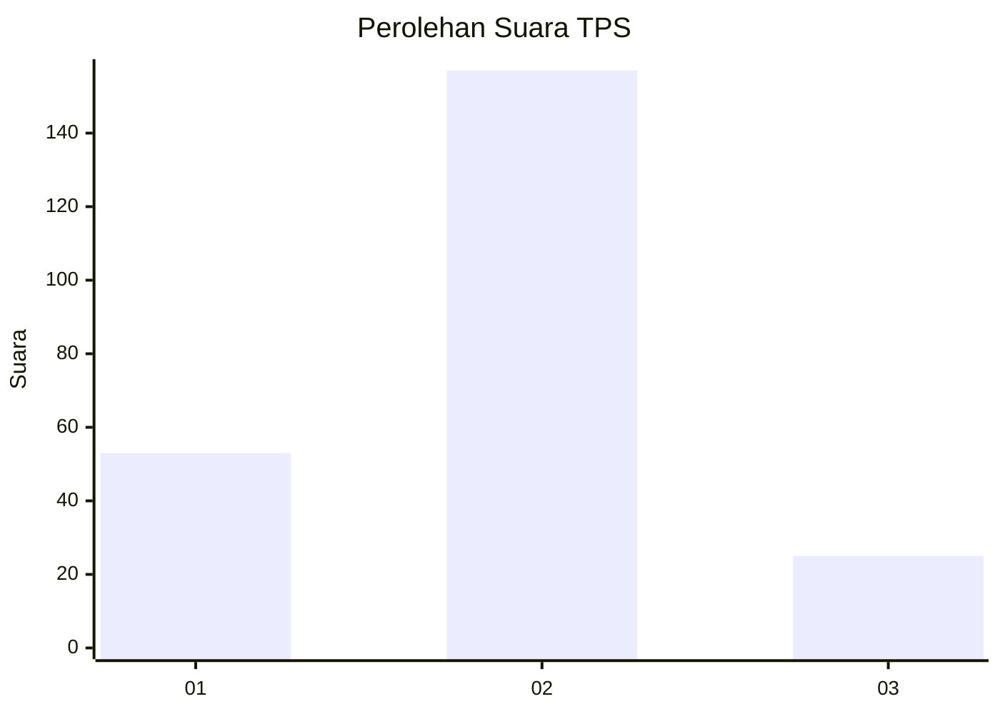
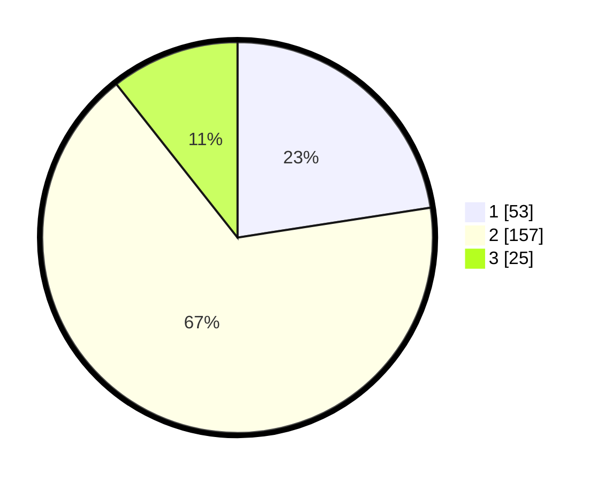

# Hasil

## Grafik

## Tabel

| No. | Nama Paslon    | Suara | Suara (raw) | Persentase |
|:--- |:-------------- | -----:| -----------:| ----------:|
| 1   | ANIES MUHAIMIN | 53    | [53][p-1]   | 22,55      |
| 2   | PRABOWO GIBRAN | 157   | [157][p-2]  | 66,81      |
| 3   | GANJAR MAHFUD  | 25    | [25][p-3]   | 10,64      |

[p-1]: https://github.com/gigit-pemilu/pemilu-2024-12-sumatera-utara/blob/main/pilpres/hitung-suara/sub/12-sumatera-utara/sub/72-kota-pematangsiantar/sub/06-siantar-martoba/sub/1001-sumber-jaya/sub/003-tps/sub/paslon-1.txt
[p-2]: https://github.com/gigit-pemilu/pemilu-2024-12-sumatera-utara/blob/main/pilpres/hitung-suara/sub/12-sumatera-utara/sub/72-kota-pematangsiantar/sub/06-siantar-martoba/sub/1001-sumber-jaya/sub/003-tps/sub/paslon-2.txt
[p-3]: https://github.com/gigit-pemilu/pemilu-2024-12-sumatera-utara/blob/main/pilpres/hitung-suara/sub/12-sumatera-utara/sub/72-kota-pematangsiantar/sub/06-siantar-martoba/sub/1001-sumber-jaya/sub/003-tps/sub/paslon-3.txt

## Foto C Plano

https://sirekap-obj-formc.kpu.go.id/6bc6/pemilu/ppwp/12/72/06/10/01/1272061001003-20240214-203158--c6d0797f-ed28-4127-8493-ab7975715712.jpg

https://sirekap-obj-formc.kpu.go.id/6bc6/pemilu/ppwp/12/72/06/10/01/1272061001003-20240214-194709--d74502bb-5041-438e-ae38-e65b26c75b5d.jpg

https://sirekap-obj-formc.kpu.go.id/6bc6/pemilu/ppwp/12/72/06/10/01/1272061001003-20240214-194816--022492da-71b6-4553-9f29-36bd40bd8a90.jpg

## Metadata

| Key        | Value               |
| ---------- | ------------------- |
| Time Stamp | 2024-02-16 01:00:27 |

