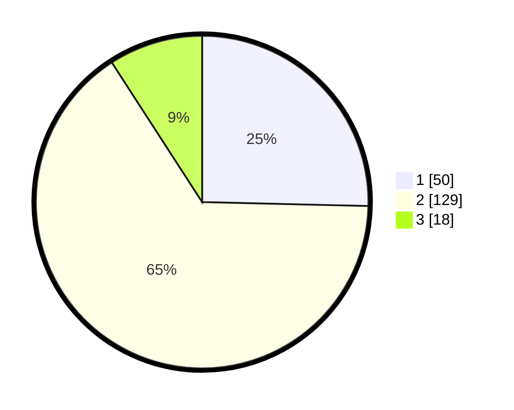

# Hasil

## Grafik

## Tabel

| No. | Nama Paslon    | Suara | Suara (raw) | Persentase |
|:--- |:-------------- | -----:| -----------:| ----------:|
| 1   | ANIES MUHAIMIN | 50    | [50][p-1]   | 25,38      |
| 2   | PRABOWO GIBRAN | 129   | [129][p-2]  | 65,48      |
| 3   | GANJAR MAHFUD  | 18    | [18][p-3]   | 9,14       |

[p-1]: https://github.com/gigit-pemilu/pemilu-2024/blob/main/pilpres/hitung-suara/sub/12-sumatera-utara/sub/72-kota-pematangsiantar/sub/06-siantar-martoba/sub/1001-sumber-jaya/sub/005-tps/sub/paslon-1.txt
[p-2]: https://github.com/gigit-pemilu/pemilu-2024/blob/main/pilpres/hitung-suara/sub/12-sumatera-utara/sub/72-kota-pematangsiantar/sub/06-siantar-martoba/sub/1001-sumber-jaya/sub/005-tps/sub/paslon-2.txt
[p-3]: https://github.com/gigit-pemilu/pemilu-2024/blob/main/pilpres/hitung-suara/sub/12-sumatera-utara/sub/72-kota-pematangsiantar/sub/06-siantar-martoba/sub/1001-sumber-jaya/sub/005-tps/sub/paslon-3.txt

## Foto C Plano

https://sirekap-obj-formc.kpu.go.id/dc48/pemilu/ppwp/12/72/06/10/01/1272061001005-20240214-221704--0efead2a-2bd7-4721-a7ca-aee97866bfbe.jpg

https://sirekap-obj-formc.kpu.go.id/dc48/pemilu/ppwp/12/72/06/10/01/1272061001005-20240215-031415--33d45427-5644-4b0f-8919-1dc194b53a2d.jpg

https://sirekap-obj-formc.kpu.go.id/dc48/pemilu/ppwp/12/72/06/10/01/1272061001005-20240214-222211--00885940-595b-4b56-b412-05985b5da3fc.jpg

## Metadata

| Key        | Value               |
| ---------- | ------------------- |
| Time Stamp | 2024-02-21 18:00:00 |

