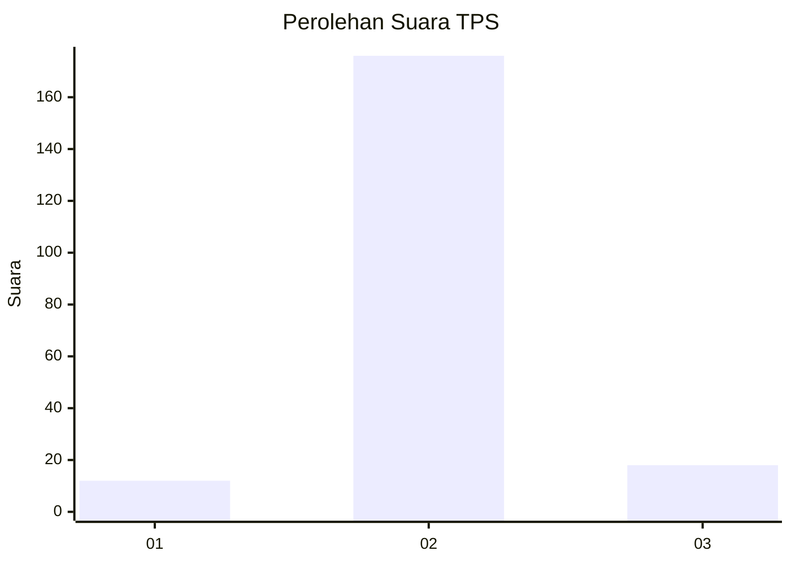
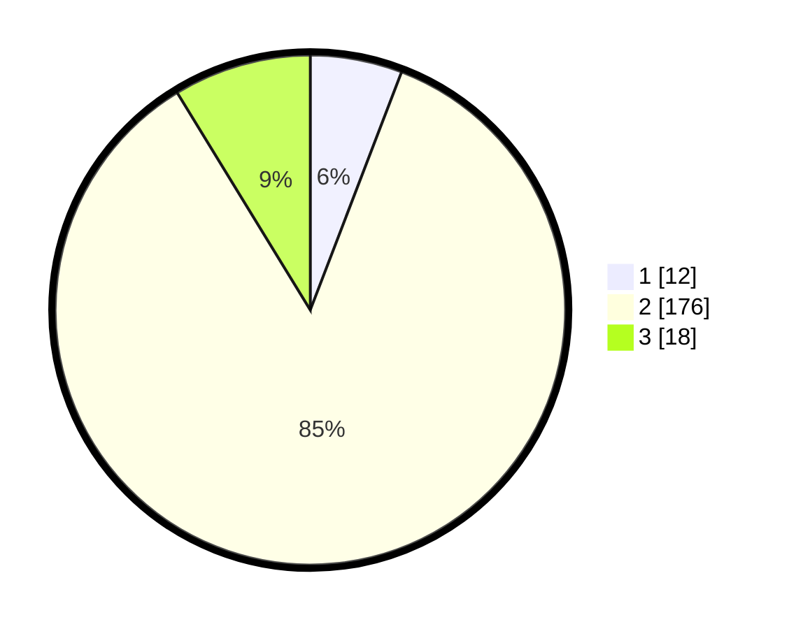

# Hasil

## Grafik

## Tabel

| No. | Nama Paslon    | Suara | Suara (raw) | Persentase |
|:--- |:-------------- | -----:| -----------:| ----------:|
| 1   | ANIES MUHAIMIN | 12    | [12][p-1]   | 5,83       |
| 2   | PRABOWO GIBRAN | 176   | [176][p-2]  | 85,44      |
| 3   | GANJAR MAHFUD  | 18    | [18][p-3]   | 8,74       |

[p-1]: https://github.com/gigit-pemilu/pemilu-2024/blob/main/pilpres/hitung-suara/sub/12-sumatera-utara/sub/73-kota-sibolga/sub/01-sibolga-utara/sub/1001-huta-barangan/sub/002-tps/sub/paslon-1.txt
[p-2]: https://github.com/gigit-pemilu/pemilu-2024/blob/main/pilpres/hitung-suara/sub/12-sumatera-utara/sub/73-kota-sibolga/sub/01-sibolga-utara/sub/1001-huta-barangan/sub/002-tps/sub/paslon-2.txt
[p-3]: https://github.com/gigit-pemilu/pemilu-2024/blob/main/pilpres/hitung-suara/sub/12-sumatera-utara/sub/73-kota-sibolga/sub/01-sibolga-utara/sub/1001-huta-barangan/sub/002-tps/sub/paslon-3.txt

## Foto C Plano

https://sirekap-obj-formc.kpu.go.id/c02d/pemilu/ppwp/12/73/01/10/01/1273011001002-20240214-193544--f967feb8-076d-4cff-88b1-38ac265fe3ce.jpg

https://sirekap-obj-formc.kpu.go.id/c02d/pemilu/ppwp/12/73/01/10/01/1273011001002-20240214-193829--32de90d2-2739-48a8-a164-e63e948cdc57.jpg

https://sirekap-obj-formc.kpu.go.id/c02d/pemilu/ppwp/12/73/01/10/01/1273011001002-20240214-193916--6f66355e-e689-4bcd-b847-1455c503198a.jpg

## Metadata

| Key        | Value               |
| ---------- | ------------------- |
| Time Stamp | 2024-02-14 21:46:01 |

