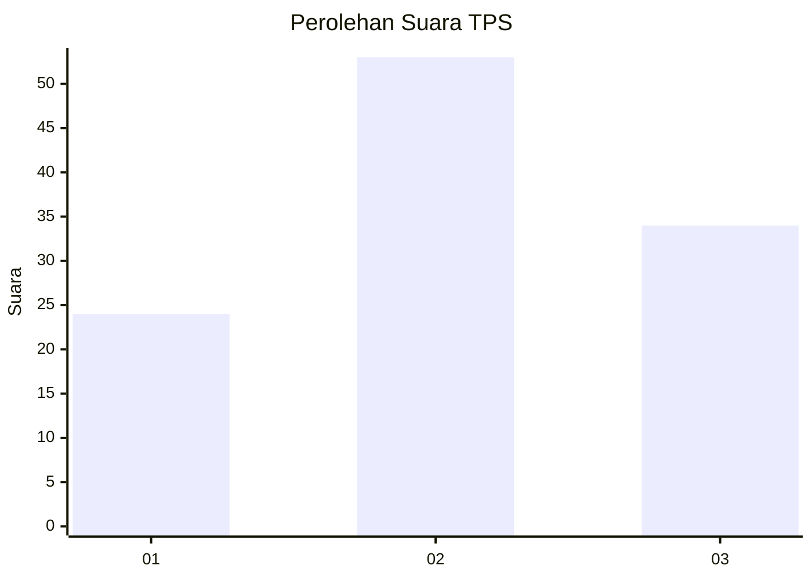
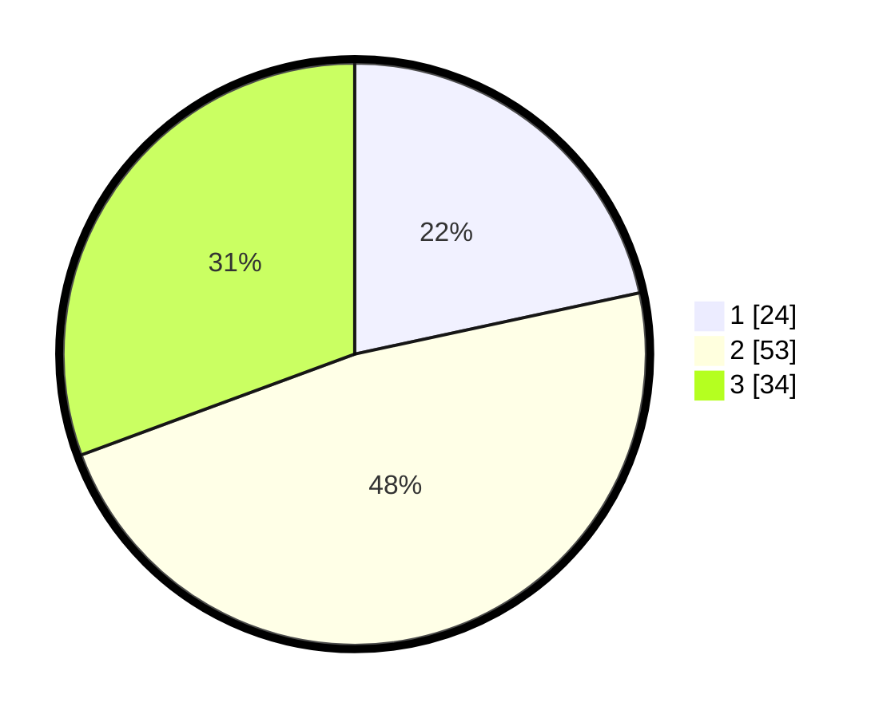

# Hasil

## Grafik

## Tabel

| No. | Nama Paslon    | Suara | Suara (raw) | Persentase |
|:--- |:-------------- | -----:| -----------:| ----------:|
| 1   | ANIES MUHAIMIN | 24    | [24][p-1]   | 21,62      |
| 2   | PRABOWO GIBRAN | 53    | [53][p-2]   | 47,75      |
| 3   | GANJAR MAHFUD  | 34    | [34][p-3]   | 30,63      |

[p-1]: https://github.com/gigit-pemilu/pemilu-2024-12-sumatera-utara/blob/main/pilpres/hitung-suara/sub/12-sumatera-utara/sub/74-kota-tanjung-balai/sub/01-tanjungbalai-selatan/sub/1001-tanjungbalai-kota-i/sub/006-tps/sub/paslon-1.txt
[p-2]: https://github.com/gigit-pemilu/pemilu-2024-12-sumatera-utara/blob/main/pilpres/hitung-suara/sub/12-sumatera-utara/sub/74-kota-tanjung-balai/sub/01-tanjungbalai-selatan/sub/1001-tanjungbalai-kota-i/sub/006-tps/sub/paslon-2.txt
[p-3]: https://github.com/gigit-pemilu/pemilu-2024-12-sumatera-utara/blob/main/pilpres/hitung-suara/sub/12-sumatera-utara/sub/74-kota-tanjung-balai/sub/01-tanjungbalai-selatan/sub/1001-tanjungbalai-kota-i/sub/006-tps/sub/paslon-3.txt

## Foto C Plano

https://sirekap-obj-formc.kpu.go.id/a97a/pemilu/ppwp/12/74/01/10/01/1274011001006-20240215-212847--c320a7ff-16fb-4792-ba85-8a4b8839b6ca.jpg

https://sirekap-obj-formc.kpu.go.id/a97a/pemilu/ppwp/12/74/01/10/01/1274011001006-20240215-212849--98ce00fc-dc54-4aa3-a742-e278dc8b9c70.jpg

https://sirekap-obj-formc.kpu.go.id/a97a/pemilu/ppwp/12/74/01/10/01/1274011001006-20240215-212848--e4f394cd-6e84-4eca-9ab4-8c0fe8958829.jpg

## Metadata

| Key        | Value               |
| ---------- | ------------------- |
| Time Stamp | 2024-02-15 22:30:27 |

## DATA PEMILIH TETAP

Jumlah pemilih dalam DPT: **185**.
 * L: **91**.
 * P: **94**.

## DATA PENGGUNA HAK PILIH

Jumlah pengguna hak pilih dalam DPT: **108**.
 * L: **52**.
 * P: **56**.

Jumlah pengguna hak pilih dalam DPTb: **3**.
 * L: **2**.
 * P: **1**.

Jumlah pengguna hak pilih dalam DPK: **1**.
 * L: **1**.
 * P: **0**.

Jumlah pengguna hak pilih: **112**.
 * L: **55**.
 * P: **57**.

## JUMLAH SUARA SAH DAN TIDAK SAH

JUMLAH SELURUH SUARA SAH: **111**.

JUMLAH SUARA TIDAK SAH: **1**.

JUMLAH SELURUH SUARA SAH DAN SUARA TIDAK SAH: **112**.

