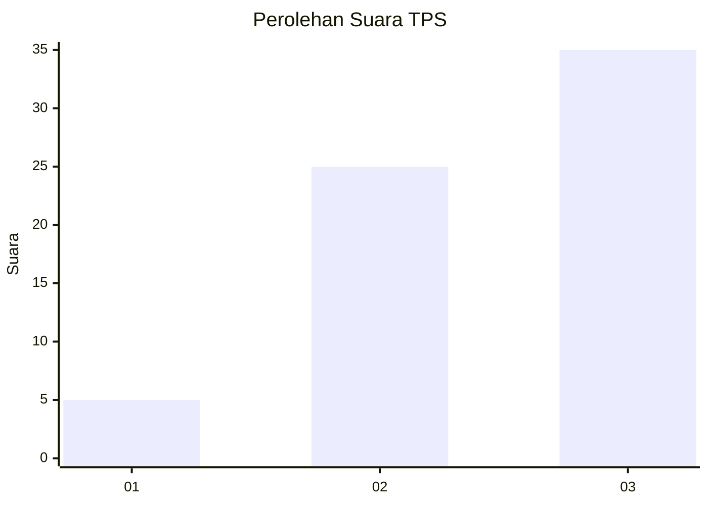
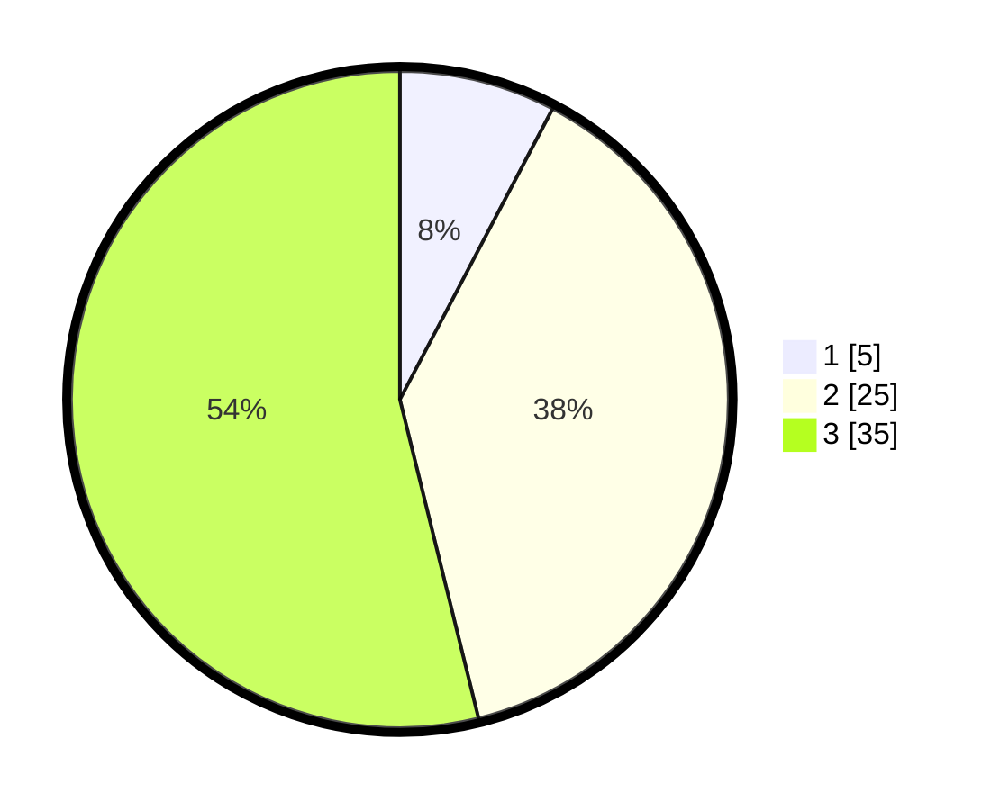

# Hasil

## Grafik

## Tabel

| No. | Nama Paslon    | Suara | Suara (raw) | Persentase |
|:--- |:-------------- | -----:| -----------:| ----------:|
| 1   | ANIES MUHAIMIN | 5     | [5][p-1]    | 7,69       |
| 2   | PRABOWO GIBRAN | 25    | [25][p-2]   | 38,46      |
| 3   | GANJAR MAHFUD  | 35    | [35][p-3]   | 53,85      |

[p-1]: https://github.com/gigit-pemilu/pemilu-2024-12-sumatera-utara/blob/main/pilpres/hitung-suara/sub/12-sumatera-utara/sub/74-kota-tanjung-balai/sub/01-tanjungbalai-selatan/sub/1006-indra-sakti/sub/007-tps/sub/paslon-1.txt
[p-2]: https://github.com/gigit-pemilu/pemilu-2024-12-sumatera-utara/blob/main/pilpres/hitung-suara/sub/12-sumatera-utara/sub/74-kota-tanjung-balai/sub/01-tanjungbalai-selatan/sub/1006-indra-sakti/sub/007-tps/sub/paslon-2.txt
[p-3]: https://github.com/gigit-pemilu/pemilu-2024-12-sumatera-utara/blob/main/pilpres/hitung-suara/sub/12-sumatera-utara/sub/74-kota-tanjung-balai/sub/01-tanjungbalai-selatan/sub/1006-indra-sakti/sub/007-tps/sub/paslon-3.txt

## Foto C Plano

https://sirekap-obj-formc.kpu.go.id/2f60/pemilu/ppwp/12/74/01/10/06/1274011006007-20240215-130611--21f4f9e8-5b76-4610-85f9-537fdb3890da.jpg

https://sirekap-obj-formc.kpu.go.id/2f60/pemilu/ppwp/12/74/01/10/06/1274011006007-20240215-130730--054dc357-fc7b-4ee1-940f-0e3405454ca7.jpg

https://sirekap-obj-formc.kpu.go.id/2f60/pemilu/ppwp/12/74/01/10/06/1274011006007-20240215-132959--45452fae-46af-4645-ab20-297d231aed39.jpg

## Metadata

| Key        | Value               |
| ---------- | ------------------- |
| Time Stamp | 2024-02-15 21:30:27 |

