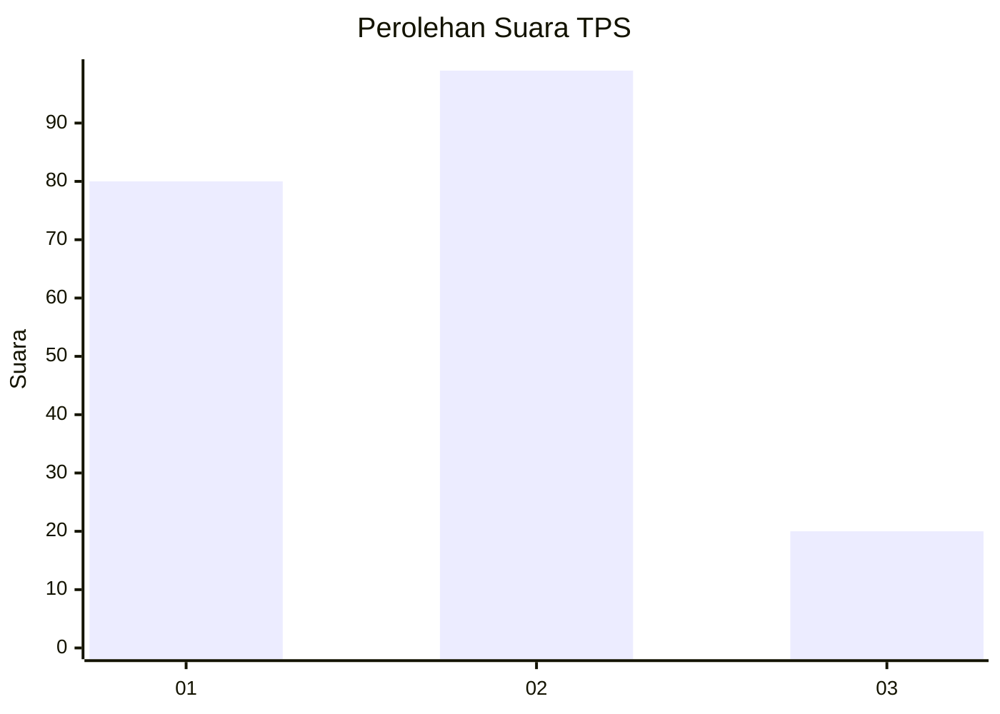
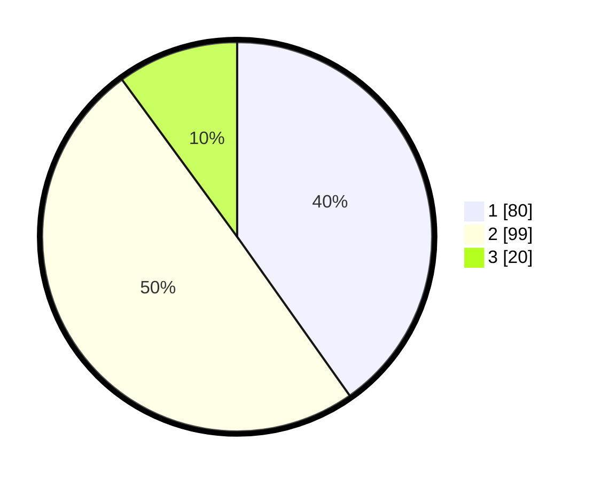

# Hasil

## Grafik

## Tabel

| No. | Nama Paslon    | Suara | Suara (raw) | Persentase |
|:--- |:-------------- | -----:| -----------:| ----------:|
| 1   | ANIES MUHAIMIN | 80    | [80][p-1]   | 40,20      |
| 2   | PRABOWO GIBRAN | 99    | [99][p-2]   | 49,75      |
| 3   | GANJAR MAHFUD  | 20    | [20][p-3]   | 10,05      |

[p-1]: https://github.com/gigit-pemilu/pemilu-2024/blob/main/pilpres/hitung-suara/sub/12-sumatera-utara/sub/74-kota-tanjung-balai/sub/02-tanjungbalai-utara/sub/1001-tanjungbalai-kota-iii/sub/004-tps/sub/paslon-1.txt
[p-2]: https://github.com/gigit-pemilu/pemilu-2024/blob/main/pilpres/hitung-suara/sub/12-sumatera-utara/sub/74-kota-tanjung-balai/sub/02-tanjungbalai-utara/sub/1001-tanjungbalai-kota-iii/sub/004-tps/sub/paslon-2.txt
[p-3]: https://github.com/gigit-pemilu/pemilu-2024/blob/main/pilpres/hitung-suara/sub/12-sumatera-utara/sub/74-kota-tanjung-balai/sub/02-tanjungbalai-utara/sub/1001-tanjungbalai-kota-iii/sub/004-tps/sub/paslon-3.txt

## Foto C Plano

https://sirekap-obj-formc.kpu.go.id/4d78/pemilu/ppwp/12/74/02/10/01/1274021001004-20240215-083211--ed357be2-0060-47be-8427-34b3820e9d18.jpg

https://sirekap-obj-formc.kpu.go.id/4d78/pemilu/ppwp/12/74/02/10/01/1274021001004-20240215-083310--314d1c31-a347-4268-b37c-09f0f14a0c6d.jpg

https://sirekap-obj-formc.kpu.go.id/4d78/pemilu/ppwp/12/74/02/10/01/1274021001004-20240215-083400--8c3ced7e-f3a0-4f61-8c60-8ad9e0e154fb.jpg

## Metadata

| Key        | Value               |
| ---------- | ------------------- |
| Time Stamp | 2024-02-25 18:00:00 |

