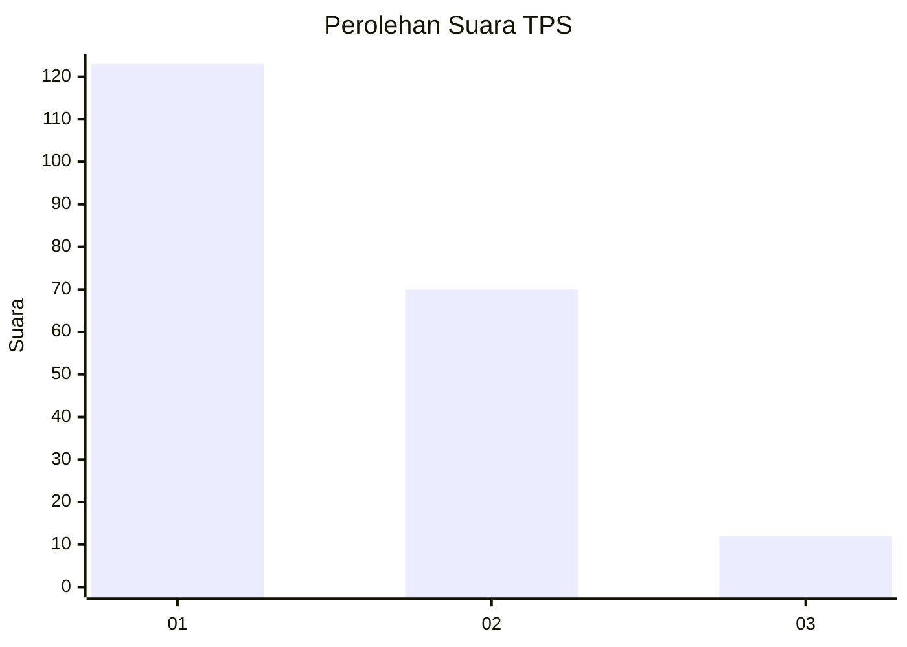
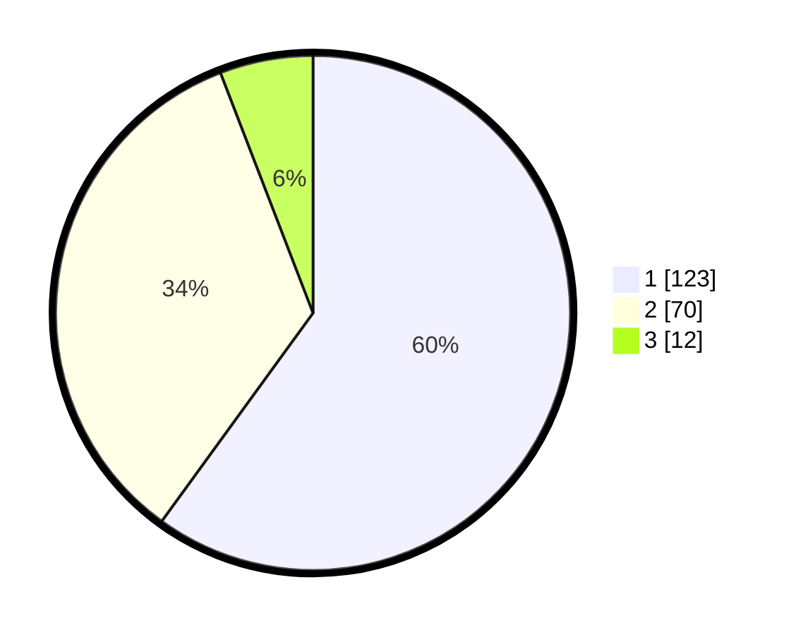

# Hasil

## Grafik

## Tabel

| No. | Nama Paslon    | Suara | Suara (raw) | Persentase |
|:--- |:-------------- | -----:| -----------:| ----------:|
| 1   | ANIES MUHAIMIN | 123   | [123][p-1]  | 60,00      |
| 2   | PRABOWO GIBRAN | 70    | [70][p-2]   | 34,15      |
| 3   | GANJAR MAHFUD  | 12    | [12][p-3]   | 5,85       |

[p-1]: https://github.com/gigit-pemilu/pemilu-2024/blob/main/pilpres/hitung-suara/sub/12-sumatera-utara/sub/74-kota-tanjung-balai/sub/02-tanjungbalai-utara/sub/1001-tanjungbalai-kota-iii/sub/006-tps/sub/paslon-1.txt
[p-2]: https://github.com/gigit-pemilu/pemilu-2024/blob/main/pilpres/hitung-suara/sub/12-sumatera-utara/sub/74-kota-tanjung-balai/sub/02-tanjungbalai-utara/sub/1001-tanjungbalai-kota-iii/sub/006-tps/sub/paslon-2.txt
[p-3]: https://github.com/gigit-pemilu/pemilu-2024/blob/main/pilpres/hitung-suara/sub/12-sumatera-utara/sub/74-kota-tanjung-balai/sub/02-tanjungbalai-utara/sub/1001-tanjungbalai-kota-iii/sub/006-tps/sub/paslon-3.txt

## Foto C Plano

https://sirekap-obj-formc.kpu.go.id/fcb8/pemilu/ppwp/12/74/02/10/01/1274021001006-20240214-204612--777b5694-8b06-466b-86ee-ae99201b9f91.jpg

https://sirekap-obj-formc.kpu.go.id/fcb8/pemilu/ppwp/12/74/02/10/01/1274021001006-20240214-204350--ad972640-728a-4f8b-9e51-735e6c45745d.jpg

https://sirekap-obj-formc.kpu.go.id/fcb8/pemilu/ppwp/12/74/02/10/01/1274021001006-20240214-204735--0d04d9d2-5fb1-447a-bdf3-6a4e6dcb1905.jpg

## Metadata

| Key        | Value               |
| ---------- | ------------------- |
| Time Stamp | 2024-02-25 00:00:00 |

