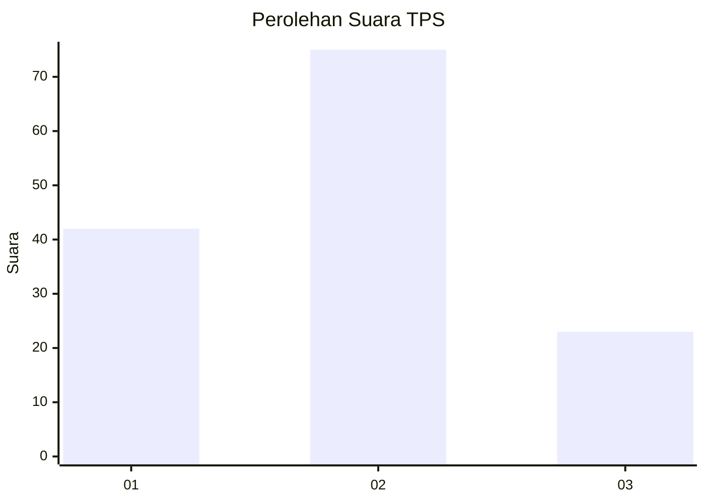
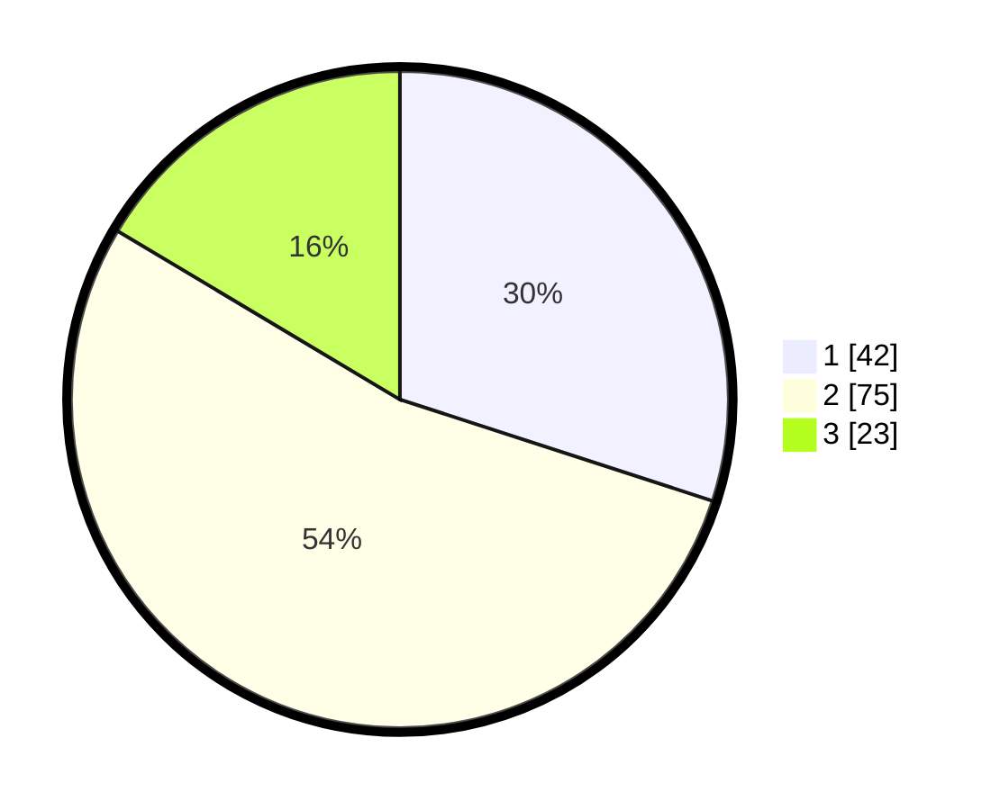

# Hasil

## Grafik

## Tabel

| No. | Nama Paslon    | Suara | Suara (raw) | Persentase |
|:--- |:-------------- | -----:| -----------:| ----------:|
| 1   | ANIES MUHAIMIN | 42    | [42][p-1]   | 30,00      |
| 2   | PRABOWO GIBRAN | 75    | [75][p-2]   | 53,57      |
| 3   | GANJAR MAHFUD  | 23    | [23][p-3]   | 16,43      |

[p-1]: https://github.com/gigit-pemilu/pemilu-2024/blob/main/pilpres/hitung-suara/sub/12-sumatera-utara/sub/74-kota-tanjung-balai/sub/02-tanjungbalai-utara/sub/1002-tanjungbalai-kota-iv/sub/006-tps/sub/paslon-1.txt
[p-2]: https://github.com/gigit-pemilu/pemilu-2024/blob/main/pilpres/hitung-suara/sub/12-sumatera-utara/sub/74-kota-tanjung-balai/sub/02-tanjungbalai-utara/sub/1002-tanjungbalai-kota-iv/sub/006-tps/sub/paslon-2.txt
[p-3]: https://github.com/gigit-pemilu/pemilu-2024/blob/main/pilpres/hitung-suara/sub/12-sumatera-utara/sub/74-kota-tanjung-balai/sub/02-tanjungbalai-utara/sub/1002-tanjungbalai-kota-iv/sub/006-tps/sub/paslon-3.txt

## Foto C Plano

https://sirekap-obj-formc.kpu.go.id/e5fe/pemilu/ppwp/12/74/02/10/02/1274021002006-20240214-192000--cd895595-df20-437b-aae8-3cb0f60be970.jpg

https://sirekap-obj-formc.kpu.go.id/e5fe/pemilu/ppwp/12/74/02/10/02/1274021002006-20240214-190110--963854ea-6d69-4d4e-ae3f-2608d886dba5.jpg

https://sirekap-obj-formc.kpu.go.id/e5fe/pemilu/ppwp/12/74/02/10/02/1274021002006-20240214-185856--158a8e3d-3aa8-48e8-835e-8f2dfa30147d.jpg

## Metadata

| Key        | Value               |
| ---------- | ------------------- |
| Time Stamp | 2024-02-14 21:46:01 |

