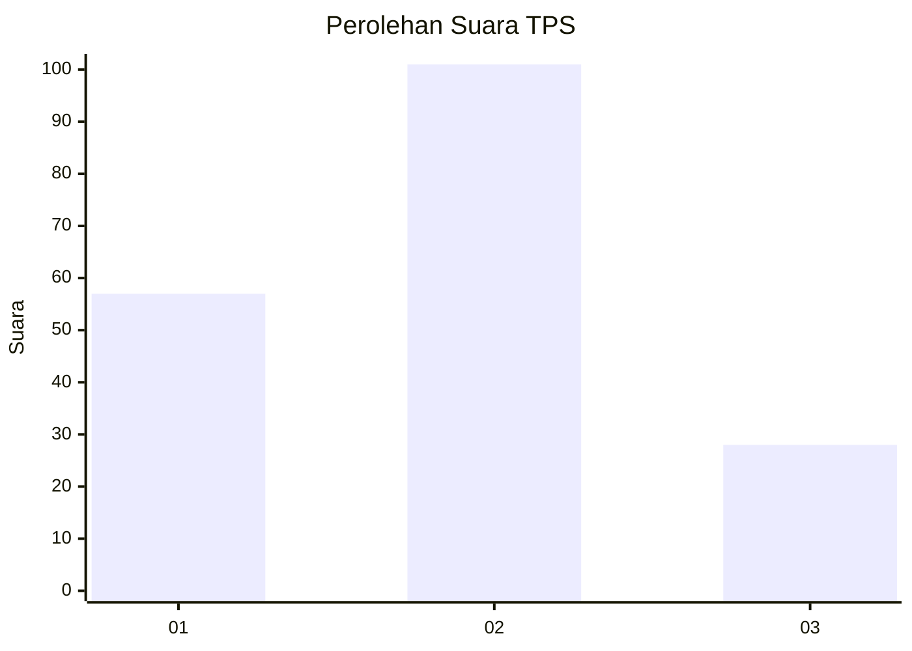
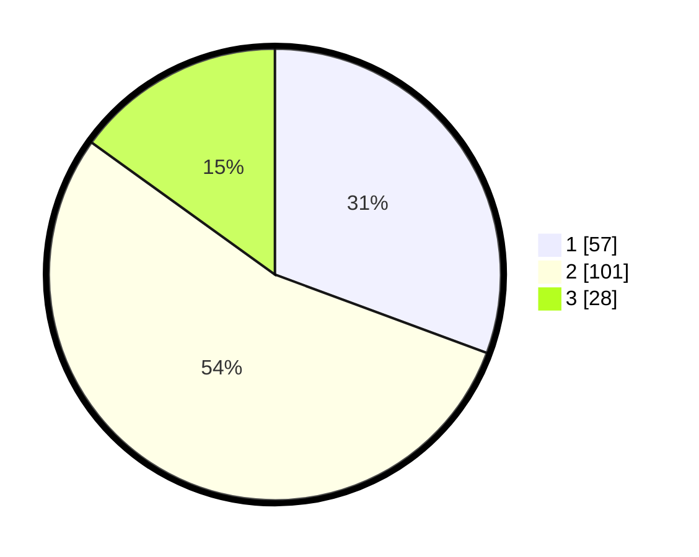

# Hasil

## Grafik

## Tabel

| No. | Nama Paslon    | Suara | Suara (raw) | Persentase |
|:--- |:-------------- | -----:| -----------:| ----------:|
| 1   | ANIES MUHAIMIN | 57    | [57][p-1]   | 30,65      |
| 2   | PRABOWO GIBRAN | 101   | [101][p-2]  | 54,30      |
| 3   | GANJAR MAHFUD  | 28    | [28][p-3]   | 15,05      |

[p-1]: https://github.com/gigit-pemilu/pemilu-2024-12-sumatera-utara/blob/main/pilpres/hitung-suara/sub/12-sumatera-utara/sub/74-kota-tanjung-balai/sub/03-sei-tualang-raso/sub/1001-keramat-kubah/sub/006-tps/sub/paslon-1.txt
[p-2]: https://github.com/gigit-pemilu/pemilu-2024-12-sumatera-utara/blob/main/pilpres/hitung-suara/sub/12-sumatera-utara/sub/74-kota-tanjung-balai/sub/03-sei-tualang-raso/sub/1001-keramat-kubah/sub/006-tps/sub/paslon-2.txt
[p-3]: https://github.com/gigit-pemilu/pemilu-2024-12-sumatera-utara/blob/main/pilpres/hitung-suara/sub/12-sumatera-utara/sub/74-kota-tanjung-balai/sub/03-sei-tualang-raso/sub/1001-keramat-kubah/sub/006-tps/sub/paslon-3.txt

## Foto C Plano

https://sirekap-obj-formc.kpu.go.id/fb34/pemilu/ppwp/12/74/03/10/01/1274031001006-20240214-191147--37ee8cb1-5eaf-4f3a-a533-f854364225eb.jpg

https://sirekap-obj-formc.kpu.go.id/fb34/pemilu/ppwp/12/74/03/10/01/1274031001006-20240214-190755--7f59303b-2242-484c-addb-b122d6aac9dc.jpg

https://sirekap-obj-formc.kpu.go.id/fb34/pemilu/ppwp/12/74/03/10/01/1274031001006-20240214-193031--b519ae12-b8d5-44ec-9bcc-b984c6f6f4b3.jpg

## Metadata

| Key        | Value               |
| ---------- | ------------------- |
| Time Stamp | 2024-02-15 19:30:26 |

